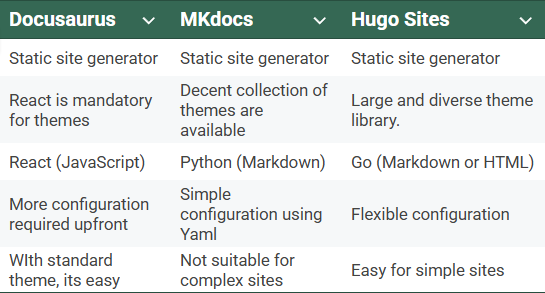
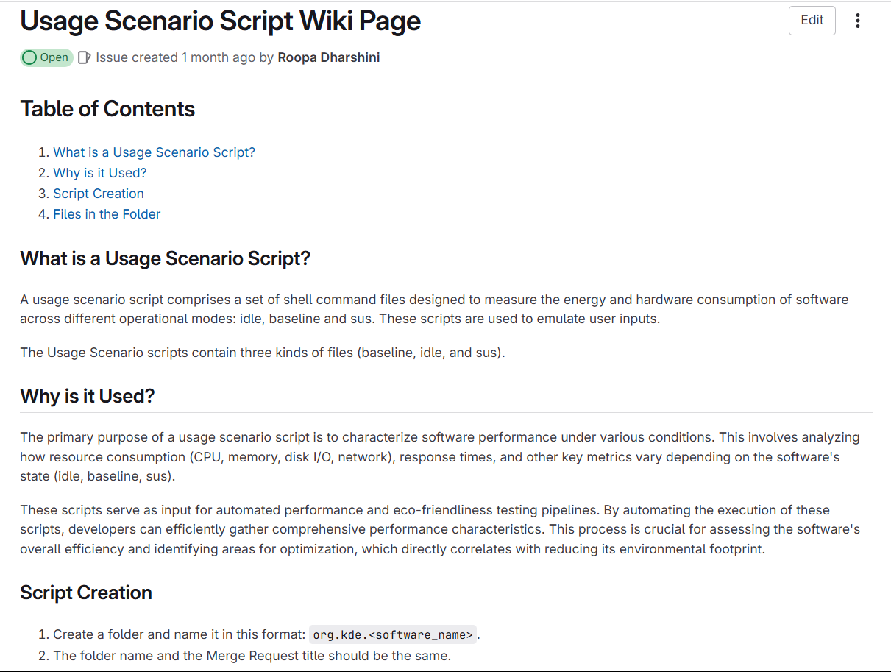
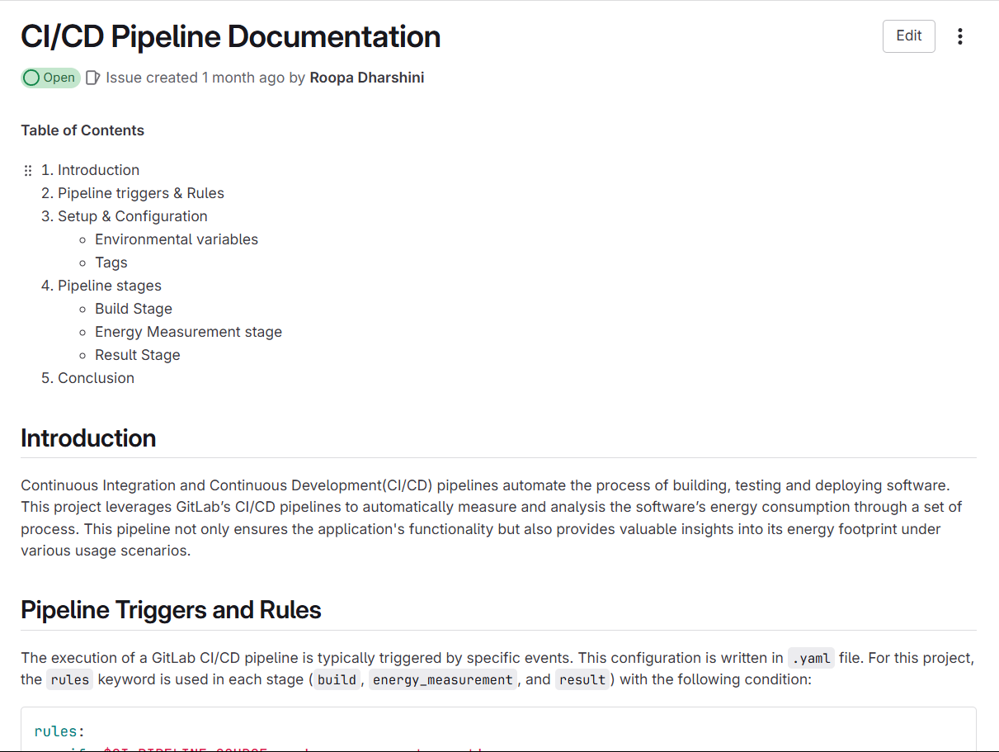
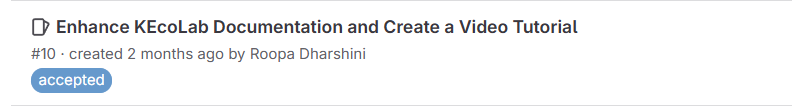

**Hey everyone!!**

Welcome to my blog post. I am Roopa Dharshini, a mentee in Season of KDE 2025 for the KEcoLab project. In this blog, I will explain my work in the SoK mentorship program.

## My Works

Before starting the contribution period, I crafted a detailed timeline for each week. With the help of my detailed timeline, I was able to complete all the work I proposed within the end of the mentorship program.

### Week 1 - 2

I started my first week of contribution by understanding the project's codebase; it's working; studying KECoLab's handbook and existing documentation; setting up a GitLab wiki in the forked repository; and discussing the GitLab wiki's Merge Request (MR) feature. 

Discussed about various technical documentation tools with the mentors, initially we planned to continue with GitLab but later due to the flexibility of KDE community wiki, we proceeded with KDE community wiki as our documentation tool to host KEcoLab documentations.

During the second week, I created an outline for the entire technical documentation. Usage Scenarios scripts are the essential parts for executing the automation pipeline in KEcolab. So, we started our documentation process with usage scenario scripts, drafted a small page with it's importance, essential scripts, and its structure. This documentaion is structured in a way, even non-technical person can be able to follow the guidelines and create their own scripts.

### Week 3 - 4

My third and fourth week contributions were spent by writing various technical documentations (CI/CD pipeline, Home Page) for the KEcoLab project. There was a change in the direction towards our documentation, earlier we were focusing on the people who uses KEcoLab, later we started to write documentation for both the people who wish to contribute and provide new changes to KEcoLab and who uses the KEcoLab for their software measurement. This change made us to write in-depth technical documentation for the developer who wishes to change the code for better change. These weeks were challenging for us to write the documentation in the simplest term to provide the best guide for first time contributors. CI/CD pipeline is the core script for the energy measurement automation in KEcoLab. Writing a detailed CI/CD pipline documentation that explains its uses, structure, and job execution was challenging yet rewarding.

### Week 5 - 6

  

With the help of wonderful teammates (fellow contributors) and mentors, I completed our tasks for SoK 2025 on time. 

## How did I apply to Season of KDE?

Season of KDE is a mentorship program that happens every year between January and March. It is a three-month mentorship where you will be assigned to a project you propose. You can write a proposal to work on the issue/project they listed on the KDE Ideas page. You can tag the mentors in the issue; they will review your proposal and check whether you are suitable or not. You can checkout [my proposal](https://invent.kde.org/teams/mentor-programs/2025/-/issues/10) for the KEcoLab project. Once they review your approach method, they will mark your proposal as accepted. And that’s how I got into it! 

## Challenges I faced

Applying to SoK was not an easy task for me. I ran into my first challenge when I tried to create my new KDE Invent account. I thought there was some technical issue with the website, so I tried every everyday to create an account (sadly, you are limited to one account creation chance per 24-hour period). After a long wait, I reached out to Johnny for help, and he helped to create an account. I was really scared to submit my proposal because there was exactly a week before the deadline of proposal submission, but I trusted my skills and submitted it. So, keep in mind that “it was never too late to apply."

The second challenge was team collaboration. Similar to me, there were 2 other contributors selected for this project. I was really new to KDE; at first it was hard to communicate with my other contributors; later on, we started to work really well.  That’s all the challenges I faced during my contributions. Challenges are never an end point; they are a stepping stone to move further.

## Thank You Note!

Challenges make the journey worthful. Without any challenges, I wouldn’t have known the perks of contributing to SoK. I take a moment here to thank my wonderful mentors (Joseph, Kieryn, Aakarsh, and Karan) for guiding me throughout this journey. Also, my fellow contributors to the project for collaborating with me to achieve what we proposed successfully.

**Thank you!**
