# INTRODUCTION: WHAT'S THIS HANDBOOK ALL ABOUT?

This handbook provides a brief overview of environmental harm driven by software, and how the Blue Angel ecolabel&mdash;the official environmental label of the German government&mdash;provides a benchmark for sustainable software design.

The Blue Angel is awarded to a range of products and services, from household cleaning agents to small appliances to construction products. In 2020, the German Environment Agency extended the award criteria to include software products. It was the first environmental certification in the world to link transparency and user autonomy&mdash;two pillars of Free & Open Source Software (FOSS)&mdash;with sustainability.

At this point, you might wonder: What does sustainability have to do with software at all? How can something so seemingly immaterial as software have an environmental footprint? In this handbook, we'll take a closer look at some of the ways software is contributing to the climate crisis, and how compliance with the Blue Angel award criteria for software eco-certification can help.

The book is divided into three parts:

 - Part I: Environmental Impact Of Software
 - Part II: Eco-Certifying Desktop Software
 - Part III: Fulfilling The Blue Angel Award Criteria

While Part I explores the *why* and Part II the *what* of software eco-certification, Part III discusses the *how* by explaining what you need to know to measure the energy consumption of your software and apply for the Blue Angel ecolabel. Specifically, in this section we provide a step-by-step guide to fullfilling the ABCs of the award criteria: (A) Resource & Energy Efficiency, (B) Potential Hardware Operating Life, and (C) User Autonomy.

# PART I: ENVIRONMENTAL IMPACT OF SOFTWARE

 public domain license.)](images/sec1_e-waste.jpg)

In 2021, the Association of Computing Machinery (ACM), the oldest scientific and educational computing society in the world, released a Technology Policy Council report entitled "[Computing And Climate Change](https://dl.acm.org/doi/pdf/10.1145/3483410)". Among other findings, the brief explores the exponential increase in energy and resource consumption of artificial intelligence as well as internet-connected devices, both in production and use. The report's estimates are staggering. In 2021 alone, the Information and Communication Technology (ICT) sector is estimated to contribute between 1.8&ndash;3.9% of global carbon emissions. To put this into perspective, this is on par with the global aviation industry, estimated to contribute 2.5% of all emissions. The report warns that if nothing is changed, by 2050 the carbon emissions attributable to the ICT sector will rise to more than 30% of all emissions globally.

 license. [Airplane](https://thenounproject.com/icon/airplane-74604/) icon by Simon Child and [IT](https://thenounproject.com/icon/it-3341003/) icon by Sari Braga licensed under a [CC-BY](https://spdx.org/licenses/CC-BY-3.0.html) license. Design by Lana Lutz.)](images/sec1_acm-report.png)

In their conclusions, the authors acknowledge an inherent contradiction of digitization: digital technology "can help mitigate climate change", but it "must first cease contributing to it" (p. 1). ICT has revolutionized how we live, and it is often praised for bringing convenience and efficiency to our daily lives. Companies have leveraged digital technology for the efficient distribution of all sorts of consumer goods and the [dematerialization](https://en.wikipedia.org/wiki/Dematerialization_(economics)) of everyday products. Vehicles like cars, scooters, and bicycles are readily available for rental through smartphone apps, eliminating the need for individuals to own them in order to use them. Widespread video streaming capabilities means not having to produce or transport DVDs and Blu-ray discs to watch a movie, and [burning fuel to drive to the rental store](https://cdn.arstechnica.net/wp-content/uploads/2014/05/energy-emissions-streaming-dvd.jpg) to pick one up on a Saturday night is a thing of the past. E-readers have replaced entire bookshelves. With the global SARS-CoV-2 pandemic accelerating digitization's integration into every aspect of daily life, video conferences are replacing events once (almost) exclusively held in person, including office meetings, international academic conferences, local piano recitals, and even first dates … all possible now from the comfort of one's own home with an internet-connected device.

For all the ways that technological developments have seemingly made our lives less material and less wasteful, and thus more convenient and more efficient, it may seem like the rapid pace of digitization does more good when it comes to achieving sustainability goals than it does harm.

But does it really?

The internet and the devices we use to connect to it require infrastructure&mdash;real, physical hardware which demand energy and consume resources. Often overlooked are the environmental impacts of, for instance, the factories that produce these devices or the continent-spanning infrastructure that enables global communication. All of this requires energy in its day-to-day use. What's more, hardware that is no longer used either ends up in disposal centers for end-of-life treatment (which requires even more energy), or as e-waste that is both toxic to people and the environment. New devices are then produced and transported, in many cases unnecessarily.

> "A fact that is even more rarely appreciated is that the key to increasing energy efficiency and protecting natural resources lies not with the hardware but rather above all with the software." &mdash; Blue Angel Award Critera: [Resource and Energy-Efficient Software Products](https://produktinfo.blauer-engel.de/uploads/criteriafile/en/DE-UZ%20215-202001-en-Criteria-V2.pdf) (p. 5)

Within this broader picture, the critical role that software plays in contributing to environmental harm may be overlooked. Indeed, in many cases it is the software that determines the energy consumption and operating life of digital infrastructure. This handbook will take a closer look at some of the ways digital technology is contributing to environmental harm and the climate crisis. To be clear, this handbook is not anti-technology&mdash;undoubtedly, digitization has improved life in countless ways for vast numbers of people. But the ecological impacts of digital technology require us to think more deeply about the ways we use it and how we might use it more efficiently. And the good news is that through software design, developers can have an immediate and significant influence on many of the issues discussed here.

Throughout the text, and especially in later sections, the Blue Angel ecolabel for desktop software will serve as a benchmark for sustainable software design. But what does "Blue Angel" mean, anyway?

The Blue Angel ecolabel (German: *Blauer Engel Umweltzeichen*) is the official environmental label of the German government. In 2020, the German Environment Agency (German: *Umweltbundesamt*, or UBA) released the award criteria for certifying desktop software products, the first environmental certification in the world to link transparency and user autonomy with sustainability. Free & Open Source Software, or FOSS, has a real advantage here. By the end of this manual, we hope you'll have a better understanding how. 

But in order to address a problem effectively, we must first identify what the problem is. So let us first understand what is meant by the digital carbon footprint and how the software we use everyday is involved.

## Material Footprint Of Digital Technology

Digital technology is often (and erroneously) associated with being immaterial. When we send an email or upload data to the cloud, it can be easy to imagine our transmissions disappearing into the ether. But there is a very real, very material aspect to digitization, encompassing not only our physical devices such as smartphones and laptops, but also the processing plants for mined metals necessary to make them run, container ships that transport mass-produced hardware, and cables and data centers which connect them to global networks. The 2018 report ["Lean ICT: Towards Digital Sobriety"](https://theshiftproject.org/wp-content/uploads/2019/03/Lean-ICT-Report_The-Shift-Project_2019.pdf) describes the issue so:

> [T]he material footprint of digital technology is largely underestimated by its users, given the miniaturization of equipment and the "invisibility" of the infrastructures used. This phenomenon is reinforced by the widespread availability of services on the "Cloud", which makes the physical reality of uses all the more imperceptible and leads to underestimating the direct environmental impacts of digital technology. (p. 10)

As one New York Times [article](https://www.nytimes.com/interactive/2019/03/10/technology/internet-cables-oceans.html) quipped, "people think that data is in the cloud, but it's not. It's in the ocean", referring to the underseas communication cables spanning the globe. To bring the tangible reality of the "cloud" down to earth and under the ocean, we need to shift our perspective to the hidden infrastructure that provides the foundation for our digital lives. Data networks may be largely underwater, but the carbon emissions will have dire consequences for all natural environments. At COP27 in November 2022, United Nations Secretary General António Guterres [underscored the urgency of the moment](https://www.reuters.com/business/cop/sustainable-switch-cop27-warned-we-are-highway-climate-hell-2022-11-07/) when he stated: "We are on a highway to climate hell with our foot on the accelerator".

Digital technology can help mitigate climate change, but it must first cease contributing to it.

; world map by Openstreetmap contributors.)](images/sec1_submarine_cable_map.png)

Within the ICT sector, what is contributing to the atmospheric rise of CO2?

Between 2012 and 2018, the energy demand of artificial intelligence (AI) increased 300,000 times, and it currently [doubles every few months](https://dl.acm.org/doi/pdf/10.1145/3483410). It has been estimated that training a single AI model (such as those used in machine translation or language modeling) can require the energy equivalent of flying round trip from New York to San Francisco … [300 times](https://doi.org/10.48550/arXiv.1906.02243) (that's about 626,000 pounds of CO2)!  Blockchain technology is also notorious contributor to exploding energy consumption&mdash;specifically, proof of work systems such as [Bitcoin](https://www.nytimes.com/interactive/2021/09/03/climate/bitcoin-carbon-footprint-electricity.html), which [Harvard Business Review reports](https://hbr.org/2021/05/how-much-energy-does-bitcoin-actually-consume) requires as much energy as entire countries like Sweden or Malaysia.

At the same time, we use more digital devices than ever before. The number of internet-connected devices, including laptops and smartphones, but also smart TVs, home assistants, and other IoT devices, is rapidly growing, and [expected](https://www.statista.com/statistics/471264/iot-number-of-connected-devices-worldwide/) to surpass 75 billion by 2025. That's just about 10 devices for every person on earth (though the global distribution of these devices is far from even). Globally, smartphone adoption has increased rapidly, as well as the demands on resources needed to manufacture new and [increasingly powerful devices](https://www.oekom.de/buch/smarte-gruene-welt-9783962380205). The production of these devices, including mining for the rare earth metals necessary to make them work, and their transporation, use, and eventual disposal all consume copious amounts of energy.

It is crucial to underscore here, however, that energy consumption is not the same as carbon emissions. Carbon emissions depend on the particular mix of fuels used for generating electricity, referred to as the [electricity or power generation mix](https://www.planete-energies.com/en/medias/close/what-power-generation-mix). As an example, for the [European Union's energy supply](https://www.bpb.de/nachschlagen/zahlen-und-fakten/europa/75140/themengrafik-energiemix-nach-staaten) in 2016, the power generation mix included 32.9% oil, 23.9% gas, 14.9% coal, 13.7% nuclear power, and 14.5% renewables. With the energy crisis of 2022, the energy mix in the EU has changed&mdash;in some cases for the [better long-term](https://www.dw.com/en/energy-crisis-france-bets-on-floating-offshore-wind-energy/a-63831932), in some for the [worse short-term](https://www.dw.com/en/germanys-energy-u-turn-coal-instead-of-gas/a-62709160). Relative carbon emissions will depend on this mix: for example, energy consumption from 100% carbon-neutral sources contribute no direct CO2 emissions.

## Relative Harm &mdash; Or, When Less Is Not More

Digitization is often associated with "dematerialization": printing concert or travel tickets on paper is no longer necessary, as they can be downloaded and presented on one's smartphone; photographs are not collected in over-stuffed shoeboxes, but on a small tablet or hard drive; thousands of films and TV series are streamed on laptops, making movie collections a thing of the past. In many cases, one device, a smartphone, is used for all of the above&mdash;and much, much more.

Each of those material objects were once a major part of our daily lives … but today, they are simply no longer necessary. That must be better for the earth, no?

While digital devices might reduce some forms of waste, estimating the true environmental impact of digital technologies requires accounting for the entire life cycle of an item. This includes the costs of producing and transporting digital devices (to and from the shop, as well as to the landfill), or the costs of remediating environmental harm caused by e-waste. This is especially true when considering the collective carbon footprint of our digital technologies, since in some cases the production of devices, together with their transportation and end of life treatment, contribute more greenhouse gas emissions than the devices' use over their *entire operating life*. To illustrate this, consider Apple's 2019 [Environmental Responsibility Report](https://www.apple.com/environment/pdf/Apple_Environmental_Responsibility_Report_2019.pdf), which estimates that Apple contributed 25.2 million metric tons of CO2 in 2018 (p. 9). Most of this&mdash;a whopping eighty percent (!!!)&mdash;comes from production (74%), transportation (5%) and end-of-life treatment (<1%). Only 19% comes from the actual usage of the devices.

So when are the costs of manufacturing a digital device to replace all of those analogue objects worth it? The book ["Smarte Grüne Welt"](https://www.oekom.de/buch/smarte-gruene-welt-9783962380205) (English: *Smart Green World*) by Steffen Lange and Tilman Santarius (2018) explores the difficulty of accounting for relative environmental harm when trying to answer such questions. Consider this excerpt, in which the authors explore the environmental impact of printing paper books vs. manufacturing e-readers (pp. 29&ndash;31; translated from German):

> Making electronic devices is obviously more energy-intensive and resource-intensive than printing a single book. For example, the production of an e-reader, usually weighing less than 200 grams, accounts for about 15 kilograms of different materials (especially non-renewable metals and rare earths), 300 liters of water, and 170 kilograms of the greenhouse gas carbon dioxide. However, it is not just the quantities of input and output materials that are decisive, but also their environmental impact. There are great differences between e-readers and books, especially in the toxicity of materials and manufacturing processes. It is true that the paper industry in many countries (still) has very negative environmental effects, for example when chlorine or acids poison local waters. However, the environmental effects of the electronics industry are sometimes devastating: e-readers and other IT products include brominated fire retardants, phthalates, beryllium, and numerous other chemical substances that are severely harmful to health and the environment. Not to mention the social consequences, such as the sometimes miserable working conditions under which cobalt, palladium, tantalum, and other resources of digital devices are initially extracted in dictatorships such as the Republic of Congo or in other countries of the global South&mdash;and then disposed of there at the end of life as environmentally-harmful e-waste.
> 
> Despite all of this, the e-reader may be better than the book. This ultimately depends on two factors: How many books are read on the e-reader over its lifetime? And how many people share the analog book? In order for the high environmental costs of the e-reader’s production to pay off ecologically, a certain number of books must be read on it. This is the case after 30 to 60 books&mdash;depending on the thickness of the book and depending on the environmental indicator. If you read less than this number of books on an e-reader, it is better to choose the paper form. If you go beyond this, each other book on the e-reader is ecologically better than its analog counterpart. Furthermore, how objects are used is crucial […]: If it is assumed that someone buys a book and does not let anyone else look at it, then a file on the e-reader is around five times more energy-efficient than a book. This advantage, however, disappears when several people share a book.

 license. Design by Lana Lutz.)](images/sec1_e-reader-infographic.png)

So, does replacing physical objects via digital technology result in a reduced environmental impact? Well, it depends. For example, if you buy an e-reader, will you read 30&ndash;60 books before discarding the device? A [Gallup poll](https://news.gallup.com/poll/388541/americans-reading-fewer-books-past.aspx) found that in 2021, 57% of US Americans read fewer than 5 books a year, and 15% read between 6-10 books. This means for over two-thirds of the US population, an e-reader would need to be used for five to ten years in order to be the more eco-friendly choice. But how many consumers upgrade to the next, shiny new device well before then?

It's also worth asking whether a device will remain supported by a company for the amount of time it would take to be the less harmful choice. At the end of 2022, Wikipedia's list of [discontinued e-readers](https://en.wikipedia.org/wiki/Comparison_of_e-readers#Discontinued_models) included seventy-one devices. According to the list, the average lifespan, i.e., from intro year to end year, was 1.5 years&mdash;considerably shorter than a minimum five-year period of use, let alone a decade! How many of those e-readers were still functioning but ended up in a landfill because of discontinued software support? This kind of hardware obsolescence is an important contributor to environmental harm, whether in the form of e-waste or the carbon emissions associated with producing the device. As Lange and Santarius write: "it is questionable whether all e-readers sold, before they break or become technically obsolete again, are used so intensively on average that an overall ecological benefit is achieved" (p. 31; translated from German).

## A "Tsunami Of E-Waste"

At seven meter's tall, the "WEEE Man" is a giant. Taking its name from the 2003 Waste Electrical and Electronic Equipment (WEEE) directive, which sets collection, recycling, and recovery targets for e-waste in the EU,[^1] the statue is made from 3.3 metric tons of electrical waste, or the average amount of e-waste that one UK individual creates in a lifetime.

[^1]: In 2005, two years after the directive was transposed into European law, the Royal Society of Arts in the UK unveiled "WEEE Man", designed by Paul Bonomini and fabricated by Stage One Creative Services. Originally located on London's South Bank, the towering figure was subsequently moved to the Eden Project in Cornwall, where it currently resides. 

 under a [CC-BY-SA-2.0](https://spdx.org/licenses/CC-BY-SA-2.0.html) license.)](images/sec1_geograph-2637892-by-James-T-M-Towill_1600x1200.jpg)

E-waste is [considered](https://www.weforum.org/reports/a-new-circular-vision-for-electronics-time-for-a-global-reboot/) the "fastest-growing waste stream in the world", with 44.7 million metric tons generated in 2016&mdash;equivalent to [4,500 Eiffel Towers](https://www.itu.int/en/ITU-D/Climate-Change/Documents/GEM%202017/Global-E-waste%20Monitor%202017%20.pdf), which, when stacked, is 17 times higher than Mount Everest. In 2018, an estimated 50 million metric tons of e-waste was reported, motivating the UN to refer to a "[tsunami of e-waste](https://news.un.org/en/story/2015/05/497772) rolling out over the world". The numbers continue to rise: in 2021, an estimated [57 million metric tons](https://www.bbc.com/news/science-environment-61350996) of e-waste was generated globally. [Less than 20 percent](https://weee-forum.org/ws_news/international-e-waste-day-2021/) of it is collected and recycled, and although it makes up [only 2%](https://www.forbes.com/sites/vianneyvaute/2019/04/23/with-love-from-an-oregon-prison-how-eric-lundgren-is-going-to-help-you-recycle-all-your-electronics/) of trash in landfills, it contributes to almost 70% of the toxic waste found there.

 license. [Eiffel Tower](https://thenounproject.com/icon/eiffel-tower-1190637/) icon by Daniela Baptista, [moutain](https://thenounproject.com/icon/moutain-372219/) icon by Samy Menai, [recycling](https://thenounproject.com/icon/recycling-5458016/) icon by Kosong Tujuh, [Excavator](https://thenounproject.com/icon/excavator-576937/) icon by Peter van Driel, [Poison](https://thenounproject.com/icon/poison-3201818/) icon by Adrien Coquet, all licensed under a [CC-BY](https://spdx.org/licenses/CC-BY-3.0.html) license. Design by Lana Lutz.)](images/sec1_e-waste-infographic.png)

The environmental impacts of e-waste are enormous. Electronic scrap components like CPUs contain potentially harmful materials such as lead, cadmium, beryllium, or brominated flame retardants. The end of life treatment of e-waste can also involve [significant risk to the health of workers and their communities](https://www.nytimes.com/2019/12/08/world/asia/e-waste-thailand-southeast-asia.html). [Scavengers risk their health](https://www.nytimes.com/2019/05/12/climate/electronic-marvels-turn-into-dangerous-trash-in-east-africa.html) for the discarded precious metals in laptops and smartphones "[laced with lead, mercury or other toxic substances](https://www.nytimes.com/2018/07/05/magazine/e-waste-offers-an-economic-opportunity-as-well-as-toxicity.html)". The process of dismantling and disposing of e-waste has led to a number of environmental impacts in developing countries. Liquid and atmospheric emissions end up in bodies of water, groundwater, soil, and air&mdash;and therefore, also in land and sea animals, in crops eaten by both animals and humans, and in drinking water. This pollution is a crucial aspect of digital technology's environmental harm.

## Look To The Software

What is the cause of all this e-waste, and why do digital devices that still work end up in landfills? Software engineering has an important but often unseen role in driving our digital consumption patterns. Manufacturers regularly encourage consumers to purchase new devices, often unnecessarily; indeed, they may even enforce it through software design. Because of licensing restrictions on software use and vendor dependencies, end users can do little about it. In short, these are largely economic&mdash;and not technological&mdash;reasons for functioning hardware becoming e-waste.

 license.)](images/sec1_800px-Agbogbloshie_Ghana_September_2019.jpg)

[Software lock-out](https://en.wikipedia.org/wiki/Planned_obsolescence#Software_lock-out) and [programmed obsolescence](https://en.wikipedia.org/wiki/Planned_obsolescence#Programmed_obsolescence) result in unusable hardware. [Abandonware](https://en.wikipedia.org/wiki/Abandonware) released under a [proprietary license](https://en.wikipedia.org/wiki/Software_licensing#Proprietary_software_licenses) can, at best, leave users vulnerable to viruses and other malware, and, at worst, simply stop working, without any alternative. Underlying infrastructure which people may depend on to run an application&mdash;such as [software license servers](https://en.wikipedia.org/wiki/Software_license_server) used for access control by software vendors&mdash;can go offline, sometimes permanently. Users may not be able to continue using "outdated" hardware even if they wanted to.

[Feature creep](https://en.wikipedia.org/wiki/Feature_creep) and other forms of [software bloat](https://en.wikipedia.org/wiki/Software_bloat) may render less-powerful hardware obsolete, even though costumers never requested the extra functionalities or might wish to remove them if they could. Consider the following:

> "Processing power has doubled about every two years since 1970. This means that functions are processed twice as fast and thus less energy is required for the same functions. A similar improvement in efficiency cannot be observed in the field of software. […] The availability of more and more powerful hardware has resulted in software becoming more and more bloated from version to version so that more resources are required *for only minimal or even no enhancement of the functionality." [emphasis added] &mdash; Blue Angel Award Critera: [Resource and Energy-Efficient Software Products](https://produktinfo.blauer-engel.de/uploads/criteriafile/en/DE-UZ%20215-202001-en-Criteria-V2.pdf) (p. 5)

In these cases, vendor dependencies and user restrictions attributable to software design and licensing mean that still-functioning devices are tossed in the garbage heap while more resources are consumed to produce and transport new ones.

When not rendering functioning hardware obsolete, software design which requires license servers, suffers from feature creep, etc., also results in higher energy consumption while using the software. For example, [one study](https://www.umweltbundesamt.de/publikationen/entwicklung-anwendung-von-bewertungsgrundlagen-fuer) published by the German Environment Agency found that two applications doing th same thing and achieving the same result may have drastically different energy profiles.

 license. The image is adapted from Figure 1 on page 24 in the German Environment Agency report.)](images/sec1_uba-sus.png)

Data from the study includes a comparison of two word processing programs: Word Processor 1 is identified as Open Source, while Word Processor 2 is identified as a proprietary software product. Both computer programs ran the same sequence of commands through a Standard Usage Scenario (SUS) script, corresponding to "the most representative use of the respective software over a defined period of time" (p. 23). We'll return to usage scenario scripting in the how-to in PART III of this handbook. For now, what's important to note is the massive difference in energy use. Running Word Processor 2 consumed 4 times the energy compared to Word Processor 1&mdash; again, and this cannot be stressed enough, to do the same task! 

Looking more closely at the two word processors' power use over time, it's also clear how the two programs behave quite differently … and perhaps contrary to what you might expect. Consider the plot below, in which power consumption is shown while running the usage scenario's sequence of commands. At about the 440-second mark, the script calls for both word processors to save the document and then stops calling for further action. As you can see, Word Processor 1 goes idle (as one might expect). By contrast, Word Processor 2 continues working, consuming power even though the script has ended.

 published under [CC-BY-NC-ND](https://spdx.org/licenses/CC-BY-NC-ND-4.0.html) license.)](images/sec1_energy-consumption_time.png)

It's worth asking what the additional activities from 440 to 600 seconds are for: Are the actions of Word Processor 2 necessary for the functionality of the software? Is the word processor collecting and transmitting user data? If so, do users have a way to opt out of these types of analytics? Indeed, user autonomy, such as the capability of turning off of unwanted data use, can make a big difference on the energy profile of a software product. Data mining, third-party tracking, personalized engagement-maximizing algorithms, and advertising are significant drivers of energy consumption. Collecting and analyzing user data and training algorithms on it require computing power and infrastructure. 

Researchers in the EU have estimated the environmental costs of tracking and advertisements that users cannot opt out of, referred to as "unwanted data use" in the 2021 report ["*Carbon footprint of unwanted data-use by smartphones: An analysis for the EU*"](https://groenlinks.nl/sites/groenlinks/files/2021-09/CE_Delft_210166_Carbon_footprint_unwanted_data-use_smartphones.pdf). The carbon footprint of this smartphone tracking&mdash;between 3 and 8 million metric tons a year in the EU alone&mdash;is "equal to the carbon footprint of between 370 and 950 thousand EU citizens" (at its worse, roughly the [annual footprint of a city](https://doi.org/10.1088/1748-9326/aac72a) like Turin or Lisbon). The report points out that about 60% of European smartphone users say they would opt out of tracking and block advertisements when possible. That's an awful lot of energy consumption for something most users don't want in the first place!

### "The Very Contrary Is The Truth": Jevons' Paradox

Increases in software efficiency alone do not necessarily translate to lighter environmental footprints. For example, the "rebound effect" (also known as the "take-back effect") describes how efficiency improvements can lead to changes in usage that decrease or even negate the original gains. 

Imagine that a change in software results in a 5% improvement in energy efficiency. However, because of the increased energy savings, you might end up using the software more, leading to less energy savings overall. Let's say that due to your increased usage, the overall energy usage of the software drops by just 1%. In this case, the [rebound effect](https://energyskeptic.com/2014/jevons-paradox-the-rebound-effect/) is 80% ((5-1)/5): in other words, those original efficiency gains have decreased by 80%, practically negating any savings from the improved efficiency!

If the rebound effect goes over 100%, meaning more energy ends up being used than before, this is referred to as [Jevons' Paradox](http://en.wikipedia.org/wiki/Jevons_paradox), or "back-fire". The concept comes from the English economist William Stanley Jevons, who in 1865 recognized that technological improvements in coal-use actually increased coal consumption across industries. Jevons concluded that:

> "It is a confusion of ideas to suppose that the **economical use of fuel is equivalent to diminished consumption**. The very contrary is the truth." [emphasis added]

A practical interpretation of this paradox is that efficiency gains must be combined with conservation practices in order to have a meaningful effect, lest one ends up consuming more than before. The [ACM report](https://dl.acm.org/doi/pdf/10.1145/3483410) from the beginning of this section makes a similar point: "Computing-enabled efficiencies must be coupled with slashed energy demand to reduce ICT sector carbon emissions" (p. 1). In other words, both software engineering AND user behavior are crucial elements to consider when combatting the environmental harm driven by software.

### Is All Of This Worth It? 

Looking at the bigger picture, software-driven environmental harm and global greenhouse gas emissions may be less significant when compared to other industries. Therefore it seems reasonable to ask: Is it worth focusing on the environmental impacts from software, a problem that might appear relatively small in the grand scheme of things?

There are a few things we might consider here. The first is a rejection of the ["Not As Bad As"](https://rationalwiki.org/wiki/Not_as_bad_as) fallacy, also known as "Appeal to Worse Problems". The general argument is so: software's contributions to global CO2 emissions may not be as bad as another industry's, and therefore it is not worth focusing on. What's wrong with this argument is that although another industry may be worse, this does not negate the fact that software engineering is responsible for causing serious environmental harm. What's more, the "Not As Bad As" fallacy suggests a false choice between addressing either one problem or the other, when in fact ecologically-friendly software design is just one piece of a bigger puzzle.

Let's not [be like XKCD's](https://www.explainxkcd.com/wiki/index.php/2368:_Bigger_Problem) White Hat, and appeal to worse problems as an excuse not to do anything!

 (published under a [CC-BY-NC-2.5](https://spdx.org/licenses/CC-BY-NC-2.5.html) license).](images/sec1_bigger_problem.png)

Second, focusing only on fixing the "biggest problem" is not necessarily the most effective strategy. It's also important to weigh the likelihood of success when addressing an issue, as well as the time and resources required to do so. Free & Open Source Software, with its focus on user autonomy and transparency, provides unique opportunities for users, communities, and organizations to directly address intertwined social and ecological issues. FOSS can be adapted, updated, and maintained at lower cost and without vendor dependencies or artifical restrictions.

Third, it's hopefully clear by now that software *does* have significant impacts on energy consumption and the production of waste, both of which have consequences for the environment. Moreover, when considered at scale minimal changes in software design can result in savings comparable to the annual energy consumption of entire cities. This claim is from an example by SAP Product Engineer Detlef Thoms, who [does back-of-the-envelope calculations](https://open.hpi.de/courses/cleanit2021/items/5DHsS3tJsXAqfUE4q4F82Z) (04:20&ndash;06:10) to go from a one CPU-second reduction, equivalent to about a 10 watt-second savings, to 95 thousand megawatt hour savings simply by scaling up. These savings are comparable to the annual energy consumption of over 30-thousand two-person households.

 license. [CPU](https://thenounproject.com/icon/cpu-4675154/) icon by Azland Studio and [Cursor](https://thenounproject.com/icon/cursor-3743073/) icon by Alice-vector licensed under a [CC-BY](https://spdx.org/licenses/CC-BY-3.0.html) license. Example from Detlef Thoms. Design by Lana Lutz.)](images/sec1_CPU-time.png)

 license. [Cursor](https://thenounproject.com/icon/cursor-3743073/) icon by Alice-vector licensed under a [CC-BY](https://spdx.org/licenses/CC-BY-3.0.html) license. Example from Detlef Thoms. Design by Lana Lutz.)](images/sec1_CPU-savings.png)

As Detlef Thoms states in the video: "Often, it is a quite manageable set of decisions which lead to significant differences in power consumption".

Finally, in order to make claims about relative harm, it is necessary to first have estimates about actual effects. Since research in the area of software's energy and resource consumption is still quite new, we often do not have data to make data-driven claims. With this handbook, and with the Blue Angel ecolabel as a guide, KDE hopes to help change that.

Changing our software may seem like a small gesture in addressing an issue as complex as climate change. It's also clear that simply changing our individual consumption patterns may not be sufficient on its own (worse, [evidence](https://doi.org/10.1016/j.oneear.2021.04.014) suggests that major contributors to global greenhouse gas emissions&mdash;such as ExxonMobile&mdash;have embraced a rhetoric of consumer individual responsibility in order to deflect from their own role in the crisis). It's true: a zero-emissions future will require fundamental shifts in how we live, and that responsibility cannot be managed at an individual level. But consider what anthropologist Margaret Mead once observed:

> "Never doubt that a small group of thoughtful, committed citizens can change the world; indeed, it’s the only thing that ever has."

Structural change happens when dedicated, passionate people organize to confront pressing societal issues. With decades of experience successfully bringing global communities together to work toward common goals, Free & Open Source Software can be a powerful force for combatting the environmental impact of digitization. We know how to organize&mdash;now, it's a matter of turning plans into practice, goals into reality. Let's unite to combat software-driven environmental harm. Let's foster a culture of digital sustainability in our software communities. Let's build energy and resource efficient software, together!

## A Note On Sources

Some material in this section is based directly on text from two Wikipedia articles: (i) ["*Waste Electrical and Electronic Equipment Directive*"](https://en.wikipedia.org/wiki/Waste_Electrical_and_Electronic_Equipment_Directive) and (ii) ["*Electronic waste*"](https://en.wikipedia.org/wiki/Electronic_Waste). Both texts are released under the [Creative Commons Attribution-Share-Alike License 3.0](https://spdx.org/licenses/CC-BY-SA-3.0.html).

# PART II: ECO-CERTIFYING DESKTOP SOFTWARE

 license.)](images/sec2_okular-BE-logo.png)

What do construction products, toilet paper, and software have in common?

Each of these can be eco-certified by the Blue Angel environmental label, the official environmental label of the German government!

The Blue Angel ecolabel is awarded to a range of products and services, from paper products and construction materials to printers, and it certifies that the product meets a list of stringent requirements for being environmentally friendly over a product's life cycle. In 2020, the German Environment Agency extended the award criteria to include software products, the first environmental certification to link transparency and user autonomy with sustainability.

Specifically, the eco-certification criteria requires transparency about the software's energy consumption when in use, while also ensuring that the software is capable of running on older hardware. Moreover, the criteria include a list of requirements related to user autonomy which can reduce the environmental impact of software.

This section provides a broad overview of the Blue Angel and the ABCs of the [award criteria for desktop software](https://www.blauer-engel.de/en/productworld/resources-and-energy-efficient-software-products). It also demonstrates how meeting the award criteria can reduce environmental harm. In particular, we will zoom in here on details about the user autonomy requirements of the Blue Angel award criteria, which we will return to in PART III. But first, a brief introduction to the Blue Angel and the KDE Eco initiative. 

## The Blue Angel

Introduced in 1978, the Blue Angel is the first ecolabel worldwide and the official environmental label awarded by the German government. The label is adminstered by Germany's Federal Ministry for the Environment, Nature Conservation, Nuclear Safety, and Consumer Protection (German: *Bundesministerium für Umwelt, Naturschutz, nukleare Sicherheit und Verbraucherschutz*, or BMUV). The Blue Angel ecolabel is also a member of the [Global Ecolabelling Network (GEN)](https://globalecolabelling.net/), an international network of Type I ecolabels which [at the time of writing](https://web.archive.org/web/20221026003053/https://globalecolabelling.net/) has 37 members across nearly 60 countries. 

 license.)](images/sec2_blauer-engel-logo.png)

The Blue Angel was not the first Type I ecolabel for software&mdash;the Hong Kong Green Council, also a member of the Global Ecolabelling Network, released [criteria in 2010](https://greencouncil.net/hkgls/GL006004_rev0.pdf) for Green IT software. But the Blue Angel ecolabel criteria are the first to identify a process for measuring software's energy consumption and to specify ways that user independence reduces environmental harm. 

You may be wondering:*What is a Type I environmental label?* For these ecolabels, the entire life cycle of the product is taken into account. Furthermore, compliance with the award criteria is assessed by a third-party. (Compliance with Type II environmental labels, by comparison, is self-declared and do not necessitate any third-party auditing.)

The Blue Angel ecolabel has been awarded to around 100 product groups and services across a variety of sectors, including paper and construction products, furnishings, clothing, washing and cleaning agents, cleaning services, household chemicals, packaging, vehicles, energy and heating, and household electrical devices. As of 2022, with the eco-certification of KDE's PDF and universal document reader Okular, that list also includes desktop software.

The award criteria for certification are developed transparently by the German Environment Agency. The process includes the Environmental Label Jury, a body made up of suppliers as well as civil society organizations and research institutions. The independent third-party auditor RAL gGmbH assesses compliance with the criteria and awards the seal. Importantly, the Blue Angel does not certify that a product is completely harmless. Instead, certified products represent a "lesser evil" with respect to environmental harm&mdash;this can be summed up with the motto '*as little as possible, as much as necessary*'. Rather than compare different products, the Blue Angel ecolabel indicates that a product fulfills a list of requirements for a specific category.

## The ABCs Of The Award Criteria For Desktop Software

The Blue Angel's award criteria for ["Resource and Energy-Efficient Software Products"](https://www.blauer-engel.de/en/products/electric-devices/resources-and-energy-efficient-software-products) were released in January 2020. There are two primary objectives of the Blue Angel for software: (i) to award software with lower performance requirements such that "longer operating lives for [...] hardware are possible"; and (ii) to recognize products which "stand out due to their high level of transparency and give users greater freedom in their use of the software" (p. 6). To achieve this, there are three main categories, referred to here as the ABCs of the award criteria: (A) Resource & Energy Efficiency, (B) Potential Hardware Operating Life, (C) User Autonomy.

 license. [Time](https://thenounproject.com/icon/time-2496474/) icon by Adrien Coquet licensed under a [CC-BY](https://spdx.org/licenses/CC-BY-3.0.html) license. Design by Lana Lutz.)](images/sec2_ABC-BE.png)

The criteria in category (A) requires that the energy consumption of a software product be measured and reported, and states that the energy consumption of the application cannot increase by more than 10% from the time of its certification. Energy consumption data is measured using an external power meter and accounts for other hardware performance information, such as CPU usage or network traffic, while running the software in a representative way. We will return to this in PART III.

The criteria in category (B) ensure that the software has low-enough performance requirements to run on older, less powerful hardware at least five years old. Compliance entails a declaration of backward compatibility, with details about the hardware on which the software runs and the required software stack.

Finally, the criteria in category (C) ensure that users have an influence on the energy consumption and resource-conserving use of their software. There are eight categories for the autonomy criteria.

 1. Data Formats &mdash; *Interoperability To Give Users Choice*

    Data formats should not be used by vendors to [lock users into](https://en.wikipedia.org/wiki/Vendor_lock-in) using a specific computer program, nor should they impose onerous switching costs. [Interoperable](https://en.wikipedia.org/wiki/Interoperability) data formats prevent users from being stuck using a program that consumes a high amount of energy, when a more efficient program can achieve the same results with fewer hardware demands. Users should be able to easily change programs and still access all of their data.

 2. Transparency &mdash; *Removing User Dependencies For Long-Term Use*
 
    Transparency in software code and application interfaces means removing any dependencies on a particular company or organization. It also means removing restrictions on the short and long-term use of the software, and thus hardware. When developers decide to end support for their software, either security updates should continue to be provided (see below) or the source code should be made publicly available so third parties can continue providing support for the software. Furthermore, enhancing the functionality of software must not be limited by restrictive or undocumented application interfaces (APIs).

 3. Continuity Of Support &mdash; *Security Updates To Prevent E-Waste*
 
    Dependending on suppliers for essential updates should not result in abandoned software products that cannot be used without presenting serious disadvantages for the users, such as vulnerabilities to [malware](https://en.wikipedia.org/wiki/Malware). Security updates should be provided for up to five years after software development is discontinued. Moreover, security updates should be separable from feature updates so that users are not coerced into adopting unwanted functionalities, e.g., [feature creep](https://en.wikipedia.org/wiki/Feature_creep) and other forms of bloat. Such [abandonware](https://en.wikipedia.org/wiki/Abandonware) and [software bloat](https://en.wikipedia.org/wiki/Software_bloat) leave hardware unusable and produce unnecessary e-waste. 

 4. Uninstallability &mdash; *Removing Unwanted Software To Increase Efficiency*

    Being able to completely uninstall software that is not needed has ecological benefits. Software bloat, feature creep, and unwanted software components can create inefficiencies by occupying memory, wasting processing time, adding disk usage, consuming storage, and causing delays at system startup and shutdown. When a user no longer wishes to continue using a computer program, it must be possible to completely purge it from the system while keeping all user-generated data.

 5. Offline Capability &mdash; *To Avoid Dependencies And Decrease Energy Consumption*
 
    Use of the software should be possible without an internet connection&mdash;unless, of course, a network connection is necessary for the software's intended functionality. License servers and other forms of access control restrict the use of an application in ways that are unnecessary to the software's intended functionality. When a server goes down or there is InternetF outage, such access control prevents people from using their software, [possibly permanently](https://en.wikipedia.org/wiki/Abandonware#Implications). Moreover, such dependencies require network traffic and thus consume energy beyond that which is needed for the intended purpose of the software.

 6. Modularity &mdash; *To Decrease Memory And Energy Demands*

    Users should be able to install only what they need. Non-essential functions increase memory and energy demands, making the software less efficient and perhaps unable to run on older hardware. People should have the ability to limit the range of software functions to those that they either want or require.

 7. Freedom From Advertising &mdash; *Opting-Out To Reduce Energy Consumption*
 
    Unwanted data use in the European Union alone is roughly equivalent to the annual energy consumption of a city like Lisbon or Turin; see PART I. Allowing users to opt out of ads reduces energy and resource demands on end-user devices and on the servers running the ads. Opting out also decreases data volume transmitted and thus reduces the energy consumption for network traffic.

 8. Documentation &mdash; *To Support Resource-Conserving, Continuous Use Of Software … And Therefore Hardware*
 
    Documentation is a prerequisite for the long-term viability of a software product. Documentation must also demonstrate the software's capacity for conserving resources. By documenting the criteria listed above, users can continue using software&mdash;and thus, hardware&mdash;in a sustainable way, while developers can maintain the software without dependencies or restrictions imposed by vendors.

Software design that complies with the award criteria is less likely to suffer from various forms of inefficiencies. This in turn can help mitigate the problem of e-waste: with software that doesn't drive early hardware obsolescence, fewer devices need to be produced and shipped, which means fewer valuable metals that need to be mined and processed, which in turn results in a reduction of water and soil pollution. By ensuring user autonomy, developers can ensure that their software reduces environmental harm in more ways than one&mdash;whether by keeping devices in use for longer, or by reducing the software's use of energy and resources while in use.

With its focus on transparency in resource and energy-efficiency, hardware operating life, and user autonomy, the Blue Angel award criteria for software provides a comprehensive framework to begin a discussion around software sustainability. In FOSS communities, we often take user autonomy and transparency and their benefits for granted. Although being Free & Open Source Software is not a requirement to obtain the Blue Angel ecolabel, it is in this category that FOSS really shines. In so many ways, we are already at the forefront of sustainable software design!

##  First Eco-Certified Computer Program: KDE's Popular Document Reader Okular

In 2022 [Okular](https://okular.kde.org/), KDE’s popular multi-platform PDF reader and universal document viewer, was the first software product to be officially recognized for sustainable software design as reflected in the Blue Angel award criteria. Okular is also the first eco-certified computer program within the Global Ecolabelling Network, representing nearly 60 countries. 

Okular is just one software product maintained by KDE, a world-wide community of software engineers, artists, writers, translators, and creators who are committed to Free Software development. KDE maintains numerous FOSS products, including the Plasma desktop environment; the design app for painters and graphic artists, Krita; the GCompris suite of educational activities for children; Kdenlive, a professional video-editing software product; and of course Okular, a document viewer for PDFs, comics, scientific and academic papers, and technical drawings. 

With KDE’s long-standing mission and guiding vision since its founding in 1996, as well as the talent and capabilities of its community members, KDE is a pioneer in championing sustainable software. In 2021 KDE started KDE Eco, a project with the goal of putting KDE and Free Software at the forefront of sustainable software design. Sustainability is not new for Free & Open Source Software (FOSS)&mdash;the [four freedoms](https://fsfe.org/freesoftware/index.en.html) have always made [Free Software sustainable software](https://fsfe.org/freesoftware/sustainability/). But now, the two pillars of FOSS&mdash;transparency and user autonomy&mdash;have wider recognition for their impacts on sustainability, and were incorporated into the sustainability criteria set by the German Environment Agency through the Blue Angel ecolabel.

 license. Design by Lana Lutz.)](images/sec2_kde-eco-logo-domain.png)

With the first ever eco-certified software product, the KDE community [celebrated the achievement](https://eco.kde.org/blog/2022-09-28_okular_blue-angel-award-ceremony/) together with the [wider](https://www.linux-magazin.de/news/pdf-reader-okular-erhaelt-blauen-engel/) [Free Software](https://fsfe.org/news/2022/news-20220316-01.de.html) [community](https://netzpolitik.org/2022/nachhaltigkeit-erste-software-mit-blauem-engel-ausgezeichnet), as well as with the computer science department at [Umwelt Campus Birkenfeld](https://www.umwelt-campus.de/en/forschung/projekte/green-software-engineering/news-details/first-blue-angel-for-software), where researchers measured the resource and energy-consumption of Okular and other KDE software.

The Blue Angel award criteria reflect KDE’s values and those of the larger FOSS movement seamlessly. Free & Open Source Software guarantees transparency and hands control over to users, rather than obligating them to work with certain vendors or service providers. This allows users to decide what they want from the software they use and in turn, make decisions about the hardware they use as well. Users might be able to reduce the energy consumption of their programs with little or no loss in functionality, installing only what they need, no more and no less; they can also avoid invasive advertising or data-mining options which run processes in the background, further consuming resources on the device and in the network. As for FOSS developers, they typically continue to support hardware that the industry would be eager to make obsolete, providing users with up-to-date and secure software for devices that might otherwise be discarded as e-waste and end up polluting landfills.

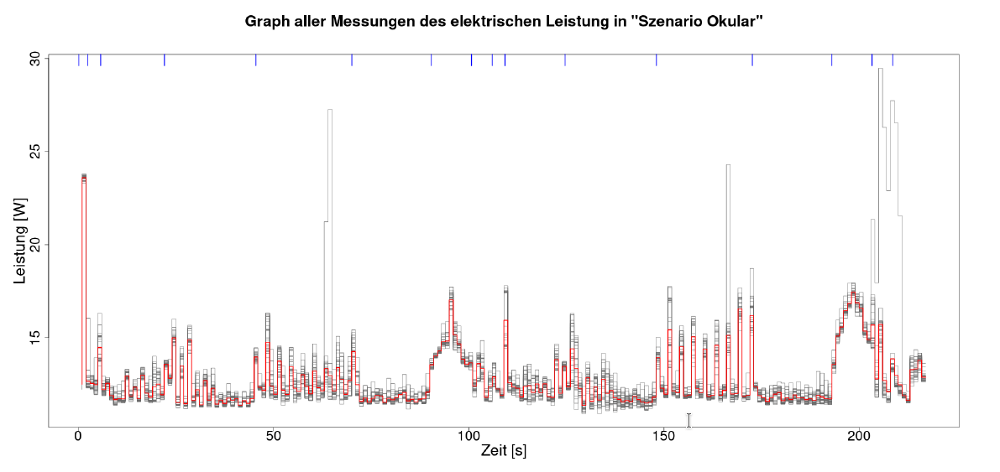

Released under the GPLv2+ license, Okular is FOSS and therefore already fulfilling many of the user autonomy criteria necessary to obtain the Blue Angel seal of approval. Further work was carried out to make Okular fully compliant with the award criteria by documenting user autonomy features, providing transparency in energy and resource consumption, and supporting the potential extension of the hardware operating life of devices.

Okular lets you check digital signatures and sign documents yourself, as well as include annotated text and comments directly embedded into the document. Okular works on Linux, Windows, Android, and Plasma Mobile, and it is available to download for all GNU/Linux distributions, as a standalone package from Flathub and the Snap Store, through the KDE F-Droid release repository for Android, as well as from the Microsoft Store. The source code is also readily available at [Okular’s GitLab repository](https://invent.kde.org/graphics/okular) for all to use, study, share, improve, and most of all, enjoy.

KDE and the Free Software community would like to send a heartfelt thank you to the Okular developers for making environmentally-friendly software for all of us!

In PART III of this handbook, we will look at the steps you need to complete to join us in having your Free Software project also recognized for its sustainable software design. First, though, what exactly are the benefits of obtaining the Blue Angel?

## Benefits Of Blue Angel

Steffi Lemke, Federal Minister for the Environment, Nature Conservation, Nuclear Safety and Consumer Protection (BMUV), has said this [about the reputation of the Blue Angel](https://www.blauer-engel.de/en/blue-angel/our-label-environment):

> An increasing number of people focus on durability and environmental friendliness when purchasing products. This is precisely what the Blue Angel stands for. The ecolabel has been a guarantee of high standards for the protection for our environment and health for 40 years in an independent and credible way.

Indeed, in their 40th anniversary info-booklet ["*Blue Angel &ndash; 40 years. Good for me. Good for the environment*"](https://www.umweltbundesamt.de/sites/default/files/medien/1410/publikationen/uba_40jahreblauerengel_publikation_en_web.pdf), the German Environment Agency (UBA) explored the history, present, and future of the ecolabel. In the booklet, they identify some of the general criteria they consider when eco-certifying a product, such as:

 - reduced emissions of harmful substances in the ground, air, water and indoors;

 - sustainable production of resources;
 
 - longevity, ability to repair and recycle the product; and

 - efficient use, e.g. products which save energy.

As you reach the end of this section, we hope it is clear how compliance with the Blue Angel award criteria for desktop software promotes the above environmental benefits, among others.

Environmental labels can be an instrument to move markets in the direction of sustainable products. As the Blue Angel website states: "The aim of the environmental label is to provide private customers, large institutional consumers and public institutions with reliable guidance for environmentally conscious purchasing."

So what does the market say?
 
A survey from the info-booklet found that 92% of Germans recognize the ecolabel, and for 37% the label influences their purchasing choices. The ecolabel is recognizable outside of Germany, too! Up to 15% of Blue Angel recipients are outside of Germany. One reason for this is that unlike some other ecolabels, the Blue Angel puts no requirements on where a product can be marketed. Moreover, the Blue Angel seal is considered a mark of high quality internationally, and the award criteria are viewed as an indicator of direction of the EU market&mdash;and they are even sometimes used as a guideline for optimizing products.

Receiving the Blue Angel seal can raise your product's profile not only among individuals, but also among large organizations. [Green Public Procurement](https://en.wikipedia.org/wiki/Sustainable_procurement) (GPP) initiatives, which "seek to promote the public procurement of goods, services, and works with a reduced environmental impact throughout their life-cycle" ([*European Commission*](https://ec.europa.eu/environment/gpp/faq_en.htm)), influence purchasing choices both in the public and [private sector](https://en.wikipedia.org/wiki/Sustainable_procurement#Private_sector). Eco-certifying your software product with the Blue Angel demonstrates a commitment to long-term digital sustainability, and it gives your product visibility both in Germany and abroad.

## A Note On Sources

Some material in this section is based directly on text from two Wikipedia articles: (i) ["*Blue Angel (certification)*"](https://en.wikipedia.org/wiki/Blue_Angel_(certification)) and (ii) ["*Software bloat*"](https://en.wikipedia.org/wiki/Software_bloat). Both texts are released under the [Creative Commons Attribution-Share-Alike License 3.0](https://spdx.org/licenses/CC-BY-SA-3.0.html). Some material in this section is also based directly on the KDE Eco blog post ["*First Ever Eco-Certified Computer Program: KDE's Popular PDF Reader Okular*"](https://eco.kde.org/blog/2022-03-16-press-release-okular-blue-angel/), which is released under the [Creative Commons Attribution-ShareAlike 4.0 International License](https://spdx.org/licenses/CC-BY-SA-4.0.html).

# PART III: FULFILLING THE BLUE ANGEL AWARD CRITERIA

 license.)](images/sec3_labplot_live-measurement.png)

The three main categories of the Blue Angel award criteria for desktop software are:

 - (A) Resource & Energy Efficiency

 - (B) Potential Hardware Operating Life

 - (C) User Autonomy

In this section we'll provide a hands-on guide to fulfilling each set of criteria. There are numerous benefits of meeting the basic award criteria. By making the energy consumption of your software transparent and complying with the hardware operating life and user autonomy criteria, you get the benefits of:

 - **Eco-Certification**: Apply for the Blue Angel ecolabel to demonstrate to users, companies, and governmental organizations that your software is designed sustainably.

 - **Data-Driven Development**: Locate inefficiencies in terms of energy and hardware consumption, and make data-driven decisions for your software development.

 - **Sustainable Design**: For the long-term sustainable use of software, and thus hardware, take the user autonomy criteria into consideration when planning your software design.
 
 - **End-User Information**: Highlight to your users the ways your software is already sustainably designed by using the Blue Angel criteria as a benchmark.

 license. [Certificate](https://thenounproject.com/icon/certificate-5461357/) icon by Ongycon licensed under a [CC-BY](https://spdx.org/licenses/CC-BY-3.0.html) license. Design by Lana Lutz.)](images/sec3_3StepsToBEECO.png)

## (A) How To Measure Your Software

The laboratory setup consists of a power meter, a computer to aggregate and evaluate the power meter output, and a desktop computer for the system under test where user behavior is emulated. The setup described here follows the specifications from the ["*Blue Angel Basic Award Criteria for Resource and Energy-Efficient Software Products*"](https://www.blauer-engel.de/en/productworld/resources-and-energy-efficient-software-products).

Terminology comes in part from Kern et al. (2018): ["*Sustainable software products &mdash; Towards assessment criteria for resource and energy efficiency*"](https://doi.org/10.1016/j.future.2018.02.044).

See also the following resources from the Umwelt Campus Birkenfeld:

 - Seiwert & Zaczyk (2021): ["*Projektbericht: Ressourceneffiziente Softwaresysteme am Beispiel von KDE-Software*"](https://invent.kde.org/cschumac/feep/-/blob/master/measurements/abschlussbericht-kmail-krita.pdf) (German only)

 - Mai (2021): "*Vergleichende Analyse und Bewertung von Betriebssystemen hinsichtlich ihrer Energieeffizienz*" (German only)

 - ["*OSCAR Manual*"](https://gitlab.umwelt-campus.de/y.becker/oscar-public/blob/master/OSCAR/static/OSCAR_Gesamt.pdf) (German only)

### Overview Of Laboratory Setup

The laboratory setup requires 1 power meter and at least 2 computers:

 - *Power Meter*

    One of the devices recommended by the Blue Angel is the [Gude Expert Power Control 1202 Series](https://www.gude.info/en/power-distribution/switched-metered-pdu/expert-power-control-1202-series.html) ([manual](https://gude-systems.com/app/uploads/2022/05/manual-epc1202-series.pdf)). It provides outlets for powering the computer and measures the current during operation. The device can be controlled and read via cabled Ethernet. There is a web-based user interface, a [REST API](http://wiki.gude.info/EPC_HTTP_Interface), and the device supports various protocols such as SNMP or syslog.

 - *Computer 1: Data Aggregator & Evaluator*

    The computer will be used for collecting and evaluating results from the power meter.

    A Python script to read out the data from the Gude Expert Power Control 1202 Series is available at the [FEEP repository](https://invent.kde.org/teams/eco/feep/-/tree/master/tools/GUDEPowerMeter).
    
    It is recommended to monitor progress live with the second computer in order to ensure everything is proceeding smoothly. This can be done with KDE's [Labplot](https://apps.kde.org/labplot2/), for instance; read more [here](#sec:labplot).

    Other power meters may require non-Free software, e.g., Janitza's [GridVis Power Grid Monitoring Software](https://www.gridvis.com/gridvis-overview.html).

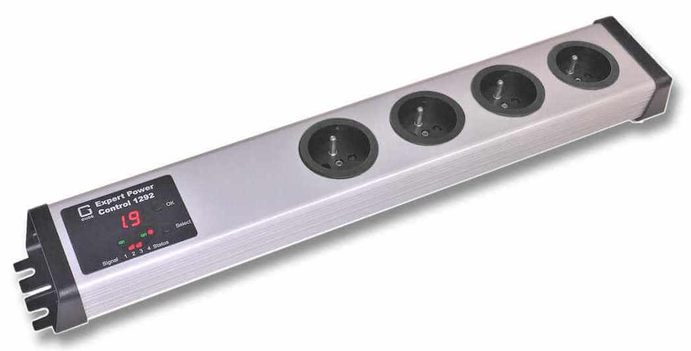

  - *Computer 2: System Under Test*

    The reference system is the hardware used to measure the energy consumption of the "system under test", or SUT. The SUT includes the operating system and software installed for (i) testing the software product, (ii) emulating the standard usage scenario[^2] and (iii) collecting the hardware performance results.

[^2]: It is possible to have a setup using 3 computers, with the Standard Usage Scenario emulation generated on a computer independent of the SUT; see Kern et al. (2018). Details of such a setup with an external workload generator can be [found at the FEEP repository](https://invent.kde.org/teams/eco/feep/-/tree/master/tools/arduino-board_external-workload-generator.md).
 
Note the following:

 - For GNU/Linux systems, the [Blue Angel criteria (Section 1.1)](https://www.blauer-engel.de/en/productworld/resources-and-energy-efficient-software-products) require one of several Fujitsu computers as the reference system.

 - For emulating activity in the standard usage scenario, Free Software task automation tools such as [`xdotool`](https://github.com/jordansissel/xdotool), [`KDE Eco Tester` (in progress)](https://invent.kde.org/teams/eco/feep/-/tree/master/tools/KdeEcoTest), or [`Actiona`](https://wiki.actiona.tools/doku.php?id=en:start) (GPLv3) can be used.

 - For collecting hardware performance data (e.g., processor and RAM utilization, hard disk activity, network traffic), the Free Software tool [`Collectl`](https://sourceforge.net/projects/collectl/) (GPLv2/Artistic License) is available.

 - It's also possible to [repurpose cheap switchable power plugs as measurement devices](https://volkerkrause.eu/2020/10/17/kde-cheap-power-measurement-tools.html); see Section ["Alternative: Gosund SP111 Setup"](#sec:gosundPM) for set up instructions.

 license. Design by Lana Lutz.)](images/sec3_lab-setup_modified.png)

#### System Under Test (SUT)

For instance, the Fujitsu Esprimo P920 Desktop-PC proGreen selection (Intel Core i5-4570 3,6GHz, 4GB RAM, 500GB HDD) is one of the recommended reference systems; see Appendix D in the award criteria for other recommended Fujitsu systems.

On the reference system you need to set up the SUT, i.e., the system on which you will test the software. The SUT must reduce unrelated energy consumption and have a standardized configuration. Recommended is the following:

 - Overwrite the entire hard drive of the machine with a standardized OS.

 - Deactivate all possible background processes (automatic updates, backups, indexing, etc.).

 - Install the necessary software, i.e., the application to be measured as well as the user emulation (e.g., `xdotool`) and hardware performance data (e.g., `Collectl`) software.
 
 - When running the usage scenario scripts, the cache should be cleared between runs and any new files deleted before starting the next measurement.

#### Preparing The Standard Usage Scenario (SUS)

Preparing the SUS requires the following:

 - Identifying tasks users typically carry out when using the application under consideration.

 - Identifying functionalities which require high energy demand or high resource utilization.

 - Based on the above, scheduling a flow chart of individual actions and emulating these actions with a task automation tool.
 
 - Scheduling a wait-period of 60 seconds before starting the measurement is recommended.

 - Running the SUS for at least 5 minutes.

 license. Design by Lana Lutz.)](images/sec3_PreparingSUS.png)

An automation tool is meeded to run the usage scenarios so as not to require human intervention. In this way the script can be run repeatedly in a well-defined manner to provide accurate measurements.

Example tasks and functions tested in the SUS for KDE's email client [`KMail`](https://apps.kde.org/kmail2/) include searching for an email, writing a reply or forwarding the email, saving an attachment, deleting a folder in the mail client, etc. See the [Actiona scripts](https://invent.kde.org/teams/eco/feep/-/tree/master/measurements) used to test Krita and Okular for further examples.

Important: If the emulation tool uses pixel coordinates to store the position of the automated clicks (e.g., `Actiona`) and, moreover, the screen resolution of the computer used in preparation differs from that of the laboratory computer, all pixel coordinates will have to be reset for the laboratory environment.

##### More Emulation Tools

Beyond [`xdotool`](https://github.com/jordansissel/xdotool), [`KDE Eco Tester` (in progress)](https://invent.kde.org/teams/eco/feep/-/tree/master/tools/KdeEcoTest), or [`Actiona`](https://github.com/Jmgr/actiona), there are other candidates for tools which might meet the requirements. See a list from KDE Contributor David Hurka in the presentation ["*Visual Workflow Automation Tools*"](https://invent.kde.org/teams/eco/feep/-/tree/master/tools/presentation_Visual_Workflow_Automation_Tools). Most of the tools use X11-specific features, and thus do not work on Wayland systems. There are a few possible approaches here:

 - [Selenium Webdriver using AT-SPI](https://invent.kde.org/sdk/selenium-webdriver-at-spi) (currently in testing for [Season of KDE 2023](https://dot.kde.org/2023/01/23/season-kde-2023-mentees-and-projects))

 - [The XDG RemoteDesktop portal](https://docs.flatpak.org/en/latest/portal-api-reference.html#gdbus-org.freedesktop.portal.RemoteDesktop)

 - Various Wayland protocols (support varies between compositors):
    - <https://github.com/swaywm/wlr-protocols/blob/master/unstable/wlr-virtual-pointer-unstable-v1.xml>
    - <https://api.kde.org/frameworks/kwayland/html/classKWayland_1_1Client_1_1FakeInput.html>

 - [libinput user devices](https://lwn.net/Articles/801767/)

### Measurement Process

The measurement process is defined in Appendix A of the [Basic Award Criteria](https://www.blauer-engel.de/en/productworld/resources-and-energy-efficient-software-products). It requires recording and logging energy data and performance indicators with a granularity of 1-second so that they can be processed and average values can be calculated.

Some general comments:

 - Times between the PM and DAE must be synchronized.

 - When using `Collectl` to collect performance load, ensure it is running in the console of the SUT; also, check that the required CSV file is correctly generated before testing.

 - Since each run of the usage scenarios results in changes to the standard operating system, clearing the cache between runs is recommended.

 - All runs (Baseline, Idle Mode, Standard Usage Scenario) must be for the same length of time, based on the time needed to run the usage scenario script.

 - On the DAE you may want to confirm that the desired power outlet is read out correctly before and/or during testing (e.g., with a live graph using `LabPlot`).

During the energy measurements, [`Collectl`](https://sourceforge.net/projects/collectl/) is used to record a set of performance indicators: processor utilisation, RAM utilisation, hard disk activity, and network traffic. Use the following command to obtain this hardware performance data:

`$ collectl -s cdmn -i1 -P --sep 59 -f ~/<FILENAME>.csv`

The options are as follows:

 - `-s cdmn`
 
    collect CPU, Disk, memory, and network data

 - `-i1`

    sampling interval of 1 second

 - `-P`

    output in plot format (separated data which consists of a header with one line per sampling interval)

 - `--sep 59`

    semicolon separator

 - `-f </PATH/TO/FILE>.csv`

    save file at specified path

#### Measuring Baseline, Idle Mode, And Standard Usage Scenarios

 -  Baseline Scenario: *Operating System* (OS)

    To establish the baseline, a scenario is measured in which the OS is running but no actions are taken.

 -  Idle Mode Scenario: *OS + Application While Idle*

    To establish the energy consumption and hardware performance data of the application while idle, a scenario is measured in which the application under consideration is opened but no action is taken.

    Important: the baseline and idle mode must be run for the same time needed to carry out the standard usage scenario. Since the power consumption for the baseline and idle scenario is relatively uniform, 10 repetitions for each is considered sufficient to obtain a representative sample (Seiwert & Zaczyk 2021).

 -  Standard Usage Scenario: *OS + Application In Use*

    To measure the energy consumption and hardware performance data of the application in use, the standard usage scenario should be run; see SUS preparation notes above. The measurement of the standard usage scenario should be repeated 30 times, which will take several hours to complete. The higher number of repetitions is necessary to obtain a representative sample as the energy consumption and performance data may vary across measurements.

####  Monitoring Output With Labplot

You can use KDE's [LabPlot](https://apps.kde.org/labplot2/) to monitor the output live as data is coming in. To do this:

 - Redirect the power meter output to a CSV file.

 - In LabPlot, import the CSV file by selecting `File > Add New > Live Data Source ....`

 - Under "Filter", select the Custom option. Under "Data Format", define the separator value used (e.g., comma, semi-colon, space).

 - You can check that the output is correct under the "Preview" tab.
 
 - If everything looks good, click OK.
 
 - Finally, right-click on the data frame window and selecting `Plot Data > xy-Curve`.

### Analysis Of The Results With OSCAR

Once you have results, the Umwelt Campus Birkenfeld provides a useful tool for generating reports called `OSCAR` (**O**pen source **S**oftware **C**onsumption **A**nalysis in **R**):

  - [Source Code](https://gitlab.rlp.net/green-software-engineering/OSCAR-public)

  - [Running instance](https://oscar.umwelt-campus.de/)

See also the OSCAR Manual with detailed instructions, including additional screenshots on how to use `OSCAR`.

#### CSV Files 

Analysis with `OSCAR` requires uploading the following files to the [OSCAR website](https://oscar.umwelt-campus.de/):

 - (i) a log file of actions taken,
 - (ii) the energy consumption data, and
 - (iii) the hardware performance data. 

All files should be CSV files. Some preprocessing of the raw data may be necessary (e.g., performance data measured by `Collectl`; see below).

Important: `OSCAR` is **very** particular about data frame formats, including column names and cell values. The tables here provide examples which are confirmed to work. If you are having issues generating a report from your CSV files, make sure CSV files are as similar as possible to those shown here.

If you just want to test OSCAR, you can download data for Okular in [this ZIP file](https://invent.kde.org/teams/eco/feep/-/blob/master/measurements/okular/2022-09-22/2022-okular-data.zip). The data are confirmed to successfully generate a report using OSCAR v0.190404. The report which was generated can also be downloaded at the [FEEP repository](https://invent.kde.org/teams/eco/feep/-/blob/master/measurements/okular/2022-09-22/Bericht%20OSCAR%20Standardnutzungsszenario.pdf).

##### Log File Of Actions

The log file of actions should have the following format. Note the columns are separated by a semi-colon. Also, columns have no names (i.e., there is no header in the CSV file). Note that the start and end of each iteration must be labelled with 'startTestrun' and 'stopTestrun' in the second column, whereas the actions can be listed with any name.

|                       |                |         |
|-----------------------|----------------|---------|
| YYYY-MM-DD HH:MM:SS ; | startTestrun ; |         |
| YYYY-MM-DD HH:MM:SS ; |              ; | action1 |
| YYYY-MM-DD HH:MM:SS ; |              ; | action2 |
| YYYY-MM-DD HH:MM:SS ; |              ; | action3 |
| YYYY-MM-DD HH:MM:SS ; | stopTestrun  ; |         |

An example log file of actions for measuring KDE's text and code editor [`Kate`](https://apps.kde.org/kate/). The (i) date and time as well as (ii) start and stop times and (iii) actions are listed in three columns.

|                       |                |                               |
|-----------------------|----------------|-------------------------------|
| 2022-05-21 18:54:36 ; | startTestrun ; |                               |
| 2022-05-21 18:55:41 ; |              ; | go to line 100                |
| 2022-05-21 18:55:46 ; |              ; | toggle comment                |
| 2022-05-21 18:55:50 ; |              ; | find kconfig                  |
| 2022-05-21 18:55:55 ; |              ; | move between searches 6 times |
| 2022-05-21 18:56:05 ; |              ; | close find bar                |
| 2022-05-21 18:56:05 ; |              ; | standby 30 sec                |
| 2022-05-21 18:56:35 ; |              ; | go to line 200                |
| 2022-05-21 18:56:40 ; |              ; | select 10 lines               |
| 2022-05-21 18:56:43 ; |              ; | delete selected text          |
| [...]               ; |              ; | [...]                         |
| 2022-05-21 18:59:13 ; | stopTestrun  ; |                               |
 
##### Energy Consumption Data

The energy consumption data has the following format: the first column is the row number, the second column is the date and time in one-second increments, and the third column is the measurement output in Watts. Note that the following is confirmed to work with OSCAR: (i) the second and third column names as written below (i.e., "Zeit" and "Wert 1-avg[W]"), (ii) the date-time as a character string with the date and time separated by a comma, and (iii) no string delimiter used in the CSV file.

|   ; | Zeit ;               | Wert 1-avg[W] |
|-----|----------------------|---------------|
| 1 ; | DD.MM.YY, HH:MM:SS ; | value1        |
| 2 ; | DD.MM.YY, HH:MM:SS ; | value2        |
| 3 ; | DD.MM.YY, HH:MM:SS ; | value3        |
| 4 ; | DD.MM.YY, HH:MM:SS ; | value4        |

When using the Gude Power Meter with the [Python script](https://invent.kde.org/teams/eco/feep/-/tree/master/tools/GUDEPowerMeter) available at the FEEP repository, the timestamp will be recorded in [nanoseconds in Epoch time](https://en.wikipedia.org/wiki/Epoch_time). For instance, below is an example of the raw output for 7 rows from the Gude Power Meter output using the Python script. The first column shows the timestamp. The second column is the readout from the power meter in Watts.

|                    |    |
|--------------------|----|
| 1661611923019071 ; | 43 |
| 1661611923142924 ; | 43 |
| 1661611924293989 ; | 29 |
| 1661611924417017 ; | 28 |
| 1661611924744885 ; | 28 |
| 1661611924869051 ; | 28 |
| 1661611924992392 ; | 28 |

The raw data can be preprocessed in R: Nanoseconds in Epoch time can be converted to date-time with the command `as.POSIXct(<NANOSECONDS>/1000000, origin = '1970-01-01', tz = 'Europe/Berlin')`. For example, the nanoseconds in row 1 from the raw output is "2022-08-27 16:52:03 CEST" after conversion.

For use with OSCAR, this date-time should then be converted to a character string with the date as DD.MM.YY followed by a comma. All of this can be achieved with one command (this operation can be vectorized over the entire column in the data frame); replace the YYYY-MM-DD date with the date of your measurements:

    `stringr::str_replace(as.character(as.POSIXct(1661611923019071/1000000, origin = '1970-01-01', tz = 'Europe/Berlin')), '2022-08-27', '27.08.22,')`

The output in Watts should be averaged per second. The same data above is shown below after processing with R; note the 7 values above are averaged per second, resulting in two rows.

To save the CSV file with a semi-colon separator, the first column with row names starting at the number 1, and no string delimiter, use the following R command:

    `write.csv2(<DATAFRAME>, file = <PATH/TO/FILE.csv>, row.names = TRUE, quote = FALSE)`

The result should look something like the following:

|  ;  | Zeit ;               | Wert 1-avg[W]   |
|-----|----------------------|-----------------|
| 1 ; | 27.08.22, 16:52:03 ; | 43.00000        |	
| 2 ; | 27.08.22, 16:52:04 ; | 28.20000        |

##### Performance Data (Raw)

When using `Collectl` for hardware performance data, it is necessary to do the following before uploading the data to OSCAR.[^3]

[^3]: See Seiwert & Zaczyk 2021: p. 13 for details; see also Appendix A 2 on p. 46 for a Python script to automate some of these tasks.

 - Remove all information above the header row.

 - Remove all \# characters from the file.

 - In the first column, no separator value should come between the data-time (otherwise, the date and time will be interpreted as two separate columns).

 - The date should also have a character inserted between YYYYMMDD, e.g., MM.DD.YYYY as above. Whatever character is used must be specified in `OSCAR`.
 
 - Column names can be anything you want as they will be specified within `OSCAR`.

 - The file must be saved in CSV format.

Moreover, the hardware performance output from `Collectl` includes many columns that are not necessary for analysis. The only measurements that need to be specified are the following columns:

 - [CPU]Totl = Processor
 - [MEM]Used = Main memory - used kilobytes
 - [NET]RxKBTot = Network - Kilobytes received/s
 - [NET]TxKBTot = Network - Kilobytes transmitted/s
 - [DSK]ReadKBTot = Disk - Kilobytes read/s
 - [DSK]WriteKBTot = Disk - kilobytes written/s.
 
Below is an example of the preprocessed results from `Collectl` measuring the performance data for Kate. The timestamp increases in one-second increments.

| Date-Time ; | cpu ; | mem ; | net_rec ; | net_trn ; | dsc_rd ; | dsc_wr |
|-|-|-|-|-|-|-|
| 27.08.2022 16:47:10 ; | 1 ; | 7131968 ; | 0 ; | 0 ; | 0 ; | 0   |
| 27.08.2022 16:47:11 ; | 4 ; | 7131968 ; | 0 ; | 0 ; | 0 ; | 0   |
| 27.08.2022 16:47:12 ; | 1 ; | 7131968 ; | 0 ; | 0 ; | 0 ; | 0   |
| 27.08.2022 16:47:13 ; | 1 ; | 7131968 ; | 0 ; | 0 ; | 0 ; | 120 |
| 27.08.2022 16:47:14 ; | 1 ; | 7131968 ; | 0 ; | 0 ; | 0 ; | 0   |
| 27.08.2022 16:47:15 ; | 1 ; | 7131968 ; | 0 ; | 0 ; | 0 ; | 56  |
| 27.08.2022 16:47:16 ; | 1 ; | 7131968 ; | 0 ; | 0 ; | 0 ; | 48  |
| 27.08.2022 16:47:17 ; | 1 ; | 7131968 ; | 0 ; | 0 ; | 0 ; | 0   |
| 27.08.2022 16:47:18 ; | 1 ; | 7131968 ; | 0 ; | 0 ; | 0 ; | 0   |
| 27.08.2022 16:47:19 ; | 4 ; | 7131968 ; | 0 ; | 0 ; | 0 ; | 132 |

#### Uploading Data

Once the above CSV files are ready, you can run the analysis using OSCAR, which will generate a summary report you can use either for eco-certification or for your own data-driven purposes. In the `OSCAR` interface, note the following:

 - The interface language is currently German only; see below for translations.

 - The duration of the measurements in seconds must be specified.

 - A semicolon separator is used.

 - The correct formatting of the time stamp must be specified for each of the uploaded files, e.g.,`%Y-%m-%d %H:%M:%OS`.

##### Step 1: Obtain Measurement Data

The landing page of the website (below) states that the first step is obtaining measurement data (German: *Erfassung Messdaten*). If you are at this point in the process, you should have already measured your software and prepared the CSV files.

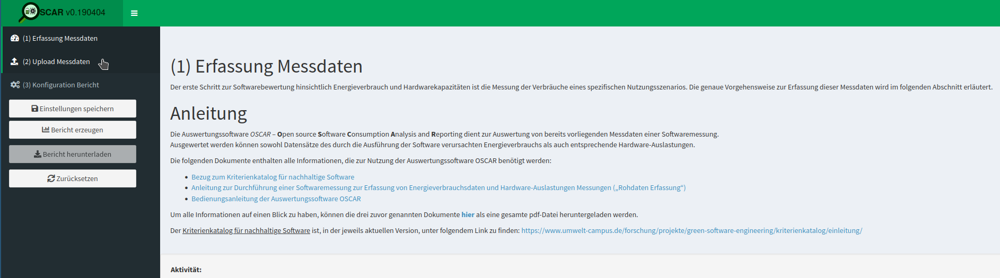

All examples here are based on the Okular data in [this ZIP file](https://invent.kde.org/teams/eco/feep/-/blob/master/measurements/okular/2022-09-22/2022-okular-data.zip).

##### Step 2: Upload Measurement Data

Once you have the CSV files for the baseline, idle mode, and standard usage scenario measurements ready, click on *(2) Upload Messdaten* > *Upload*.

The measurement data (German: *Messdaten*) include the log file of actions (German: *Aktionen*), energy consumption (German: *Elektrische Leistung*), and hardware performance data (German: *Hardware-Auslastung*).

 - Under *Messungen*, upload either the idle mode or standard usage scenario measurement data.  

   For *Art der Messung* ('Type of Measurement') in the lower right of the UX, select *Leerlauf* ('Idle Mode') or *Nutzungsszenario* ('Usage Scenario') depending on which report you wish to generate.

 - Under *Baselines* upload the baseline measurement data.

 - Indicate the duration of the measurement scenarios in seconds (German: *Dauer der Einzelmessungen (s)*).

Note that the baseline measurements are always uploaded along with either the idle mode or standard usage scenario measurements.

See below for what a completed upload for the *Nutzungsszenario* looks like.

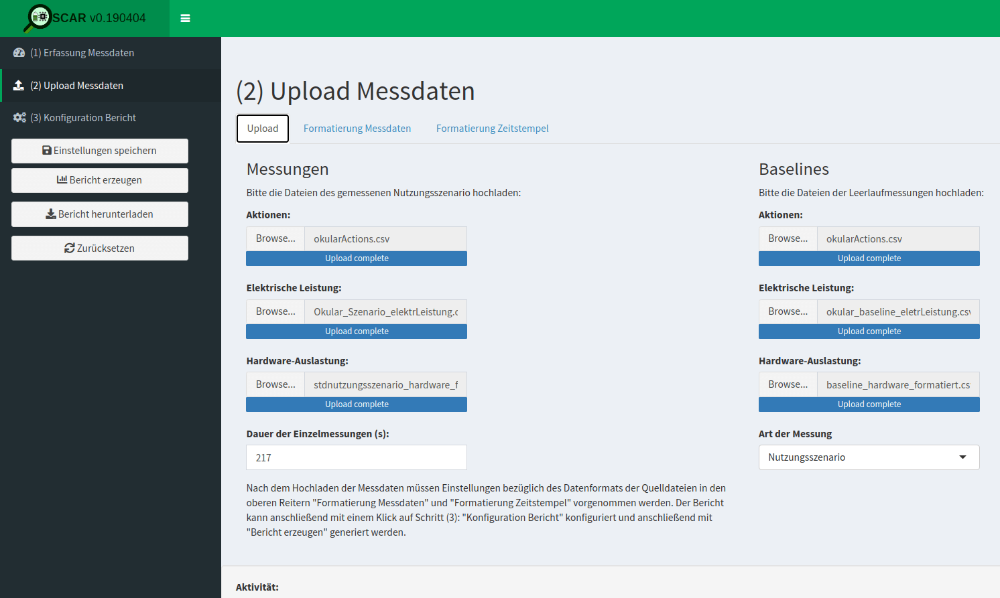

###### Timestamps

Once the data has been uploaded, you will need to tell `OSCAR` how to read the data.

Let's start with the timestamp format (German: *Formatierung Zeitstempel*). This is one aspect of the process which can cause problems if not done correctly. This is done under *(2) Upload Messdaten* > *Formatierung Zeitstempel*.

Consider the Okular data:

 - For the log file of actions, the datetime is encoded as *YYYY-MM-DD HH:MM:SS* (e.g., "2022-10-04 12:32:43.656" in "okularActions.csv").
  
   In `OSCAR`, this is specified as "%Y-%m-%d %H:%M:%OS" (see screenshot below). OSCAR will take care of the fractional seconds.

 - For the energy consumption data, the datetime is encoded as *DD.MM.YY, HH:MM:SS* (e.g.,  "04.10.22, 12:32:43" in "okular_baseline_eletrLeistung.csv"). Note the period in the date and the comma seperating date from time, as well as only having two digits for the year.
  
   In `OSCAR` this is specified as "%d.%m.%y, %H:%M:%OS" (see screenshot below), in which the lowercase "%y" indicates a year with two digits.

 - For the hardware performance data, the datetime is encoded as *DD.MM.YYYY HH:MM:SS* (e.g.,  "04.10.2022 12:31:43" in "baseline_hardware_formatiert.csv"). Note the period in the date and the four-digit year.
  
   In `OSCAR`, this is specified as: "%d.%m.%Y %H:%M:%OS" (see screenshot below), in which the uppercase "%Y" indicates a year with four digits.

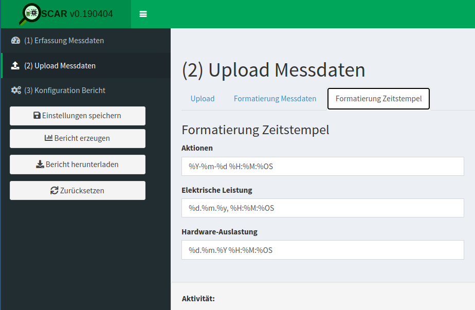

###### Measurement Data

After the timestamps have been correctly specified, let's explore the format of the measurement data (German: *Formatierung Messdaten*) in `OSCAR`.

First, take a look at the log file of actions (German: *Aktionen*). This is done under *(2) Upload Messdaten* > *Formatierung Messdaten* > *Aktionen*.

Here you need to indicate for the uploaded CSV file the separator (German: *Trennzeichen*), the string delimiter (German: *Textqualifizierer*), and the decimal separator (German: *Dezimaltrennzeichen*).

For the Okular data, this is defined as a semi-colon separator, double quotation string delimiter, and a period or full-stop decimal separator (see screenshot below).

Additionally, you will need to specify the following:

 - whether the first line contains headings (German: *Erste Zeile enthält Überschriften*);
 - the number of lines to skip (German: *Anzahl zu überspringender Zeilen*); and
 - the character encoding (German: *Zeichensatz (Encoding)*).
 
For the Okular data, this is defined as follows in the following screenshot: "first line contains headings" is unchecked, 0 lines are skipped, and character encoding is utf-8.

When everything is defined correctly, a preview of the spreadsheet will be shown.

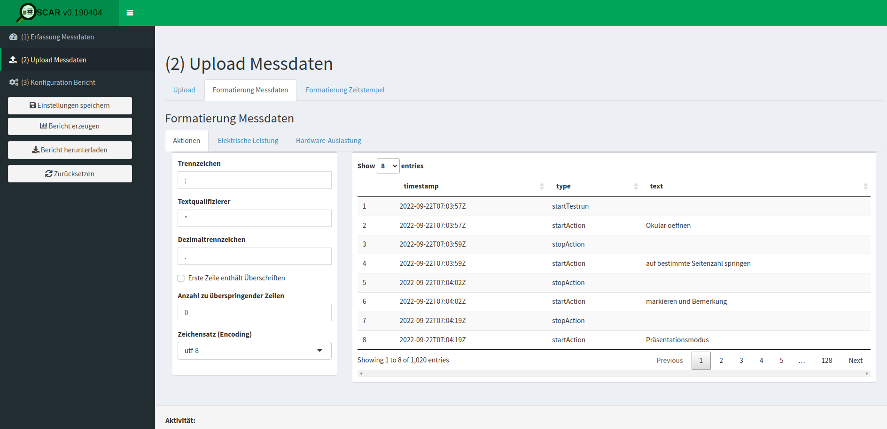

Second, take a look at the energy consumption measurements (German: *Elektrische Leistung*). This is done under *(2) Upload Messdaten* > *Formatierung Messdaten* > *Elektrische Leistung*.

The required input is the same as for the log file of actions, seen in the following screenshot.

For the Okular data here, this is a semi-colon separator, double quotation string delimiter, and character encoding utf-8. However, now a comma is specified for the decimal separator and a checkmark indicates that the first line contains headings. Finally, the 1st line is skipped.

When everything is defined correctly, a preview of the spreadsheet will be shown.

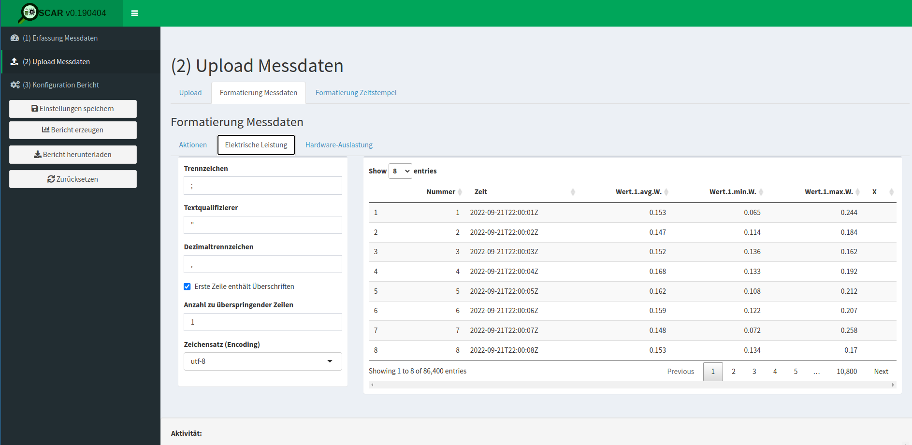

Finally, take a look at the hardware performance data (German: *Hardware-Auslastung*). This is done under *(2) Upload Messdaten* > *Formatierung Messdaten* > *Hardware-Auslastung*.

The required input is the same. The input in this example is a semi-colon separator, a double quotation string delimiter, a period (a.k.a. full stop) decimal separator. There is a checkmark that the first line contains headings, 0 lines are skipped, and the character encoding is utf-8.

However, now there is the additional requirement of specifying the columns (German: *Spalten*).

For the columns specification, the following need to be identified; select NA for unused columns, e.g., "Auslastung Auslagerungsdatei" here.

 - *Zeitstempel*: Datetime (i.e., 'Date-Time')
 - *CPU-Auslastung*: CPU (i.e., 'X.CPU.Totl')
 - *RAM-Auslastung*: RAM (i.e., 'X.MEM.Used')
 - *Über Netzwerk gesendet*: Network transmitted (i.e., 'X.NET.TxKBTot')
 - *Über Netzwerk empfangen*: Network received (i.e., 'X.NET.RxKBTot')
 - *Von Festplatte gelesen*: Disk read (i.e., 'X.DSK.ReadKBTot')
 - *Auf Festplatte geschrieben*: Disk written (i.e., 'X.DSK.WriteKBTot')
 - *Auslastung Auslagerungsdatei*: Swap (here, 'N/A')

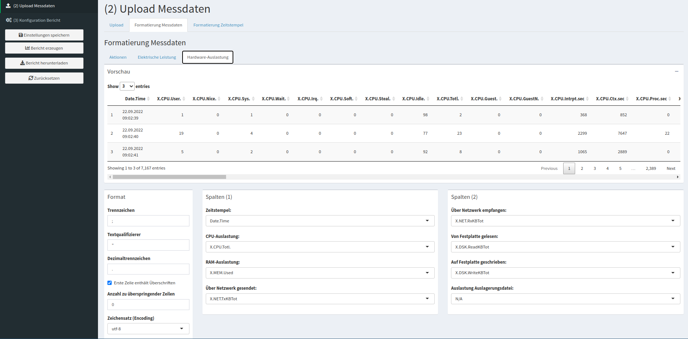

###### Translations

Here is an overview of some of the German terminology used in `OSCAR` and the English translations:

 - *Messungen*: Measurements (e.g., Idle Mode or SUS)
 - *Aktionen*: Actions (i.e., log file of actions taken)
 - *Elektrische Leistung*: 'Electrical power' (i.e., energy consumption measurements)
 - *Hardware-Auslastung*: 'Hardware load' (i.e., hardware performance measurements)
 - *Dauer der Einzelmessungen (s)*: 'Duration of the individual measurements (s)' (i.e., specify how long each iteration was in seconds)
 - *Art der Messung*: 'Type of measurement'
     - *Leerlauf*: 'Idle' (i.e., Idle mode)
     - *Nutzungsszenario*: 'Usage scenario' (i.e., SUS)

 - *Formatierung Messdaten*: 'Formatting measurement data'
 - *Formatierung Zeitstempel*: 'Formatting timestamp'

 - *Trennzeichen* 'Separator'
 - *Textqualifizierer*: 'String delimiter'
 - *Dezimaltrennzeichen*: 'Decimal separator'
 - *Erste Zeile enthält Überschriften*: 'First line contains headings'
 - *Anzahl zu überspringender Zeilen*: 'Number of lines to skip'
 - *Zeichensatz (Encoding)*: 'Character set (encoding)'
 
 - *Spalten*: Columns
     - *Zeitstempel*: 'Datetime'
     - *CPU-Auslastung*: 'CPU utilization'
     - *RAM-Auslastung*: 'RAM utilization'
     - *Über Netzwerk gesendet*: 'Sent via network'
     - *Über Netzwerk empfangen*: 'Received via network'
     - *Von Festplatte gelesen*: 'Read from disk'
     - *Auf Festplatte geschrieben*: 'Written to disk'
     - *Auslastung Auslagerungsdatei*: 'Swap file utlization'

##### Step 3: Generating The Reports (Idle, SUS)

After completing the above, the report can be generated and downloaded. You will need to do this process twice, once for (i) the idle mode and (ii) standard usage scenario measurements, resulting in two documents.

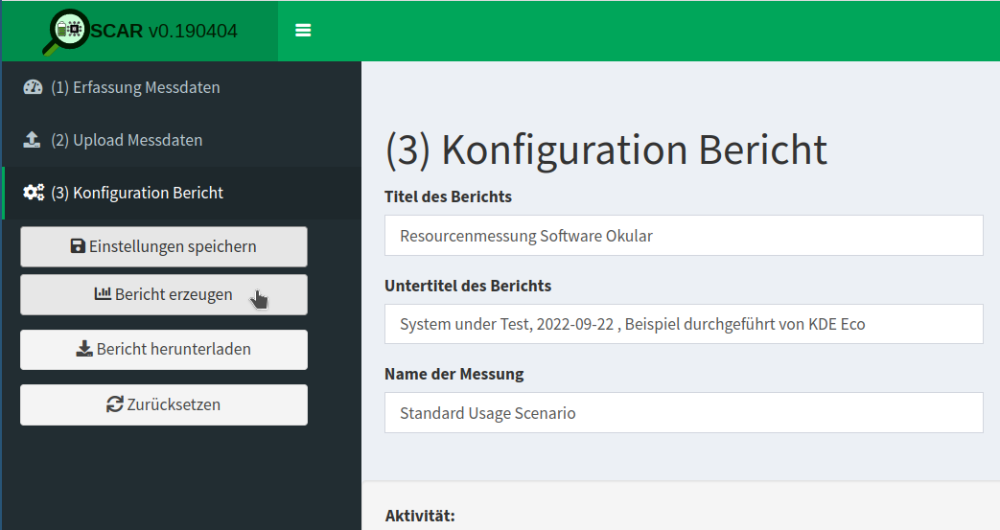

For Blue Angel eco-certification, the two reports will be submitted for evaluation by RAL.

For examples of the above for Okular, see KDE's [Blue Angel Applications](https://invent.kde.org/teams/eco/blue-angel-application) repository:

 - [OSCAR Report: Idle Mode](https://invent.kde.org/teams/eco/blue-angel-application/-/blob/master/applications/okular/de-uz-215-eng-annex-3-okular-idle.pdf)
 - [OSCAR Report: SUS](https://invent.kde.org/teams/eco/blue-angel-application/-/blob/master/applications/okular/de-uz-215-eng-annex-3-okular-scenario.pdf)

### Preparing The Documentation For Blue Angel

For Blue Angel eco-certification, it is necessary to complete several forms alongside the two reports from `OSCAR`.

Information that needs to be included in the forms is as follows:

 - Details about the software (name, version) and measurement process (when and where measurements were made, etc.).

 - Technical details about the power meter (instrument, sampling frequency, length of scenario, sample size).

 - Technical details about the reference system (year, model, processor, cores, etc.).

 - Software stack used for the measurements (`xdotool`, `Collectl`, etc.).

 - Minimum system requirements (processor architecture, local working memory, etc.).

 - Energy consumption results found in the `OSCAR` reports or equivalent.

 - Hardware utilization results, which includes the following (for IDLE use the idle mode measurements, and for SUS use the standard usage scenario measurements):
   - *Full Load*: "For processing power, the full load is 100%, for working memory the sum of the installed RAM capacities, for network bandwidth the maximum transmission speed, etc." (Blue Angel award criteria: p. 23).
   - *Base Load*: Average load for the reference system in Baseline measurements.
   - *Idle/SUS Load*: Average load for the reference system for IDLE/SUS measurements.
   
     From the above measurements, the following calculations are made for hardware utilization (for IDLE use the idle mode measurements, and for SUS use the standard usage scenario measurements):
     - *Net Load*: IDLE/SUS Load - Base Load
     - *Allocation Factor*: Net Load/(Full Load - Base Load)
     - *Effective Load*: Net Load + Allocation Factor * Base Load
     - *Hardware Utilization* (SUS only): Effective Load * Time (seconds)

For Blue Angel eco-certification, the above information will be added to two documents called "Annex 1" and "Annex 2".

For examples of the above for Okular, see KDE's [Blue Angel Applications](https://invent.kde.org/teams/eco/blue-angel-application) repository:

 - [Annex 1](https://invent.kde.org/teams/eco/blue-angel-application/-/blob/master/applications/okular/de-uz-215-eng-annex-1-okular.docx)
 - [Annex 2](https://invent.kde.org/teams/eco/blue-angel-application/-/blob/master/applications/okular/de-uz-215-eng-annex-2-okular.xlsx)

###  Alternative: Gosund SP111 Setup

Want to get started with the process of measuring your software, but short on cash or gear? Want to give the process a try without setting up a dedicated lab? Try this hack converting an inexpensive power plug to a power meter, courtesy of Volker Krause, who also documented the process provided here. You can read more at the following posts from Volker's blog:

 - ["*Cheap Electric Power Measurement*"](https://web.archive.org/web/20221002125057/https://volkerkrause.eu/2020/10/17/kde-cheap-power-measurement-tools.html)

 - ["*KDE Eco Sprint July 2022*"](https://web.archive.org/web/20220819231538/https://www.volkerkrause.eu/2022/07/23/kde-eco-sprint-july-2022.html)

Below is a guide to setting up a [Gosund SP111](https://templates.blakadder.com/gosund_SP111_v2.html) power plug already [flashed](https://github.com/tasmota/docs/blob/development/docs/devices/BlitzWolf-SHP6.md) with [Tasmota firmware](https://tasmota.github.io/docs) in 10 steps.

Although the data from the inexpensive power meter will likely not be accepted by the Blue Angel for eco-certification, it is nonetheless possible to obtain preliminary data using this tool.

 - (0) *Prerequisite*
 
    It is necessary to have the power plug already flashed with a sufficiently new Tasmota version.

 - (1) *Firmware Reset*
 
    If the device had previously been connected to another Wifi network, it might need a full reset before being able to connect to a new one.

    If the device did open a WiFi access point named "tasmota-XXXXX" this is not needed, continue directly to (2).

    Press the button for 40 seconds.

    The device will restart and you should be able to continue at (2).

 - (2) *WiFi Setup*

    The device opens a WiFi access point named "tasmota-XXXXX"&mdash;connect to that.

    Open http://192.168.4.1 in a browser.

    The device will ask you for the WiFi name and password to connect to after entering those. The device will reconnect to that WiFi and disable its access point.

    While doing that it should show you its new address in the browser&mdash;make a note of it.

    In case that did not happen, check your WiFi router for the address of the device.

 - (3) *Tasmota Setup*

    Open the address from step (2) in a browser.

    You should see the Tasmota web UI (a big "ON/OFF" text and a bunch of blue and one red button).

    Click "Configuration".

    Click "Configure Other".

    Copy

            {"NAME":"Gosund SP111 2","GPIO":
            [56,0,57,0,132,134,0,0,131,17,0,21,0],"FLAG":0,
            "BASE":18}

    into the template input field.

    Tick the "Activate" checkbox.

    Click "Save".

    The device will restart; connect to it again.

    The UI should now also contain text fields showing electrical properties, and the "Toggle" button should now actually work.

 - (4) *Calibration*

    Open the address from step (2) in a browser.

    Connect a purely resistive load with a known wattage, such as a conventional light bulb (not a LED or energy-saving bulb).

    Switch on power by clicking "Toggle" if needed.

    Verify that the "Power Factor" value is shown as 1 (or very close to 1); if it is lower, the current load is not suited for calibration.

    Click "Console".

    Enter the following commands one at a time and press enter:

          AmpRes 3  
          VoltRes 3  
          EnergyRes 3  
          WattRes 3  
          FreqRes 3  
          SetOption21 1
          VoltageSet 230

    Enter the command PowerSet XXX with XXX replaced by the wattage specified for the test load (e.g., "40" for a 40W light bulb).

    Click "Main Menu".

    The main page now should show correct power readings with several decimals precision.

 - (5) *MQTT Broker Setup*

    At present, the only known way to achieve high-frequency automatic readouts is by polling over MQTT. This is not ideal and needs additional setup, unfortunately.

    If you happen to have a MQTT Broker around already, skip to step (6); otherwise, you need to set one up. The below scenario assumes Mosquitto is packaged for your GNU/Linux distribution (and therefore does not configure any security), so only do this in your own trusted network and switch it off when not needed.

   - install the `mosquitto` package
   - add a file `/etc/mosquitto/conf.d/listen.conf` with the following content:

          listener 1883  
          allow_anonymous true

   - start Mosquitto using `systemctl start mosquitto.service`

 - (6) *MQTT Tasmota Setup*

    Connect to the Tasmota device using a web browser, and open the MQTT configuration page via Configuration > Configure MQTT.
    
    Enter the IP address of the MQTT broker into the "Host" field.

    Note down the value shown right of the "Topic" label in parentheses (typically something like "tasmota_xxxxxx"). This will be needed later on to address the device via MQTT. You can also change the default value to something easier to remember, but this has to be unique if you have multiple devices.

    Click "Save".

    The device will restart and once it is back you should see output in its Console prefixed with "MQT".

 - (7) *Verifying MQTT Communication*

    This assumes you have the Mosquitto client tools installed, which are usually available as distribution packages.

    You need two terminals to verify that MQTT communication works as intended.

      - In terminal 1, run `mosquitto_sub -t 'stat/<topic>/STATUS10'`
      - In terminal 2, run `mosquitto_pub -t 'cmnd/<topic>/STATUS' -m '10'`

    Replace `<topic>` with the value noted down in step (6).

    Everytime you run the second command, you should see a set of values printed in the first terminal.

 - (8) *Continuous Power Measurements*

    See [these scripts](https://volkerkrause.eu/2020/10/17/kde-cheap-power-measurement-tools.html).

 - (9) *Switching WiFi Networks*

    For security reasons, once connected to a WiFi network, Tasmota will not let you get back to step (2) by default without hard resetting the device (40-second button press). However, a hard reset also removes all settings and the calibration. If you need to move to a different network, there are less drastic options available, but these changes can only be made inside the network you originally connected to:

    Under Configuration > Configure WiFi, you can add details for a second WiFi access point. Those will be tried alternatingly with the first configuration by default. This does not compromise security, but requires you to know the details for the network you want to connect to.

    You can configure Tasmota to open an access point as in step (2) by default for a minute or so after boot, and then try to connect to the known configurations. This makes booting slower in known networks, and opens the potential for hijacking the device, but it can be convenient when switching to unknown networks. This mode can be enabled in the Console by the command `WifiConfig 2`, and disabled by the command `WifiConfig 4`.

    For Tasmota version 11 the 40-second button press reset can leave the device in a non-booting state, whereas resetting from the Console using `Reset 1` doesn't have that problem, but has to be done before disconnecting from the known WiFi as well.

 - (10) *Recovering Non-Booting Devices*
 
    First and foremost: **DO NOT CONNECT THE DEVICE TO MAIN POWER**! That would be life-threatening. The entire flashing process is solely powered from 3.3V supplied by the serial adapter. Do not do any of this without having read this [getting started guide](https://tasmota.github.io/docs/Getting-Started/).

    With Tasmota 11, you can end up in a non-booting state by merely resetting the device using the 40-second button press. This does not permanently damage the device, and it can be fixed with reflashing via a serial adapter.

    The basic process is described in the above [guide](https://tasmota.github.io/docs/Getting-Started/). The PCB layout of the Gosund SP 111 can be seen [here](https://templates.blakadder.com/gosund_SP111_v1_1).

    In order for this to work, you need to connect GPIO0 (second pin on bottom left in the above image) to GND **before** powering up (i.e., before connecting with USB). The device LEDs (red and blue) are a useful indicator of whether you ended up in the right boot mode: the red LED should be on, and not flashing quickly, and the blue and red LED should not be on together. Once in that state, the connection can be removed (e.g., if you just hold a jumper cable to the pin) and it will remain in the right mode until a reboot.

    Again: **DO NOT CONNECT THE DEVICE TO MAIN POWER** as this is life-threatening.

## (B) Hardware Operating Life

The criteria in category (B) ensure that the software has low-enough performance requirements to run on older, less powerful hardware at least five years old.

Many FOSS applications run on hardware much older than 5 years. In fact, members of the KDE community have noted that KDE's desktop environment `Plasma` runs on hardware from even 2005!

This category is relatively easily to fulfill for the Blue Angel application. Compliance entails a declaration of backward compatibility, including details about the hardware on which the software runs and the required software stack. To demonstrate compliance, document the following information in two documents called "Annex 1" and "Annex 2":

 - *Reference System Year* &mdash; e.g., 2015

 - *Model* &mdash; e.g., Fujitsu Esprimo 920

 - *Processor* &mdash; e.g., Intel Core i5-4570

 - *Cores* &mdash; e.g., 4

 - *Clock Speed* &mdash; e.g., 3,6 GHz

 - *RAM* &mdash; e.g., 4 GB

 - *Hard Disk (SSD/HDD)* &mdash; e.g., 500 GB

 - *Graphics Card* &mdash; e.g., Intel Ivybridge Desktop

 - *Network* &mdash; e.g., Realtek Ethernet

 - *Cache* &mdash; e.g., 6144 KB

 - *Mainboard* &mdash; e.g., Fujitsu D3171-A1

 - *Operating System* &mdash; e.g., Ubuntu 18.04

Again, examples for Okular can be found at the following links:

 - [Annex 1](https://invent.kde.org/teams/eco/blue-angel-application/-/blob/master/applications/okular/de-uz-215-eng-annex-1-okular.docx)
 - [Annex 2](https://invent.kde.org/teams/eco/blue-angel-application/-/blob/master/applications/okular/de-uz-215-eng-annex-2-okular.xlsx)

## (C) User Autonomy

As discussed in PART II, the Blue Angel user autonomy criteria cover eight general areas:

  1. Data Formats
  2. Transparency
  3. Continuity Of Support
  4. Uninstallability
  5. Offline Capability
  6. Modularity
  7. Freedom From Advertising
  8. Documentation

Many FOSS projects may take for granted that Free Software respects user autonomy and in some cases information from the above list is missing from websites, manuals, wikis, etc. This may include documentation about support for open standards, uninstallability, continuity of support, and so on.

Documenting this information is important, both for fulfilling the Blue Angel award criteria and for giving users information about long-term sustainable use of their software and hardware.

This is not an exhaustive presentation for each of the above categories of the Blue Angel criteria. Rather, this guide focuses on aspects of the criteria which KDE/FOSS projects can easily document and provide (which is already most of the work). For the full criteria, see Section 3.1.3 in the [basic award criteria](https://www.blauer-engel.de/en/productworld/resources-and-energy-efficient-software-products).

### 2.1 Data Formats

The main information to include in documentation:

 - Which (open) data formats are supported&mdash;with links to specifications, e.g., [PDF](https://www.iso.org/standard/51502.html)?

 - Also of interest: Are there examples of other software products that process these data formats?

For an example of the online documentation of supported data formats for Okular, visit [the Okular website](https://okular.kde.org/formats/).

An example of documentation for the Blue Angel can be found in [Annex 4](https://invent.kde.org/teams/eco/blue-angel-application/-/blob/master/applications/okular/de-uz-215-eng-annex-4-okular.md).

### 2.2 Transparency Of The Software Product

When missing, provide links to documentation of the API, source code, and software license. For example, for KMail:

 - [KDE PIM API documentation](https://api.kde.org/kdepim/index.html)

 - [Source code](https://invent.kde.org/pim/kmail)

 - [License](https://invent.kde.org/pim/kmail/-/blob/master/LICENSES)

An example of documentation for the Blue Angel can be found in [Annex 5](https://invent.kde.org/teams/eco/blue-angel-application/-/blob/master/applications/kmail/de-uz-215-eng-annex-5-kmail.md).

### 2.3 Continuity Of Support

Details about continuity of support to document include:

 - Information about how long the software has been supported for (with links to release announcements).

 - Release schedule and details (e.g., who maintains the software).

 - Statement that updates are free of charge.

 - Declaration on how the free and open source software license enables continuous support indefinitely.

 - Information about whether and how functional and security updates may be installed separately.

An example of Okular's continuity of support documentation for the Blue Angel can be found in Section 3.1.3.3 of [Annex 6](https://invent.kde.org/teams/eco/blue-angel-application/-/blob/master/applications/okular/de-uz-215-eng-annex-6-okular.md).

### 2.4 Uninstallability

How are users able to completely uninstall the software? Relevant details might include:

 - Uninstallation instructions that depend on how the software was installed (source code or binary).

 - Examples of uninstallation instructions (source code or package managers, with relevant links to documentation).

 - Information about whether user-generated data is also removed when uninstalling a program.

An example of Okular's uninstallability documentation for the Blue Angel can be found in Section 3.1.3.4 of [Annex 6](https://invent.kde.org/teams/eco/blue-angel-application/-/blob/master/applications/okular/de-uz-215-eng-annex-6-okular.md).

### 2.5 Offline Capability

Does the software require external connections such as a license server in order to run? If not, and no network connection is needed as the software can be used offline, this should be documented.

An example of Okular's offline capability documentation for the Blue Angel can be found in Section 3.1.3.5 of [Annex 6](https://invent.kde.org/teams/eco/blue-angel-application/-/blob/master/applications/okular/de-uz-215-eng-annex-6-okular.md).

### 2.6 Modularity

Information to document includes:

 - What aspects of the software are modular and can be deactivated during installation?

 - Can the software manuals or translations be installed separately?

 - Are any modules which are unrelated to the core functionality included with installation, such as tracking modules or cloud integration? If not, document it!

An example of Okular's modularity documentation for the Blue Angel can be found in Section 3.1.3.6 of [Annex 6](https://invent.kde.org/teams/eco/blue-angel-application/-/blob/master/applications/okular/de-uz-215-eng-annex-6-okular.md).

### 2.7 Freedom From Advertising

If the software does not display advertising, make this explicit in manuals and wikis and declare it in the Blue Angel application document.

### 2.8 Documentation

This includes the following:

 - General process for installing/uninstalling the software? This may include generic instructions or tutorials for a specific desktop environment or package manager.

 - Data import/export process?

 - What can users do to reduce the use of resources (e.g., configuration options for improving performance)?

 - Does the software have any resource-intensive functionality not necessary for the core functionality? If not, great. Let's tell the users!

 - Licensing terms related to further development of the software products, with links to source code and license?

 - Who supports the development of the software?

 - Does the software collect any personal data? Is is compliant with existing data protection laws? If yes, document it!

 - What is the privacy policy? Is there telemetry? If yes, how does the software handle data security, data collection, and data transmission? Also, are there ads or tracking embedded in the software? If not, excellent&mdash;now make sure to spread the word!

An example of Okular's product documentation for Blue Angel certification can be found in Section 3.1.3.8 of [Annex 6](https://invent.kde.org/teams/eco/blue-angel-application/-/blob/master/applications/okular/de-uz-215-eng-annex-6-okular.md).

## Submitting To RAL

For examples of all of the above documentation, see KDE's [Blue Angel Applications](https://invent.kde.org/teams/eco/blue-angel-application) repository.

Once you have all of the documentation prepared, you need to submit it for review to RAL gGmbH (if you recall, RAL is the authorized body that assesses compliance with the award criteria). The portal for submitting Blue Angel applications can be found [here](https://portal.ral-umwelt.de/) (https://portal.ral-umwelt.de/).

If you need help with the online interface, RAL provides [documentation](https://portal.ral-umwelt.de/RALUmwelt/Anleitung/1).

## Example Submission Documents

Below are examples of Blue Angel documentation for Okular.

 - [Annex 1: Form](https://invent.kde.org/teams/eco/blue-angel-application/-/blob/master/applications/okular/de-uz-215-eng-annex-1-okular.docx)

 - [Annex 2: Spreadsheet](https://invent.kde.org/teams/eco/blue-angel-application/-/blob/master/applications/okular/de-uz-215-eng-annex-2-okular.xlsx)

 - [Annex 3: OSCAR Report For Idle Mode](https://invent.kde.org/teams/eco/blue-angel-application/-/blob/master/applications/okular/de-uz-215-eng-annex-3-okular-idle.pdf)

 - [Annex 3: OSCAR Report For SUS](https://invent.kde.org/teams/eco/blue-angel-application/-/blob/master/applications/okular/de-uz-215-eng-annex-3-okular-scenario.pdf)

 - [Annex 4: Data Formats](https://invent.kde.org/teams/eco/blue-angel-application/-/blob/master/applications/okular/de-uz-215-eng-annex-4-okular.md)

 - [Annex 5: Open Standards](https://invent.kde.org/teams/eco/blue-angel-application/-/blob/master/applications/okular/de-uz-215-eng-annex-5-okular.md)

 - [Annex 6: Product Information](https://invent.kde.org/teams/eco/blue-angel-application/-/blob/master/applications/okular/de-uz-215-eng-annex-6-okular.md)

 - [Annex 7: Data format for passing on the product information about resource and energy efficiency](https://invent.kde.org/teams/eco/blue-angel-application/-/blob/master/applications/okular/de-uz-215-eng-annex-7-okular.xml)

## Notable Sustainable Software Initiatives

There are many initiatives working on tooling for measuring the energy consumption of software. We would like to mention five in particular who have been collaborating with the KDE Eco initiative:

 - [The Green Software Engineering work group](https://www.umwelt-campus.de/en/green-software-engineering) at the [Environmental Campus Birkenfeld](https://www.umwelt-campus.de/en/) (German: *Umwelt Campus Birkenfeld*)
 
   Since 2008, the Green Software Engineering work group have been working on research projects with a focus on sustainable software. Their research provides the foundation of the work here, and their team developed tools such as `OSCAR` and have measured various KDE applications, including Okular.

 - [Öko-Institut e.V.](https://www.oeko.de/en/)
 
   The Öko-Institut is one of Europe's leading independent research and consultancy organizations working for a sustainable future. The *Sustainable Products & Material Flows* research group is working on various measurement methodologies. In this [blog post](https://blog.oeko.de/energieverbrauch-von-software-eine-anleitung-zum-selbermessen/) (in German) researchers present a self-measurement technique using a simple Python script.

 - [Green Coding Berlin](https://www.green-coding.org/)
 
   Green Coding Berlin is focused on research into the energy consumption of software and its infrastructure, creating open source measurement tools, and building a community and ecosystem around green software. 

 - The [SoftAWERE](https://sdialliance.org/steering-groups/softawere) project from the [Sustainable Digital Infrastructure Alliance](https://sdialliance.org/)
 
   The SoftAWERE steering group oversees and sets the direction for the development of tools and labels for energy-efficient software applications.

 - [Green Web Foundation](https://www.thegreenwebfoundation.org/)
 
   The Green Web Foundation tracks and accelerates the transition to a fossil-free internet.

# About

## Authors

KDE Eco tooling and documentation are provided by community members who have volunteered to contribute to this project for the benefit of all. Primary contributors include (listed in alphabetical order by first name): Arne Tarara, Cornelius Schumacher, Emmanuel Charruau, Karanjot Singh, Nicolas Fella, and Volker Krause. Thank you&mdash;your contributions make this handbook possible.

The text of this version of the handbook was written and/or compiled from the above documentation by Joseph P. De Veaugh-Geiss. Olea Morris edited the text. Lana Lutz and Arwin Neil Baichoo made the book and website design as well as the images therein beautiful. Paul Brown made significant improvements to the Okular blog post adapted in Section ["First Eco-Certified Computer Program: KDE's Popular Document Reader Okular"](#sec:sec:okular). Wikipedia was a source for several texts which were included here in modified form. Thank you to the community of Wikipedia writers and editors for making such a wonderful resource for all of us. See the end of each section for additional information about sources.

The PDF of the handbook was generated using the [Evisogel](https://github.com/Wandmalfarbe/pandoc-latex-template) pandoc LaTeX template by [Pascal Wagler](https://github.com/Wandmalfarbe).

## Acknowledgments

Thank you to the many contributors to the KDE Eco initiative in general (listed in alphabetical order by first name): Achim Guldner, Adriaan de Groot, Aleix Pol, Alexander Semke, André Pönitz, Björn Balazs, Carl Schwan, Chris Adams, Christopher Stumpf, David Hurka, Fabian, Felix Behrens, Franziska Mai, Harald Sitter, Jens Gröger, Johnny Jazeix, Jonathan Esk-Riddell, Kira Obergöker, Lydia Pintscher, Marina Köhn, Mathias Bornschein, Max Schulze, Phu Nguyen, Sami Shalayel, Stefan Naumann, Sven Köhler, and Tobias Fella. Your contributions are greatly appreciated.

People who are interested in contributing to KDE Eco are encouraged to join the [mailing list](https://mail.kde.org/cgi-bin/mailman/listinfo/energy-efficiency) or [Matrix room](https://webchat.kde.org/#/room/#energy-efficiency:kde.org). Contributors are also invited to join one of the KDE Eco sprints and in-person or online meetups. Learn more at out [website](https://eco.kde.org/get-involved/).

The KDE Eco initiative has benefitted from many informative discussions that took place at the following conferences and workshops: Akademy 2022, Linux App Summit 2022, FOSDEM 2023, rC3: NOWHERE 2021, SFSCon 2021/2022, Grazer Linuxtage 2022, Qt World Summit 2022, QtDevCon 2022, Fedora Nest 2022, Green Coding Berlin meetups, Sustainable Digital Infrastructure Alliance hackathon, EnviroInfo 2022, and Bits & Bäume 2022. Thank you!

## License

Unless indicated otherwise, all contents released under the [Creative Commons Attribution-ShareAlike 4.0 International (CC-BY-SA-4.0)](https://spdx.org/licenses/CC-BY-SA-4.0.html) license. For more information about documentation licensing at KDE, see [KDE's licensing policy](https://community.kde.org/Policies/Licensing_Policy).

# Funding Notice

The *Blauer Engel Für FOSS* project was funded by the Federal German Environment Agency (UBA) and the Federal Ministry for the Environment, Nature Conservation, Nuclear Safety and Consumer Protection (BMUV). The funds are made available by resolution of the German Bundestag.

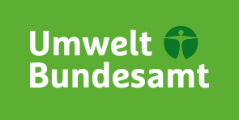

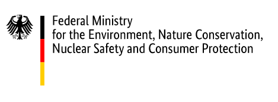

The publisher is responsible for the content of this publication.

