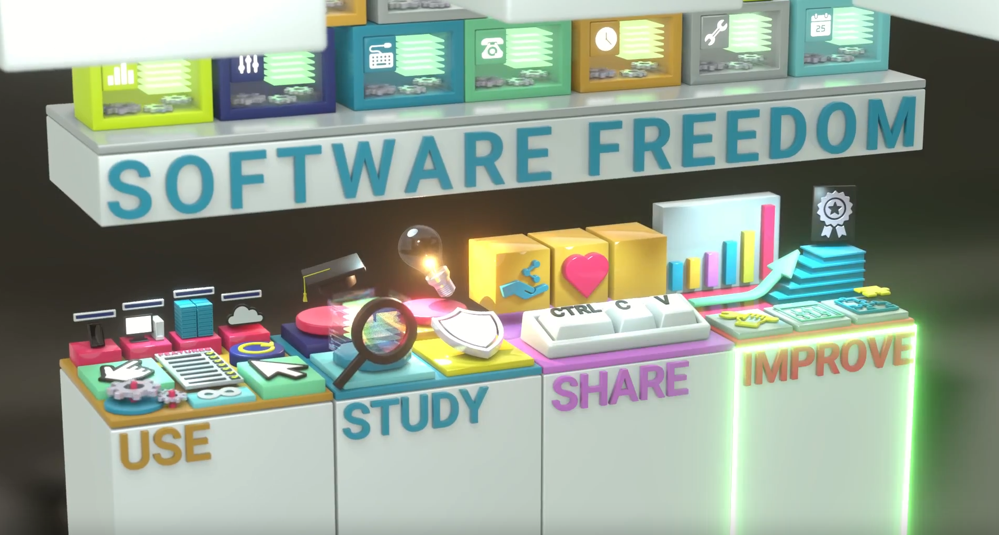
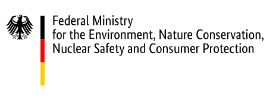

# About This Handbook

### Authors

The text of this version of the handbook was written and compiled from various sources by Joseph P. De Veaugh-Geiss. Annie Musgrove edited the text according to KDE Eco editorial guidelines. Anita Sengupta and Arwin Neil Baichoo made the book and website design beautiful.

### Acknowledgments

A general thank you to the many contributors to the KDE Eco initiative, the Opt Green project, and End Of 10 campaign. An incomplete list (in alphabetical order): Aaron Wey, Albert Astals Cid, Bernard Sadaka, Bettina Louis, Carl Schwan, Carolina Silva Rodé, Christopher Waldon, Finnjan Hofmann, Geoffrey Teale, Harald Reingruber, Jannick Kremer, the KDE development community, the KDE translation teams, Lydia Pintscher, Nico Düsing, Nicole Teale, Øjvind Fritjof Arnfred, Susanne Rabler, Tobias Bernard, and, last but not least, the countless people around the world helping new users with Free & Open Source Software. You are all an inspiration.

People interested in contributing to KDE Eco are encouraged to join the [Matrix room](https://webchat.kde.org/#/room/#kde-eco:kde.org). Contributors are also invited to join one of the KDE Eco sprints and in-person or online meetups. Learn more at our [website](https://eco.kde.org/get-involved/).

The Opt Green project has benefited from many informative discussions that took place at the following conferences, workshops, meetups, and festivals: Akademy, Anstiftung, Chaos Communication Congress, ecoCompute, FOSDEM, FOSS Meetup Delhi, Jahrestagung der Gesellschaft für Informatik, KDE India Conference, Linux App Summit, Lucknow FOSS, Repair Cafe Workshops in Hannover, Nürnberg, and Dessau, SFSCon, Umweltfestival, and Weltveränderer. Thank you!

### No Generative AI or LLMs

No Generative AI or LLMs were used at any stage in the preparation or writing of this handbook, despite what the frequent use of [em-dashes](https://www.nytimes.com/2025/09/18/magazine/chatgpt-dash-hyphen-writing-communication.html) might otherwise suggest.

### A Note On Sources

Some text in Parts I & II have been adapted from the KDE Eco handbook ["Applying The Blue Angel Criteria To Free Software"](https://eco.kde.org/handbook/), released under a [Creative Commons Attribution-ShareAlike 4.0 International (CC-BY-SA-4.0)](https://spdx.org/licenses/CC-BY-SA-4.0.html) license.

Part III benefited from the following texts by the Linux User Group Villingen-Schwenningen and Repair-Café Hilpoltstein:

* [Umstieg auf Linux](https://lug-vs.org/lugvswiki/index.php/Umstieg_auf_Linux)
* [Offene Linux-Werkstatt](https://www.repaircafe-hilpoltstein.de/offene-werkstatt/linux)

Wikipedia provided references to several texts included here. Thank you to the commons community for making such excellent resources available for all of us.

### License

Unless indicated otherwise, all contents released under the [Creative Commons Attribution-ShareAlike 4.0 International (CC-BY-SA-4.0)](https://spdx.org/licenses/CC-BY-SA-4.0.html) license. For more information about documentation licensing at KDE, see [KDE's licensing policy](https://community.kde.org/Policies/Licensing_Policy).


# Introduction: What's This All About?

This handbook provides a brief overview of environmental harm driven by software and how Free & Open Source Software (FOSS) provides a solution.

At this point, you might wonder: What does sustainability have to do with software? How can something so seemingly immaterial as software have an environmental footprint? Simply put, computers and other devices end up in landfills because software developments render them obsolete&mdash;even if in some case such developments are not necessary.

In this book, we'll take a closer look at the ways software, and the hardware that runs it, is contributing to the climate crisis, and what you can do about it in your community, today! The book is divided into three main parts:

 - Part I: Environmental Impact Of Software
 - Part II: Digital Sustainability
 - Part III: Upgrading Devices With FOSS

While Part I explores the *why* and Part II the *what*, Part III discusses the *how* by exploring what you need to consider when helping others upgrade their hardware with Free & Open Source Software. This way, you and others can use devices until the end of the hardware operating life, rather than discard functioning computers when software support ends. Part III is not a step-by-step technical guidebook, but rather an outline for what we think is helpful to get started, with pointers on how to find resources for more information.

The target audience for Parts I & II is anyone who cares about the environment and the role software plays in digital sustainability. Part III is more specific and more practical. The target audience for this section are those who want to help prevent e-waste and "repair" unsupported computers by upgrading them with FOSS. This includes volunteers in Repair Cafes, environmental organizations, and other repair initiatives, as well as those helping out at End of 10 and Digital Independence Day events, Linux Install Parties, CryptoParties, and so on.

Let's get started!
# Part I: Environmental Impact Of Software

<!-- public domain license.)](images/sec1_e-waste.jpg)-->

Before we dive into the environmental impact of software, consider how you would complete this sentence:

**The most environmentally-friendly device is …**

Think about it for a minute.

Now keep your answer in mind&mdash;we'll come back to it shortly.

Digital technology has revolutionized how we live, and it is often praised for bringing not only convenience but also efficiency to our daily lives. Companies have leveraged digitization for the efficient distribution of all sorts of consumer goods and the [dematerialization](https://en.wikipedia.org/wiki/Dematerialization_(economics)) of everyday products. Printed concert or travel tickets are no longer necessary, as they can be downloaded and presented on one's phone. Photographs are not collected in over-stuffed shoeboxes, but on a tablet or computer. Thousands of films and TV series are streamed on laptops, making movie collections a thing of the past. In many cases, one device, a smartphone, is used for all of the above&mdash;and much, much more. Those physical objects were once a major part of our daily lives, but today, they are simply no longer necessary, as they now exist almost solely in digital form on our devices.

For all the ways that digitization has made our lives more convenient and more efficient, it may seem like these technological developments are also less material and less wasteful. But are they really?

Short answer, no. The internet and the computers we use to connect to it require physical infrastructure. This includes the extraction of materials for manufacturing, the factories that produce the devices, and the continent-spanning networks that enable global communication. All of this requires energy and resources. A lot of energy and resources. Plus, hardware that is considered obsolete either ends up in disposal centers for end-of-life treatment, or as landfill waste that is toxic to both people and the environment. Then, new devices are produced and transported to replace them. But, are those "old" devices really obsolete when they still work? What exactly has turned them into e-waste? In many cases, it is the software that determines the operating life of digital infrastructure. Not only that, software determines a device's energy and resource consumption while you're still using it.

 license.)](images/sec1_800px-Agbogbloshie_Ghana_September_2019.jpg)

This handbook will take a closer look at some of the ways digital technology is contributing to environmental harm and the climate crisis. To be clear, this handbook is not anti-technology. Undoubtedly, digitization has improved life in countless ways for vast numbers of people. But the ecological impacts of digital technology require us to think more deeply about the ways we use it and how we might use it more sustainably. The good news is that through our choices in software, users can have an immediate and significant influence on many of the issues discussed throughout this handbook.

In order to address a problem effectively, however, we must first understand the problem. So let's explore what is meant by the digital environmental footprint and how the software we use everyday is involved.

## Material Footprint Of Digital Technology

Digital technology is often (and erroneously) associated with being immaterial. But there is a very real, very material aspect to digitization, encompassing not only our physical devices such as smartphones and laptops, but also the processing plants for mined metals necessary to make them run, container ships that transport mass-produced hardware, and cables and data centers which connect them to global networks.

We use more digital devices than ever before. The number of internet-connected devices, including laptops and smartphones, but also smart TVs, home assistants, and other Internet of Things (IoT) devices, is growing. Globally, smartphone adoption has increased rapidly, as well as the demands on resources needed to manufacture new and [increasingly-powerful devices](https://www.oekom.de/buch/smarte-gruene-welt-9783962380205). The production of these devices, including mining for the rare earth metals necessary to make them work, and their transporation, use, and eventual disposal all have an environmental impact.

 license. [Airplane](https://thenounproject.com/icon/airplane-74604/) icon by Simon Child and [IT](https://thenounproject.com/icon/it-3341003/) icon by Sari Braga licensed under a [CC-BY](https://spdx.org/licenses/CC-BY-3.0.html) license. Design by Lana Lutz.)](images/sec1_acm-report.png)

In fact, the environmental impact of the industry as a whole, in particular in terms of CO~2~ emissions, is currently on par with the aviation industry. The Association of Computing Machinery (ACM), the oldest scientific and educational computing society in the world, released a Technology Policy Council report in 2021 entitled "[Computing And Climate Change](https://dl.acm.org/doi/pdf/10.1145/3483410)". The report's estimates are staggering. The Information and Communication Technology (ICT) sector is estimated to contribute between 1.8&ndash;3.9% of global carbon emissions annually. The global aviation industry is 2.5%. The ACM report warns that if nothing is changed, ICT's carbon emissions will rise to *more than 30%* of all emissions globally by 2050. In their conclusions, the authors acknowledge an inherent contradiction of digitization: digital technology "can help mitigate climate change", but it "must first cease contributing to it". 

To estimate digital technology's contributions to environmental harm, it is necessary to account for its entire lifecycle. This includes the costs of producing and transporting digital devices (to and from the shop, as well as to the landfill), the costs of using them, and the costs of remediating environmental harm caused by e-waste. This is especially true when considering the aggregate carbon footprint of our digital technologies, since in some cases merely the production of a device contributes more greenhouse gas emissions than the device's usage over its entire operating life! Hold that thought for a minute, as our exploration of a device's lifecycle will actually begin with its end, when it becomes e-waste. Once we have taken a tour of the landfills and scrapyards, we will explore the environmental impact of hardware production and device use.

 under a [CC-BY-SA-2.0](https://spdx.org/licenses/CC-BY-SA-2.0.html) license.)](images/sec1_geograph-2637892-by-James-T-M-Towill_1600x1200.jpg)

## A "Tsunami Of E-Waste"

At seven meter's tall, the "WEEE Man" is a giant. Taking its name from the 2003 Waste Electrical and Electronic Equipment (WEEE) directive, which sets collection, recycling, and recovery targets for e-waste in the EU,[^1] the statue is made from 3.3 metric tons of electrical waste. This is the average amount of e-waste that one UK individual generates in a lifetime.

[^1]: In 2005, two years after the directive was transposed into European law, the Royal Society of Arts in the UK unveiled "WEEE Man". Originally located on London's South Bank, the towering figure was subsequently moved to the Eden Project in Cornwall, where it currently resides. 

In 2015, as e-waste was on its way to becoming the "[fastest-growing waste stream in the world](https://www.weforum.org/reports/a-new-circular-vision-for-electronics-time-for-a-global-reboot/) ", then Executive Director of the UN Environment Programme Achim Steiner warned of a "[tsunami of e-waste](https://news.un.org/en/story/2015/05/497772) rolling out over the world". The numbers are overwhelming. In 2022, an estimated [62 billion kilograms](https://ewastemonitor.info/electronic-waste-rising-five-times-faster-than-documeted-e-waste-recycling-un/) of e-waste was generated globally, almost double what it was in 2010, according to a [report](https://ewastemonitor.info/wp-content/uploads/2024/03/GEM_2024_18-03_web_page_per_page_web.pdf) from the UN Institute for Training and Research (UNITAR) and International Telecommunication Union (ITU). To put that number in perspective, 62 billion kilograms would fill 1.55 million 40-tonne trucks that wrap bumper-to-bumper around the earth's equator. That is 40,075 kilometers of e-waste. In one year!

 license. Design by Anita Sengupta.)](images/sec1_e-waste-trucks-on-equator-illustration.png)

The numbers continue to rise. According to the same report, the amount of e-waste is rising by about 2.3 billion kilogams each year&mdash;and we are on track to generate 82 billion kilograms by the year 2030. Worse, [less than 20 percent](https://weee-forum.org/ws_news/international-e-waste-day-2021/) of e-waste is collected and recycled. Although it makes up [only 2%](https://www.forbes.com/sites/vianneyvaute/2019/04/23/with-love-from-an-oregon-prison-how-eric-lundgren-is-going-to-help-you-recycle-all-your-electronics/) of trash in landfills, it contributes to almost 70% of the toxic waste found there. The [WEEE Forum](https://weee-forum.org/about-2024/) warns: "Currently, the amount of e-waste is growing five times faster than formal recycling collection rates since 2010". In 2024, about [18% of e-waste](https://ewastemonitor.info/wp-content/uploads/2024/03/GEM_2024_18-03_web_page_per_page_web.pdf) comes from personal computers, printers, mobile phones, routers, GPS devices, and telephones as well as screens and monitors. The rest includes video cameras, toys, microwave ovens, e-cigarettes (together referred to as "small equipment"); washing machines, dishwashers, large printers, photocopiers (together referred to as "large equipment"); photovoltaic panels, among others.

Of all these devices, computer technology e-waste is particularly bad. Electronic scrap components like CPUs contain potentially harmful materials such as lead, cadmium, beryllium, or brominated flame retardants. As a result, its end-of-life treatment can involve [significant risk to the health of workers and their communities](https://www.nytimes.com/2019/12/08/world/asia/e-waste-thailand-southeast-asia.html). Moreover, [scavengers risk their health](https://www.nytimes.com/2019/05/12/climate/electronic-marvels-turn-into-dangerous-trash-in-east-africa.html) for the discarded precious metals in laptops and smartphones "[laced with lead, mercury or other toxic substances](https://www.nytimes.com/2018/07/05/magazine/e-waste-offers-an-economic-opportunity-as-well-as-toxicity.html)". The process of dismantling and disposing of e-waste has already led to a number of environmental impacts in developing countries. Liquid and atmospheric emissions end up in bodies of water, groundwater, soil, and air&mdash;and therefore, also in land and sea animals, in crops eaten by both animals and humans, and in drinking water.

This handbook concerns itself primarily with desktop computers and laptops, but the issues addressed here relate to any device requiring software to work. Increasingly, this includes, well, pretty much anything. As public-interest technologist Bruce Schneier [writes](https://www.schneier.com/blog/archives/2017/02/security_and_th.html): "We no longer have things with computers embedded in them. We have computers with things attached to them." Schneier continues (emphasis added):
 
> Your modern refrigerator is a *computer* that keeps things cold. Your oven, similarly, is a *computer* that makes things hot. An ATM is a *computer* with money inside. Your car is no longer a mechanical device with some computers inside; it’s a *computer* with four wheels and an engine. Actually, it’s a distributed system of over 100 *computers* with four wheels and an engine. And, of course, your phones became full-power general-purpose *computers* in 2007, when the iPhone was introduced.
> 
> We wear *computers*: fitness trackers and computer-enabled medical devices&mdash;and, of course, we carry our smartphones everywhere. Our homes have smart thermostats, smart appliances, smart door locks, even smart light bulbs. […] Cities are starting to embed smart sensors in roads, streetlights, and sidewalk squares, also smart energy grids and smart transportation networks. A nuclear power plant is really just a *computer* that produces electricity, and&mdash;like everything else we’ve just listed&mdash;it's on the internet.

All of these computerized devices are on the internet, [many are collecting data about you](https://www.nytimes.com/wirecutter/reviews/advice-smart-devices-data-tracking/)&mdash;and, crucially, they all need software to work.

## Embodied Harm&mdash;Before A Device Is Ever Used

Now let's assess the start of the lifecycle, when the device is produced. When a functioning device goes in the landfill, all of energy costs and embodied emissions go with it. What are embodied emissions and how do these differ from usage emissions? Embodied emissions refer to the the carbon footprint needed to produce and transport the device well before it was ever in a user's hands. By contrast, usage emissions are the CO~2~ emissions, you guessed it, when actually using the device. In most cases, carbon emissions from production are grossly disproportionate to usage.

, [desktop](https://www.delltechnologies.com/asset/en-gb/products/desktops-and-all-in-ones/technical-support/optiplex-7090-tower-pcf-datasheet.pdf), and [monitor](https://www.delltechnologies.com/asset/en-gb/products/electronics-and-accessories/technical-support/p2422h-monitor-pcf-datasheet.pdf) (modified image from Scott Logic published under a [CC-BY-SA-4.0](https://spdx.org/licenses/CC-BY-SA-4.0.html) license).](images/sec1_embodied-vs-usage-proportions.png){#fig:co2prop width=400px height=262px}

<!--In a 2019 report from the International Energy Agency, the ICT sector is estimated to consume [2000 TWH of energy](https://dl.acm.org/doi/pdf/10.1145/3613207), half of which, 1000 TWH, comes from manufacturing alone. It is worth underscoring here that energy consumption is not the same as carbon emissions. Carbon emissions depend on the particular mix of fuels used for generating electricity, referred to as the [electricity or power generation mix](https://www.planete-energies.com/en/medias/close/what-power-generation-mix). So, ok, half of all energy in ICT is consumed in device production, but what exactly is the carbon footprint? \cmt{CHECK}-->

Embodied carbon is critical when considering the carbon footprint of our devices. Consider three common end user devices: laptops, desktops, and monitors. When comparing usage vs. embodied carbon emissions (Figure 5), production alone accounts for 50-80% of the total emissions over these devices' entire operating life. In fact, a [2012 report](https://www.oeko.de/oekodoc/1583/2012-439-de.pdf) published by the German Environment Agency estimates that, on environmental grounds, one would need to use a laptop for *decades* before any efficiency gains in newly-produced devices would warrant their purchase. The report states (emphasis added):

> [T]he environmental impacts of the production phase of a [notebook](https://en.wiktionary.org/wiki/notebook_computer#English) are so high, that they cannot be compensated in realistic time-periods by energy efficiency gains in the use phase. In case of a 10% increase in the energy efficiency of a new notebook as compared to the older one, replacement of the older notebook can only be justified *after 33 to 89 years*, if environmental concerns are considered.

In light of the e-waste problem and the embodied carbon of end user devices, let us return to that sentence which introduced this section. How did you finish this statement: "The most environmentally-friendly device is …"?

Our response: **The most environmentally-friendly device is the one you already own!**

 (modified) published under a [CC-BY-SA-4.0](https://spdx.org/licenses/CC-BY-SA-4.0.html) license.](images/sec1_leaflet.png)

Now let us consider *how* software increases the demands on hardware as well as *why* we often discard devices which still work in order to buy new ones. To do so, we must look to the software.

## Hardware, Meet Software

Let us now turn to the middle of a device's lifecycle, that is, the years you use your computer.

Software engineering has an important but often unseen role in defining our digital consumption patterns. There are often economic&mdash;and not technological&mdash;reasons driving it. In fact, manufacturers often encourage consumers to purchase new devices unnecessarily; indeed, they may even enforce it through software design. The newest, hottest release that users are encouraged to buy&mdash;often with new computationally-expensive features like generative AI accompanied by increased data-mining and integrated advertisements&mdash;may send less-powerful yet functioning devices directly to the bin. Users can do little about it when software licensing prohibits user modifications. As the [Blue Angel award critera](https://produktinfo.blauer-engel.de/uploads/criteriafile/en/DE-UZ%20215-202001-en-Criteria-V2.pdf)  for eco-certifying software puts it: "[…] the key to increasing energy efficiency and protecting natural resources lies not with the hardware but rather above all with the software".

To understand a device's energy consumption and how software is involved, this section will explore three aspects:

1. *Demands* &mdash; Software determines energy consumption and minimum system requirements.
2. *Dependencies* &mdash; Software can hardcode dependencies on external services and companies.
3. *Longevity* &mdash; Software is responsible for how long devices remain (safely) in use.

#### Hardware Demands

Software consumes energy. Unwanted software components create inefficiencies and drive up hardware demands by occupying memory, wasting processing time, consuming storage, and causing delays at system startup and shutdown. Worse still, [feature creep](https://en.wikipedia.org/wiki/Feature_creep) and other forms of [software bloat](https://en.wikipedia.org/wiki/Software_bloat) increase energy consumption and make less-powerful hardware unusable (in Part II we will look more closely at examples of inefficient software code). Consider this, again from the Blue Angel award critera "[Resource and Energy-Efficient Software Products](https://produktinfo.blauer-engel.de/uploads/criteriafile/en/DE-UZ%20215-202001-en-Criteria-V2.pdf)":

> Processing power has doubled about every two years since 1970. This means that functions are processed twice as fast and thus less energy is required for the same functions. A similar improvement in efficiency cannot be observed in the field of software. […] The availability of more and more powerful hardware has resulted in software becoming more and more bloated from version to version so that more resources are required for only minimal or even no enhancement of the functionality.

What is more, data mining, advertising, third-party tracking, and personalized engagement-maximizing algorithms all drive up energy consumption in the software we run, both on a user's device and in the cloud. In a 2021 report entitled ["*Carbon footprint of unwanted data-use by smartphones: An analysis for the EU*"](https://groenlinks.nl/sites/groenlinks/files/2021-09/CE_Delft_210166_Carbon_footprint_unwanted_data-use_smartphones.pdf), researchers in the EU estimated the environmental costs of tracking and advertisements which users cannot opt out of. The carbon footprint of this "unwanted data use" in smartphones amounts to between 3 and 8 million tonnes of CO~2~ a year in the EU alone, "equal to the carbon footprint of between 370 and 950 thousand EU citizens". At its worst, this is roughly the [annual carbon footprint of a city](https://doi.org/10.1088/1748-9326/aac72a) in the European Union like Turin or Lisbon. The report points out that about 60% of European smartphone users say they would opt out of tracking and block advertisements when possible. That's an awful lot of CO~2~ for something most users don't even want!

Meanwhile, systems bundled with Large Language Models and other forms of generative AI drive up not only hardware demands and energy consumption, locally and remotely, but also water consumption. For the time being, opting out of integrated generative AI functionality may be possible, but it is [not](https://arstechnica.com/gadgets/2025/11/what-i-do-to-clean-up-a-clean-install-of-windows-11-23h2-and-edge/) [easy](https://www.pcworld.com/article/2913812/tired-of-ai-in-your-windows-11-pc-heres-how-to-get-rid-of-it.html)&mdash;and disabling these tools may not be possible in the future. On the backend, [training and deploying generative AI models](https://news.mit.edu/2025/explained-generative-ai-environmental-impact-0117) requires a [staggering amount of electricity](https://arstechnica.com/ai/2025/09/openai-and-nvidias-100b-ai-plan-will-require-power-equal-to-10-nuclear-reactors/). This is straining the power grid and [raising electricity bills](https://www.nytimes.com/2025/08/14/business/energy-environment/ai-data-centers-electricity-costs.html) in areas near the data centers, while requiring [new power sources](https://arstechnica.com/ai/2024/10/google-and-kairos-sign-nuclear-reactor-deal-with-aim-to-power-ai/) and [reopening retired ones](https://arstechnica.com/ai/2024/09/re-opened-three-mile-island-will-power-ai-data-centers-under-new-deal/) to run them. A query using ChatGPT is estimated to require five times the energy of a web search, and water consumption by Google's and Microsoft's [data centers](https://journals.calstate.edu/ai-edu/article/download/5448/4391/16689) have increased about 20-35%, attributed to generative AI workloads. Bundling generative AI with software, such as with Microsoft's Copilot+ and Apple Intelligence, requires significantly [higher minimum hardware requirements](https://arstechnica.com/gadgets/2024/05/microsofts-copilot-ai-pc-requirements-are-embarrassing-for-intel-and-amd/), which has already rendered [lower-end consumer devices](https://arstechnica.com/gadgets/2024/12/generative-ai-has-done-one-unambiguously-good-thing-for-pcs-and-macs-16gb-of-ram/) obsolete.

#### External Dependencies

Network dependencies can play a critical role in hardware longevity. Underlying infrastructure which people may depend on to run an application&mdash;such as [software license servers](https://en.wikipedia.org/wiki/Software_license_server) used for access control, or server-dependent functionalities&mdash;can go [offline](https://arstechnica.com/gaming/2022/03/server-issues-lock-gran-turismo-7-owners-out-of-single-player-races/), sometimes [permanently](https://arstechnica.com/gadgets/2025/07/belkin-shows-tech-firms-getting-too-comfortable-with-bricking-customers-stuff/), and result in devices having reduced functionality, [even for primary features](https://arstechnica.com/gadgets/2024/08/amazon-is-bricking-primary-feature-on-160-echo-device-after-1-year/). Moreover, as you might expect by now, such dependencies require extra processing and thus consume resources and energy, often beyond that which is needed for the intended purpose of the software.

As Ars Technica [reports](https://arstechnica.com/cars/2026/02/what-happens-to-a-car-when-the-company-behind-its-software-goes-under/) regarding software-defined automobiles that rely on "centralized servers, subscriptions, and proprietary software":

> The lesson is clear: In today’s cars, the engine or electric motor isn’t always what keeps you moving&mdash;the software does. When that software vanishes with a bankrupt company, your car can go from daily driver to expensive paperweight overnight. And in the age of software-defined vehicles, owning a car increasingly means betting on the survival of its code. When that code dies, the driveway or highway&mdash;not the repair shop&mdash;becomes the final stop.

#### Device Longevity

All of this additional processing to run bloated software or have integrated generative AI tools in user applications (whether you want it or not), to send your data to unknown servers for processing or serve you up ads on *your* device, is not only driving up hardware demands, but it is also running down the device. As the online computing publication XDA [states](https://www.xda-developers.com/do-cpus-degrade-over-time/): "CPUs subjected to constant heavy workloads, overclocking, and high operating temperatures are almost certainly going to degrade faster." All of these "features" coded in the software may well be overworking and heating up your device, while wearing it down more quickly. The question is: Did you even want that extra "functionality"? And can you remove it if you wanted to?

There is another common way that software can render a device obsolete. Software [end-of-life](https://en.wikipedia.org/wiki/Software_release_life_cycle#End-of-life) and [abandonware](https://en.wikipedia.org/wiki/Abandonware), in particular when released under a [proprietary license](https://en.wikipedia.org/wiki/Software_licensing#Proprietary_software_licenses), can at worst mean your device stops working, or at best (!) leave users vulnerable to viruses and other malware. It is not just new features that are discontinued when software development stops; more importantly, it is the security updates. These updates are critical for your computer and for the [devices they connect to](https://www.nytimes.com/wirecutter/reviews/bluetooth-earbuds-hacking-threat/). All software needs to receive updates to keep your data safe and secure. More on this in the next part of this handbook.

In Part I, we have explored the environmental harm of digitization and identified several ways software can render a functioning device obsolete. In Part II, we will look at the role Free & Open Source Software plays in extending hardware's operating life and providing continued device support. But first, let's ask ourselves: Is focusing on software really worth it?

### Is Focusing On Software Worth It? 

In the bigger picture, the environmental harm driven by software may be less significant when compared to other industries. Therefore it seems reasonable to ask: Is it worth addressing?

There are a few things we might consider here. The first is a rejection of the ["Not As Bad As"](https://rationalwiki.org/wiki/Not_as_bad_as) fallacy, also known as "Appeal to Worse Problems". The general argument is so: software's contributions to global CO~2~ emissions may not be as bad as another industry's, and therefore it is not worth focusing on. What's wrong with this argument is that although another industry may be worse, this does not negate the fact that software engineering is responsible for causing serious environmental harm. What's more, the "Not As Bad As" fallacy suggests a false choice between addressing either one problem or the other, when in fact ecologically-friendly software design is just one piece of a bigger puzzle.

 (published under a [CC-BY-NC-2.5](https://spdx.org/licenses/CC-BY-NC-2.5.html) license).](images/sec1_bigger_problem.png)

Let's not [be like XKCD's](https://www.explainxkcd.com/wiki/index.php/2368:_Bigger_Problem) White Hat, and appeal to worse problems as an excuse to do nothing!

Second, focusing only on fixing the "biggest problem" is not necessarily the most effective strategy. It's also important to weigh the likelihood of success when addressing an issue, as well as the time and resources required to do so. Free & Open Source Software, with its focus on user autonomy and transparency, provides unique opportunities for users, communities, and organizations to directly address intertwined social and ecological issues. The software licenses allow the software to be adapted, updated, and maintained without vendor dependencies or artifical restrictions, often at lower cost.

Finally, it's hopefully clear by now that software *does* significantly contribute to energy and resource consumption as well as waste, and these contributions will just get worse unless we make real changes.

Changing our software and using our hardware more sustainably may seem like a small gesture in addressing an issue as complex as climate change. It's also clear that simply changing our individual consumption patterns may not be sufficient on its own. It's true: a zero-emissions future will require fundamental shifts in both how we live and how industries operate, and that responsibility cannot be managed at an individual level. But consider what anthropologist Margaret Mead once observed:

> "Never doubt that a small group of thoughtful, committed citizens can change the world; indeed, it’s the only thing that ever has."

Structural change happens when dedicated, passionate people organize to confront pressing societal issues. With decades of experience successfully bringing global communities together to work toward common goals, Free & Open Source Software can be a powerful force for combatting the environmental impact of digitization. We know how to organize&mdash;now, it's a matter of turning plans into practice, goals into reality. Let's unite to combat software-driven environmental harm. Let's foster a culture of digital sustainability in our communities and beyond.
# Part II: Digital Sustainability

What does the environmental impact of software have to do with Free & Open Source Software? Before we explore this topic in detail, let's first take a look at what FOSS is exactly, and how it differs from its counterpart, proprietary software.

## What Is Free & Open Source Software (FOSS)?

Free & Open Source Software, often referred to by its acronym FOSS, is software available under a license that guarantees users certain rights. These rights are sometimes referred to as the [four essential freedoms](https://www.gnu.org/philosophy/free-sw.html.en), that is, the freedom to use, study, share, and improve the software. These freedoms are at the core of FOSS&mdash;the word "Free" in Free & Open Source Software has nothing to do with price, but rather the freedoms that come with the software license. We are talking about the meaning of "free" as in the phrase "free society"!



What do each of these rights mean, exactly? The Free Software Foundation Europe (FSFE) [explains](https://fsfe.org/freesoftware/index.en.html):

* *Use*: FOSS "can be used for any purpose and is free of restrictions such as licence expiry or geographic limitations."
* *Study*: FOSS "and its code can be studied by anyone, without non‐disclosure agreements or similar restrictions."
* *Share*: FOSS "can be shared and copied at virtually no cost."
* *Improve*: FOSS "can be modified by anyone, and these improvements can be shared publicly."

The video ["What is Free Software (Open Source)?"](https://media.fsfe.org/w/p/9gYSyoEYggsqBExLWjRejL?playlistPosition=1) from the FSFE provides a short introduction to the topic of FOSS and its importance for society. Check it out if you want more information about the connection between software and freedom.

A whole section about software licenses?! How boring! Well, it may sound dry and technical, but it is actually quite exciting. Really. And we hope you agree by the end! When we talk about software licensing, we are really talking about our rights and ability to participate in a digital society. Digital technology underpins just about every aspect of modern life: our homes, schools, universities, governments, industries, non-profits, hospitals, and so on. Today, they all rely on digital technology. And all of this technology requires software.

Since this software is shaping our lives and communities, shouldn't we have a say in how it works? [KDE](https://kde.org/community/whatiskde/), the Free & Open Source Software community which stands behind the KDE Eco initiative, has the following [vision](https://community.kde.org/KDE/Vision). It sums up nicely the kind of world FOSS and its supporters are working toward.

> "A world in which everyone has control over their digital life and enjoys freedom and privacy."

KDE Eco would only add: "… enjoys freedom, privacy, *and a more sustainable use of digital technology*"!

In this text we use the term Free & Open Source Software, but the reader may also come across the [terms](https://fsfe.org/freesoftware/index.en.html#synonyms) Free Software, Open Source Software, and Free/Libre Open Source Software. For our purposes, they are all referring to the same thing: the rights guaranteed by the software licensing. And these rights are directly linked to the accessibility of software's source code.

## What Is Source Code?

FOSS's opposite is "proprietary software". Proprietary software is licensed to give users no agency over the code behind the software they use. In fact, proprietary software is typically distributed with undisclosed source code.

Wait a minute, what is source code, you wonder?

Actually, what is software for that matter?

At its most basic, software is a recipe for the computer. Programmers write the recipes in "source code", which is, simply put, a human-readable set of instructions for the computer. And just as a recipe is written in one or another human language, source code is written in a programming language. With access to the source code, anyone can understand and review the recipe&mdash;even you! In fact, try it yourself: Can you guess what the source code below does?[^2]

[^2]: Example from E. Buckman \& Joshua Gray, ``A Note On Software'' in *[Free Software, Free Society (First Edition)](https://dn790008.ca.archive.org/0/items/Free_Software_Free_Society/Free_Software_Free_Society.pdf)*.

```
int main(){
    printf(''Hello World!'');
    return 0;
}
```

You probably guessed correctly: it prints the phrase "Hello World!" on the screen. Even if you know nothing about the programming language (a language called C), the code is transparent and legible. Perhaps you can already do something with it, modify or improve it in some way, even as a non-progammer. For example, if you speak a different language you could translate the text printed on the screen, or you could make it say something else entirely.

This source code, this recipe, is great for humans, but it is actually not so great for computers. A computer requires the recipe to be encoded in something more computer-like, that is, 1s and 0s, or binary code. This conversion from source code to binary code is the job of a compiler&mdash;compilers turn human-readable source code into computer-friendly binary code. Huzzah! Consider that same easy-to-read code snippet above, but now in binary form:

```
1100011110111010100101001001001010101110
0110101010011000001111001011010101111101
0100111111111110010110110000000010100100
0100100001100101011011000110110001101111
0010000001010111011011110111001001101100
0110010000100001010000100110111101101111
```

Can you read this code? Can you do anything with it? Modify it in some meaningful way? Fret not, no human can! Proprietary software is typically distributed in binary code, just a bunch of 1s and 0s, while the source code remains a secret, hidden behind proprietary licenses. All those things you could do when you had access to the recipe&mdash;understand what the source code does, perhaps even change or improve it&mdash;remain entirely out of reach[^3] when all you have is the baked cake. You cannot know how the cake was made and with which ingredients, and you certainly cannot modify it.

[^3]: Although "decompilers" which convert binary code back into source code do exist, the output is often distorted from the original and can be difficult to understand.

In short, whoever controls the recipe will decide the cake we eat.

If only we were just talking about recipes for cake! In fact, what we are talking about is the code shaping every aspect of life in the digital age, from work to socializing, from health care to dating, from neighborhood book clubs to academic research. And everything else we do with our computers and smartphones all the time.

In contrast to proprietary software, FOSS ensures the rights of users to access source code and do things with the software independently from the people or company who wrote it. So, in a world where digital technology sits quietly (and sometimes not so quietly) behind most aspects of daily life, access to source code and the ability to modify it are ultimately about the rights we have as a people and society.

What we are talking about is control and freedom&mdash;and it has big implications for us and for the environment. That is very exciting, isn't it?!

There are many misconceptions of FOSS which we address in an appendix at the end of this chapter, continuing with the analogy to recipes. If you're wondering whether anyone, perhaps even bad actors, can modify the source code, or whether making the source code transparent makes it less secure, and other such questions, you can jump to the end of this section to get some answers! 

## FOSS Is Better For The Environment

#### Improving Code&mdash;By Users & For Users

With FOSS, the source code can be modified to ensure that the software is not doing things unnecessarily, thus reducing the hardware demands, saving shared resources, and ensuring the hardware's longevity. Consider the results from [a study](https://www.umweltbundesamt.de/publikationen/entwicklung-anwendung-von-bewertungsgrundlagen-fuer) published by the German Environment Agency and [a related article](https://doi.org/10.1016/j.future.2018.02.044) in the journal *Future Generation Computer Systems*. The researchers report that two applications doing the same thing and achieving the same result may put different demands on the hardware and have drastically different energy profiles.

The study included a comparison of two word processing programs: Word Processor 1 is identified as "Open Source", while Word Processor 2 is identified as "Proprietary". Both computer programs were instructed to perform the same actions. The result is seen in Figure 9. Running Word Processor 2 consumed four times the energy compared to Word Processor 1&mdash;again, and this cannot be stressed enough, to do the same task!

 license. The image is adapted from the German Environment Agency report.)](images/sec2_uba-sus.png)

Looking at the two word processors' power use over time, it's also clear how the two programs behave quite differently … and perhaps contrary to what you might expect. Consider the plot in Figure 10. At about the 440-second mark, both word processors save the document and no further actions are called by the measurement script. As you can see, Open Source Word Processor 1 goes idle (as one might expect). By contrast, Proprietary Word Processor 2 continues working, consuming additional power until the completion of the measurement. It's worth asking what the additional activities from 440 to 600 seconds are for: Are the actions of Word Processor 2 necessary for the functionality of the software? Is the proprietary word processor collecting and transmitting user data? If so, do users have a way to opt out of these types of analytics? Well, that depends on the software design.

 published under [CC-BY-NC-ND](https://spdx.org/licenses/CC-BY-NC-ND-4.0.html) license; screenshot published here with permission.)](images/sec2_energy-consumption_time.png)

In these cases, user autonomy can make a big difference in the energy profile of a software product. Proprietary software may provide some autonomy by offering users pre-defined choices, but these are just choices the vendor has decided to give, and they can be taken back at any time. By contrast, FOSS gives users access to the source code and the rights to modify it. This is real autonomy. In this way, software can be made to run in the way the users, not the companies, want. To be clear, simply releasing software under a FOSS license comes with no guarantee of higher code efficiency. Proprietary code can be very efficient. However, FOSS has a real advantage in that inefficiencies can be found and improved by anyone&mdash;that is simply impossible with proprietary software.

Do changes in code efficiency really matter? At scale, they most certainly do! Given that applications such as word processors run in just about every modern home and office, minimal improvements in software efficiency can, at scale, result in savings comparable to the annual energy consumption of entire cities. This claim is based on an example by SAP Product Engineer Detlef Thoms, who [does back-of-the-envelope calculations](https://open.hpi.de/courses/cleanit2021/items/5DHsS3tJsXAqfUE4q4F82Z) (04:20&ndash;06:10) to go from a one CPU-second reduction, equivalent to about a 10 watt-second savings, to 95 thousand megawatt hour savings simply by scaling up. These savings are comparable to the annual energy consumption of over 30-thousand two-person households. As stated in the video: "Often, it is a quite manageable set of decisions which lead to significant differences in power consumption"&mdash;which is to say, small changes will yield big results.

Just one example has been discussed here, but the same logic applies to other examples of software's hardware demands, external dependencies, and device longevity presented in Part I. Software will determine what's required from our hardware to run applications and operating systems. When access to the source code is restricted, users have only apparent agency over the software. Through transparency and user autonomy, FOSS gives users real control, and that makes it possible to have a more sustainable use of resources. We now turn to what this means specifically for hardware longevity.

#### FOSS Isn't Made For Only The Latest And Greatest

FOSS helps keep older models of hardware in action, operating long past the point that proprietary software might have made them obsolete. Let's discuss how FOSS enables longer device lifecycles and what lightweight, independent software means for sustainable hardware use.

First, software determines not only how much energy hardware needs, it also determines how powerful hardware must be to run the software. Consider the following two tables comparing the minimum system requirements for RAM, processor, and storage of Microsoft Windows 11, macOS 14 "Sonoma", and the base operating systems (OS) for a handful of Free & Open Source Software distributions. All systems in the table receive security updates as of early 2026, with Sonoma being the oldest version of macOS that is still supported by Apple.

| Proprietary OS | RAM | Processor | Storage |
| --------------:| --- | --------- | ------- |
| [Windows 11](https://www.microsoft.com/en-us/windows/windows-11-specifications) | 4 GB | certain 64 bit processors | 64 GB |
| + Copilot genAI | 16 GB | + NPU | 256 GB |
| [macOS 14](https://mackeeper.com/blog/macos-sonoma-compatibility/) | 8 GB | 64 bit | 25 GB |

The proprietary operating systems have generally higher minimum system requirements and no low-end hardware support. By contrast, when considering the FOSS-based systems below, one can see they generally have lower system requirements. Why is that? Windows and macOS operating systems come with many system services as well as applications built into them, and it is certain that telemetry is enabled by default. Today these systems increasingly come bundled with generative AI tools and in some cases even ads. What's more, by design the software is intended to run on newer hardware and thus will require higher computational power. With such powerful hardware, issues of [software bloat](https://en.wikipedia.org/wiki/Software_bloat) will be less relevant.

| FOSS-based OS | RAM | Processor | Storage |
| ------------- | --- | --------- | ------- |
| [Fedora](https://docs.fedoraproject.org/en-US/fedora/latest/release-notes/hardware_overview/) (Linux) | 2 GB | 64 bit | 15 GB |
| [openSUSE](https://en.opensuse.org/Hardware_requirements) (Linux) | 2 GB | 64 bit | 8 GB |
| [Debian](https://www.debian.org/releases/stable/amd64/ch02.en.html) (Linux) | 512 MB | 64 bit | 4 GB |
| [Arch](https://wiki.archlinux.org/title/Installation_guide) (Linux) | 512 MiB | 64 bit | 2 GB |
| [OpenBSD](https://www.openbsdhandbook.com/installation/) (BSD) | 512 MB | 32 or 64 bit | 1 GB |
| [Haiku](https://www.haiku-os.org/about/faq/) (BeOS) | 384 MiB | 32 or 64 bit | 1.5 GB |


By contrast, the base operating systems in the FOSS ecosystem typically are just that, a base system, with fewer background services and applications, telemetry typically disabled by default, and thus lower overall overhead. Users have many more options with the setup of the base system and the software put on top of it, such as desktop environment, windows manager, and applications. This higher level of customization means more user control. 

It is not just end users that customize the systems. Many FOSS distributions (or distros) build on these base systems and distribute them along with services and software tailored for various users and computers. Many users new to FOSS may be interested in a distribution designed specifically for "newbies", which typically include many default services and settings so things just work out-of-the-box. Furthermore, FOSS permits modifications of the source code and allows changes to be shared. In fact, such derivatives happen all the time. While having so many options can be a source of confusion for Windows and macOS users, the fact that a high-level of customization is possible offers much more variability in hardware support, including continued support for low-end devices.

Keep in mind that aging machines which merely satisfy the minimum technical requirements might not meet today's expectations of speed and convenience. It certainly depends on what one needs to do with their computer, which applications are used, and how much patience the user has. Nevertheless, decades old computers can still run up-to-date software with FOSS!

By imposing computationally expensive "features" and restricting who can modify source code, proprietary software excludes hardware from ongoing support and drives premature hardware obsolescence. That said, should all hardware be supported indefinitely? Whether proprietary of FOSS, it's reasonable that development teams are selective about what hardware they want to support in order to best focus their efforts. No one has an unlimited supply of time and energy. However, while FOSS permits anyone to continue to support any hardware if they so choose, proprietary licenses preclude it.

If you aim to buy a new device, these may be all non-issues for you. However, if you already own a computer&mdash;one that still functions but is no longer supported&mdash;and you want to continue using it, it's not an exaggeration to say FOSS is your only option. If a FOSS operating system runs on your aging device, it will generally continue to receive updates, including security updates. Software updates are an important part of this story and the main topic of the next section.

#### Software Is Buggy, And That's Risky

Software contains defects, known as bugs. All software, whether it is [Windows](https://www.microsoft.com/en-us/security/blog/threat-intelligence/vulnerabilities-and-exploits/) or [macOS](https://www.cve.org/CVERecord/SearchResults?query=macOS) or FOSS. All software! These bugs can be minor or severe. A minor bug may result in software running more slowly, whereas a severe bug could cause the software to stop working entirely. Perhaps the most severe and insidious kind of bug creates security risks for the user, called a vulnerability. These security vulnerabilities are exploited by bad actors to infiltrate a computer system and can result in financial loss, data breaches, your vehicle [being taken over](https://www.wired.com/2015/07/hackers-remotely-kill-jeep-highway/), and introduce serious risks to wherever computers are embedded, including our own bodies.

 published under [CC BY-SA 3.0](https://creativecommons.org/licenses/by-sa/3.0/deed.en) license).](images/sec2_Harvard_Mark_I_program_tape.agr.jpg)

So how do we keep our systems secure? Just as you would patch a hole in clothing with a tear in it, software gets "patched" to fix defects. In early computing, this process literally involved patching in fixes on paper tape or punch cards, but now it's achieved through software updates. As Bruce Schneier writes in the book *[Click Here To Kill Everybody](https://www.vice.com/en/article/patching-is-failing-as-a-security-paradigm/)*, "Patching is something we all do all the time with our software&mdash;we usually call it 'updating'&mdash;and it’s the primary mechanism we have to keep our systems secure." This is why security experts put [updating your software](https://arstechnica.com/information-technology/2015/07/what-amateurs-can-learn-from-security-pros-about-staying-safe-online/) as one of the most important safety practices you can implement.

Security updates are essential. Any device requiring software to run, whether it is a laptop or smartphone or automobile, requires software updates to fix defects. Schneier describes security updates this way: "We maintain security through (1) discoverers disclosing a found vulnerability to the software vendor and the public, (2) vendors quickly issuing a security patch to fix the vulnerability, and (3) users installing that patch." Why is the "find-and-patch" approach the way we do things? Why don't we "get it right the first time"? Well, some systems try get it right the first time&mdash;software running on airplanes, cars, or medical equipment, for example&mdash;but it is generally slow and expensive to do so. And even then, you don't always get it right: even [airplanes](https://www.nytimes.com/2025/11/28/business/airbus-software-a320-jets.html) and [cars](https://arstechnica.com/cars/2024/09/more-than-20-of-vehicle-recalls-are-software-fixes-now/) and [medical equipment](https://web.archive.org/web/20200219162118/https://www.fda.gov/medical-devices/safety-communications/urgent11-cybersecurity-vulnerabilities-widely-used-third-party-software-component-may-introduce) may still require patches to fix defects.

". The campaign helps new users find in-person support with Linux. ([Image](https://invent.kde.org/websites/endof10-org/-/blob/master/brand/social-media-avatar-circle.png) published under [CC BY 4.0](https://creativecommons.org/licenses/by/4.0/) license.)](images/sec2_social-media-avatar-circle.png)

What is referred to as the [End of Life](https://en.wikipedia.org/wiki/Software_release_life_cycle#End-of-life) for software means that no new patches, or updates, are released. When source code is proprietary, there is nothing anyone can do to repair software defects. In such cases, bugs and vulnerabilities will simply remain unfixed, forever. A recent example, one that may affect readers of this handbook, is Windows 10 end of support. Initially planned for [14 October 2025](https://arstechnica.com/gadgets/2024/10/lots-of-pcs-are-poised-to-fall-off-the-windows-10-update-cliff-one-year-from-today/), later extended to [13 October 2026](https://arstechnica.com/gadgets/2025/10/windows-10-support-ends-today-but-its-just-the-first-of-many-deaths/) (albeit with strings attached, such as requiring a Microsoft account), the End of Life for Windows 10 is estimated to make e-waste out of over 240 million computers. The reason: given restrictive new hardware requirements, hundreds of millions of computers are unable to upgrade to Windows 11, leaving users of these abandoned devices with unsupported software and in a vulnerable position.

Although Windows 10 computers may still turn on and be "usable" after support ends, newer applications will eventually stop working, and, most critically, for any new vulnerability found the user will be at risk, with no update in sight. Ever. Again, when software on a computer remains unfixed, continuing to run it poses a security risk. Replacing that unsupported device is one way to solve the problem. In fact, replacing your Windows 10 computer seems to be what [Microsoft wants](https://arstechnica.com/gadgets/2025/01/as-it-buries-windows-10-microsoft-declares-2025-year-of-the-windows-11-pc-refresh/). But replacing a device means producing and transporting a new one, and that comes with a huge ecological cost. Recall: 

**The most environmentally-friendly device is the one you already own.**

There are better ways to solve software-driven hardware obsolescence than buying a new computer. The one we recommend is to install new software, one that continues to receive security updates: FOSS! In fact, the German Federal Office for Information Security [recommended Linux](https://www.heise.de/en/news/BSI-warns-Windows-10-is-becoming-insecure-Quick-change-required-10486647.html) as one way to keep those abandoned Windows 10 devices securely in use.

Maintaining and testing software is certainly a lot more complex than simply having Free & Open Source code. Nonetheless, only FOSS permits software to be repaired (i.e., patched) independently of the vendors, which is why KDE Eco refers to FOSS as repairable software. In fact, along with other organizations such as [Software Freedom Conservancy](https://sfconservancy.org/blog/2022/may/02/copyright-assignment-project/), [Free Software Foundation](https://www.fsf.org/campaigns/fight-to-repair), and [Free Software Foundation Europe](https://fsfe.org/activities/upcyclingandroid/openletter.en.html), we consider software licensing a critical part of the larger [Right to Repair](https://en.wikipedia.org/wiki/Right_to_repair) movement.
## Appendix: Common Misconceptions

In this section, we'll debunk five of the most common misconceptions about FOSS:

1. "Anyone can modify the application I am using."
2. "You never know where the software came from."
3. "FOSS is less secure."
4. "I need to be a developer to benefit from FOSS."
5. "FOSS is free of cost because it is developed by volunteers."

All of these statements are incorrect, and the following explanations will reveal more about how FOSS works as a software, as an ecosystem, and as a business.

**Misconception 1: Anyone can modify the application I am using.**

The misconception is the idea that any and all code changes actually end up in the software you download and use. This is not the case. A core team of developers manages FOSS development, whether it is an application or desktop environment or some other component of the operating system. Anyone can make changes and propose them to the core developer team, who will review them and decide to either accept or reject them. This process does not mean FOSS is free from poorly written or malicious code, it just means that not all proposed changes to the code are automatically included in the software released by the core developers&mdash;and then run on your computer.

To make an analogy with cooking: When a famous chef publishes a recipe, anyone can modify the recipe themselves when preparing the dish. These changes may make the recipe better, or they may make it worse. In fact, some modifications may be so good that a person thinks they should be included in the original recipe, and so they submit their suggestions to the original chef. Whether or not these changes are included in future versions of the recipe, however, depends entirely on the original chef, and not the one who suggested the changes. In short, anyone can suggest any modifications they want, but that does not mean those changes will be added to the original recipe&mdash;or end up on your plate.

**Misconception 2: You never know where the software came from.**

It's true that anyone can modify FOSS and release their changes to the public, but the misconception here is that modified software is indistiguishable from the original. FOSS is typically branded and identifiable. For example, a trademark will legally protect the logo, symbols, names, and such associated with the software. While the source code is licensed to permit users certain rights&mdash;to use, study, share, and improve the underlying code&mdash;trademarks provide legal restrictions for developers for the brand. Code that's been modified from the original (or "forked") may be rebranded, and such re-branding happens all the time. But a trademark means the forked software cannot be released with the same brand as the original; legally, it must be identifiable as modified software, so you can see exactly where it came from.

Using the cooking analogy: Even if any cook may change a recipe when preparing a dish, they cannot publish it under the name of the original chef. That is, you can modify the recipe for your own use, in some cases even publish your changes, but you cannot claim that those changes are from the original chef.

**Misconception 3: FOSS is less secure.**

This is perhaps one of the most common misconceptions about FOSS, and the opposite is actually true. Though FOSS can still contain bugs or malicious code (all code can), the transparency of the code means those weaknesses are easier to spot; and crucially, once problematic code is discovered, it's easier to fix. In fact, the German Federal Office for Information Security (German: *Bundesamt für Sicherheit in der Informationstechnik* or BSI for short) highlighted the [security advantages of FOSS](https://www.bsi.bund.de/EN/Themen/Unternehmen-und-Organisationen/Informationen-und-Empfehlungen/Freie-Software/freie-software_node.html). They state: "The use of [FOSS] per se does not guarantee a secure system. It does, however, offer significant strategic advantages in this process."

Once again, using the cooking analogy: It's more difficult to add harmful or unwanted elements to a recipe when the ingredient list is visible to all. Moreover, if such ingredients are found, a cook can easily adapt the recipe and remove them to make the dish safe to consume again. Transparency cannot guarantee that a recipe has no undesirable ingredients, but it has real advantages for finding and removing them.

**Misconception 4: I need to be a developer to benefit from FOSS.**

You do not need to be a software engineer to use FOSS and gain its benefits. You can download and install it, and be assured that necessary updates will come your way when they're ready. Essentially you can be a FOSS customer, and that's enough. If you wanted to, however, you could learn the programming language of your favorite software and submit code for review yourself. Many do, every hour of every day. In fact, there are millions of programmers around the world developing FOSS. Some are paid for their work, some do it on a volunteer basis; some get paid for it and still volunteer outside their working hours. Even if you aren't a developer, others are&mdash;you may even know some&mdash;and they're out there adding new features, squashing bugs, fixing security vulnerabilities, etc. But you certainly don't have to do any of this in order to enjoy Free & Open Source Software.

Using the cooking analogy: You don't need to be a cook to enjoy the results of a good recipe. If you can't cook, you probably know someone who does, and they'll share dinner with you (as long as you chip in for the groceries!). If you don't know someone, you can always hire a personal chef to prepare the food you enjoy it just the way you want. Having access to the recipe makes that possible. It's important to add that you can, and should, support the teams behind the software you use and enjoy. You can donate your money, or your time&mdash;volunteers are vital to FOSS projects, offering all kinds of non-coding skills such as design, outreach, translation, promotion, and much more.

In Part III of this handbook, you'll learn how to run install events and support new users with FOSS. Helping new users get started is a great way to contribute back to the software you use and love.

**Misconception 5: FOSS is free of cost because it is developed by volunteers.**

This is not true, not at all. FOSS is not necessarily free of cost, nor is it developed only by volunteers. FOSS is developed by both paid software engineers and volunteers, and contributors come from all around the world. The word "Free" in Free & Open Source Software does not refer to price, but the user freedoms guaranteed by the FOSS license. People still need to make a living. How one makes money depends on the business model, and there are [many different business models](https://en.wikipedia.org/wiki/Business_models_for_open-source_software) in the FOSS ecosystem. Some programmers sell their software, for example in app stores; some businesses sell professional services to support the software they develop; other organizations sell merchandise; while some development projects sell nothing at all, instead relying on donations (small and large) from users. As long as the software code is released under a FOSS license, it is still Free & Open Source Software, regardless of how much money is made. 

The cooking analogy has its limits. One important difference to note: Even if a recipe can be shared with an unlimited number of people, an individual cook can only share the results (that is, the dish being served) with a limited number of people. By contrast, software code and its result&mdash;the app you download and use&mdash;can be shared an infinite number of times with an infinite number of people. Changes made to the code base by a mere one-time contributor (perhaps you!) can be scaled up to millions, even hundreds of millions, of software users!
# Part III: Upgrading Devices With FOSS

Hopefully by now you're convinced to use FOSS yourself and to help others install a FOSS operating system and apps on their computers. This way, you and others can use your devices to the end of the hardware operating life and not discard functioning computers when proprietary software support ends.

This part of the handbook focuses on how to upgrade user devices to FOSS. In fact, the easiest and most direct way is to assist your friends, family, and loved ones directly. Do not underestimate how important that support is!

That said, our focus here is on FOSS support with a wider public through outreach and install parties and other types of organized meetups to help people make the switch. For those who want to do this work, we recommend getting involved with an existing organization first. This includes volunteering with Repair Cafes, environmental organizations, and other repair initiatives as well as those helping out at End of 10 and Digital Independence Day events, Linux Install Parties, CryptoParties, and so on. If none exist in your area, then you can start one&mdash;and we'll discuss that later on.

. (The End Of 10 poster on the left was designed by Finnjan Hofmann and the End Of 10 Akademy poster on the right was designed by Farid Abdelnour, Kieryn Darkwater, Joseph P. De Veaugh-Geiss. Both are released under a [CC-BY-4.0](https://spdx.org/licenses/CC-BY-4.0.html) license.)](images/sec3_end_of_10.png)

We don't assume you have previous experience with organizing install events, and the first section offers suggestions of ways to gain more experience. We won't cover too many technical details here&mdash;this is not a step-by-step guidebook. Rather we provide an outline for what we think is helpful to get started, with pointers on how to find resources for more information. Note that no particular software will be the focus of the handbook, although we will use many resources from the KDE community throughout the text. There are a couple of reasons we aren't providing specific step-by-step guidance:

* The specifics often change as new versions of software are released, which would quickly render the handbook out-of-date. 
* The details depend on the specific software being installed, for which there already exist numerous online guides. No need to re-invent the wheel! 

There are certainly other ways this is an incomplete text, but we hope the handbook nonetheless provides a good basis for getting started with new user FOSS support.

The text here is also opinionated, and the reader may disagree with some of the suggestions. We nonetheless think it is useful. By noting areas of disagreement, you'll be more aware of the decisions you choose. That awareness can benefit the planning and implementation of your own install events. Nevertheless, we welcome your feedback, comments, suggestions, and constructive input!

From here, this section is broken down into 4 stages:

1. Gaining Experience with FOSS and FOSS groups
2. Before Install Events
3. During Install Events
4. After Install Events

Ideally, you can repeat these steps like the shampoo algorithm: [lather, rinse, repeat](https://en.wikipedia.org/wiki/Lather,_rinse,_repeat). That is, ideally one approaches FOSS support as a continuous activity, rather than a one-and-done event. We address this again towards the end of the section.

As you dig deeper into the FOSS ecosystem, you may come across several new terms. Here is a short glossary of useful vocabulary:

* **PC**: a laptop or desktop computer
* **FOSS Operating System** (OS): Linux is the most popular, but there are others such as OpenBSD and Haiku 
* **Proprietary Operating System** (OS): MS Windows, MacOS
* **Distribution** (or Distro): A FOSS OS and accompanying software, often obtained from a website
* **ISO** / **image file**: the file that contains the operating system to be installed
* **Graphical User Interface** (GUI): a graphics-based way to interact with the computer (e.g., point and click with the mouse)
* **Desktop Environment**: the [Graphical User Interface](https://en.wikipedia.org/wiki/Graphical_user_interface) (GUI) used to interact with or administer the operating system
* **Applications** (or Apps): computer programs for end-user tasks, e.g., PDF readers, text editors, games, rather than for administering the system (cf. Desktop Environment)
  * With proprietary operating systems, applications are often downloaded and installed from an external website, although nowadays some applications can also be installed through an app store.
  * In the FOSS ecosystem, applications are most typically installed through the software or package manager of the Desktop Environment.
* **CPU** (Central Processing Unit): primarily [Intel](https://en.wikipedia.org/wiki/Intel) or [AMD](https://en.wikipedia.org/wiki/AMD) CPUs based on the [x86 architecture](https://en.wikipedia.org/wiki/X86) with a [32-bit](https://en.wikipedia.org/wiki/IA-32) or [64-bit](https://en.wikipedia.org/wiki/X86-64) architecture, but not only
* **RAM** (or working memory): impermanent memory that is lost when the PC is turned off. More RAM typically means faster processing.
* **Mass storage**: Hard Disk Drive (HDD), Solid State Drive (SSD), SD card, etc.
* **Repositories** (for Linux and other FOSS ecosystems): The source from which the system and applications can be updated and new applications can be installed.
* **Command Line Interface** (CLI) / **Terminal**: a text-based interface (e.g., typing commands with the keyboard) as compared to a GUI.

## Stage 1. Gaining Experience

The easiest and cheapest way to gain experience with a FOSS OS is to find an unused computer, preferably not too old (<10 years) so you can really experience the power of your new OS, and just try it yourself. There are numerous guides that will walk you through the installation process step-by-step. Search online for the OS you want to install or check out overview websites like "[Year of the Linux Desktop](https://yearofthelinuxdesktop.net)". If you don't have an old computer lying around, your friends and family probably do. Ask around! You'd be surprised by how easy it can be to find a functioning yet abandoned computer in your social circles.

So you found a computer for testing FOSS, but at this point you may be wondering: How can I decide which FOSS operating system and desktop environment I should use when there are so many options? And yes, there are sooooo many options. It's one of the most common complaints we hear from new users. Our response: Apart from constraints like minimum system requirements, it doesn't really matter! You can always switch to another FOSS operating system and desktop environment at a later date. There are no licensing costs or other restrictions when using FOSS, so downloading and installing another system is always an option. In fact, "distro hopping" is a common phenomenon among new users to FOSS.

A couple of things to note at this point:

* FOSS is typically made available through a "distribution" (or "distro" for short) which offer different default setups and user interfaces for various user needs and hardware.
  * If you have a particularly old computer with low hardware specs, you will want to look for a "lightweight" OS designed for low-powered devices. Search online and you will find many recommendations.
  * If you have a newer computer that offers more hardware power, you can install just about any OS. The main differences you'll notice are the desktop environment, default system setup, and the like. Hop around various distros to find the one that works best for you.
* Since most hardware was *not* designed for FOSS, you may run into problems with drivers for graphics cards, WiFi, webcams, among others. These issues can often be resolved with a little effort, but you may need to do some research to find solutions.
  * Some distributions include GUI software to detect and install proprietary drivers. This is recommended before getting your hands dirty with the command line interface.
  
If you want in-person support while getting started, we recommend visiting the [End Of 10](https://endof10.org) website to find a place or event in your area. Also, see the next section for tips on how to build a FOSS power team!

As this is a handbook from the KDE Eco initiative, we recommend trying a distribution with the [KDE Plasma](https://kde.org/plasma-desktop/) desktop environment. This can be installed on many [major distributions](https://kde.org/distributions/), such as [Fedora](https://fedoraproject.org/kde/), [openSUSE](https://www.opensuse.org/), [Debian](https://www.debian.org/), as well as their derivatives such as [Kubuntu](https://kubuntu.org/), [MX Linux](https://mxlinux.org/), [CachyOS](https://cachyos.org/) and [more](https://community.kde.org/Distributions). And if you own a SteamDeck, you may be using KDE Plasma already.


 license.)](images/sec3_fullscreen_with_apps.png)

KDE Plasma's slogan is:

> "Simple by default, powerful when needed."

In other words, although the out-of-the-box settings make it simple to use with no additional tweaking, KDE Plasma is in fact very powerful software, allowing for personalization so it will work as *you* want it to. With a little exploration of the system settings, and a few clicks here and there, you can make it look and feel familiar&mdash;or try something else entirely, something unique for your needs. KDE Plasma has many options for both new users and powerusers. And beyond the Plasma Desktop Environment, KDE offers many widely-used applications. Check out the "[KDE For You](https://kde.org/for/)" page to learn how KDE applications and other Free & Open Source Software can meet your needs, whether you are a [Creator](https://kde.org/for/creators/), [Gamer](https://kde.org/for/gamers/), [Student](https://kde.org/for/students/), or [Scientist](https://kde.org/for/scientists/), and more.

## Stage 2. Before Install Events

In this section we'll explore building FOSS teams as well as some ways to prepare for and promote an event, before you find yourself in a room packed with curious and nervous new users.

#### Finding Other FOSS Angels

If there are no Linux User Groups or Linux Cafes in your area (see next section), that is a pity but also an opportunity: you can start one!

In KDE Eco's "Opt Green" project we have had contact with many organizations and individuals offering FOSS support. One story in particular is worth sharing. In order to build a local team of FOSS angels,[^4] a group in Germany hosted an info session at the local city hall. About 100 people showed up! They discussed the issues revolving around the End of Life for Windows 10 (go back to Part II for a reminder of its environmental impacts) and asked the audience (a) who would be interested in installing FOSS themselves and (b) who would be interested in helping others do so.

[^4]: We use the term "angel" following the terminology used by the Chaos Computer Club in Germany for volunteers at their events.

From this event they built a team of 20 volunteers who met over several weeks for pizza and beer in order to gain experience and troubleshoot problems together. They also kept interested members in the audience up-to-date with their activity. Once the support team was ready, they held several install events, upgrading over 40 devices to FOSS in just a couple of months. With the success of this initiative, they are now planning a Linux Cafe in their area to offer ongoing support to their community!

By following this excellent example, you too can build a FOSS power team in your area.

 is on the left and the GNOME community at [GUADEC](https://events.gnome.org/event/306/page/781-guadec-photos-from-previous-years) is on the right. The two communities come together every year at the [Linux App Summit](https://linuxappsummit.org/). These events happen in locations all around the globe. Maybe you would like to join one of their next events? (Both images released under a [CC-BY-4.0](https://spdx.org/licenses/CC-BY-4.0.html) license.)](images/sec3_Akademy2025-Guadec2025.png)

If you like this idea but feel you live in a FOSS desert, don't forget that contributors to FOSS projects live all over the world. It is truly a global network. When looking for like-minded people, consider reaching out to a project directly and ask if any contributors live in your area who would like to help, or if they know someone that would. Find a mailing list or chat room, introduce yourself, and let the community know what you're interested in doing. FOSS teams generally welcome new people who show interest in their work, and you'll likely get feedback pretty quickly.

Starting a Linux or Repair Café is more work than organizing an event, but well worth it for ongoing support. Here are some resources on how start one:

 - [Repair Cafe International](https://www.repaircafe.org/en/visit/) has very helpful information at the "[Start Your Own](https://www.repaircafe.org/en/join/start-your-own/)" and "[Linux Repair Café](https://www.repaircafe.org/linux-repair-cafe/)" webpages.
 - [Restart Project](https://therestartproject.org/repair-options/find-your-repair-community/) has prepared a "[End of Windows 10: A Toolkit for Community Repair Groups](https://therestartproject.org/end-of-windows-10-toolkit-for-repair-groups/)".

Organizing the first of many install events or starting a Repair Café is very doable. Many people like you are leading the way! Don't be discouraged if interest is low at first. It takes time and energy to build a community.

#### Joining An Organization

Why start from scratch when a motivated group may already be active in your area? For example, repair initiatives offering software support, Linux User Groups, CryptoParties, and more can be found all around the globe. Some places to get started are:

* [End Of 10](https://endof10.org) directory
* [Repair Café International](https://www.repaircafe.org/en/visit/)
* [Restart Project](https://therestartproject.org/repair-options/find-your-repair-community/)
* [iFixit](https://www.ifixit.com/Wiki/How_to_Find_your_Local_Repair_Caf%C3%A9) repair café directory
* [Linux User Groups](https://linux-events.org/SL_LUGs)
* [CryptoParties](https://cryptoparty.in/)
* Student and FOSS clubs (such as the [FOSS United Clubs](https://fossunited.org/clubs) in India)
* IT stores offering Linux support

Reach out and ask what they need help with. Don't be shy! From experience, such groups are always happy to have more helpers. You can get involved by helping to organize FOSS install parties and promotional events (for instance, [Software Freedom Day](https://digitalfreedoms.org/sfd) or [Linux Presentation Day](https://l-p-d.org/en/public/start)), providing ongoing support to new users, raising funds, or whatever else the organization is doing to promote and support Free & Open Source Software for new users.

### Planning An Install Party

It is worth emphasizing that installation is only one of many steps in the migration process. So let's think about it from the user perspective. The main stages for a new user may look like the following:

* Stage 0: Deciding to install a FOSS OS
* Stage 1: Securing their data
* Stage 2: Installation
* Stage 3: Getting follow-up support

By considering each of these stages, you can best meet a user's needs (i) *before* the event by doing effective promotion, (ii) *during* the event by making sure everything goes smoothly, and (iii) *after* the event should issues arise.

Note: The easiest first step for new users may be to use cross-platform FOSS apps on their existing proprietary OS before installing a new operating system altogether. Many FOSS applications also run on Windows and macOS. These include (but are certainly not limited to) the web browser [FireFox](https://www.firefox.com/), the e-mail client [Thunderbird](https://www.thunderbird.net/), the text editor [LibreOffice](https://www.libreoffice.org/), KDE's PDF and document viewer [Okular](https://okular.kde.org/), and many others. Then, once they do make the switch to a FOSS OS, some of the software will already be familiar!

### Why A New User Decides (Not) To Install A FOSS OS

Many installation guides start right at the installation step or perhaps with data backup, but very few start with what is the most important step of all: Deciding to migrate to a FOSS OS in the first place. Understanding user motivations for making the switch will help you prepare for outreach and event promotion.

Many potential users would never think to try a FOSS OS. This can be for many reasons, such as:

* They don't know FOSS operating systems even exist.
* They believe FOSS won't meet their needs.
* They think it's too hard to use.
* They see that their out-of-date software still works, so why bother.
* They've heard that many things won't work.
* They fear they won't have support when problems arise.
* They don't know anyone else who uses FOSS.

And certainly more. It's important to consider these reasons in order to understand how to best address them. Some ideas that may help:

* Show, don't tell! Always have a demo computer which users can try. This can be at the install event itself, or before the event at a public presentation or stand. Let users use a device and directly get a feel for how well it works. Many are surprised by how comfortable it is to use!
* End of software support is a great moment to mention FOSS as a viable option. For example, when Microsoft or Apple discontinue support for their proprietary software&mdash;in some cases leaving users with seemingly no other option but to buy new hardware&mdash;FOSS can be presented as a way to keep that device in use.
  * Since the user may be ready to buy a new device anyway, this option has almost no risk (as long as they have backed up their data). They can try it out without spending any money, and they may be pleased by how well it works for them.
  * If you're really enthusiastic, consider demoing devices running FOSS that would otherwise be considered e-waste at markets or environmental festivals (and bring some [leaflets](https://invent.kde.org/teams/eco/opt-green/-/tree/master/materials/leaflets/EN/current-version) about the environmental benefits of FOSS). This alone can be quite convincing, especially when the software is faster and more responsive than the software the person currently uses.
* Learn about a user's computing needs and help them assess whether a FOSS system will be suitable. For instance, determine if the user depends on some proprietary software (e.g., Adobe products) or external hardware (e.g., specialized lab equipment) that does not work (well) with FOSS.
  * It may help to point out that other FOSS applications may meet their needs&mdash;highlighting that the software is not better or worse, just different from what they're used to. Install it and let them try it out. And don't forget: It's ok if they decide the alternative is not right for them.
  * Find out what peripherals they use such as printers and other external equipment and check if they are supported. If not, make that clear to them.
* Explain why updates are important to fix security vulnerabilities, and how this is true for all software.
  * Point out specific examples to new users, when possible. There is sometimes media attention to the issue of security vulnerabilities in software. For example, the German Federal Office for Information Security (BSI) [released tips](https://www.heise.de/en/news/BSI-gives-tips-on-the-end-of-support-for-Windows-10-10351445.html) for what users can do before the End of Life for Windows 10, including installing Linux.
* Make a list of places nearby that offer support outside of the event. For instance, see the [places](https://endof10.org/places) listed at End Of 10, or reach out to other local organizations and independent computer shops that offer FOSS support. Give this list to users before and after the event.
* Rather than to individuals, promote your event to groups of potential users together. For instance, approach a school, an environmental or political group, a collective, a shared living environment, and so on, and offer to hold an event or teach a course. Migrating multiple users who are in regular contact with each other will help with informal support after installing a new OS.
  * Here is an example of how KDE worked together with the Cape Verdean American Community Development community in Rhode Island to upgrade unused devices: "[These computers almost went to a landfill. Teens are reviving them for free. Here's how.](https://eu.providencejournal.com/story/news/local/2024/02/22/rhode-island-teens-are-fixing-junked-computers-and-learning-valuable-tech-skills/72340312007/)"
  * Here is an example of how KDE Eco worked together with a school in Hannover and a local company that donated hardware to teach 9th graders about the environmental benefits of FOSS: "[The Academy of Games](https://web.archive.org/web/20240905233749/https://engineering.upvest.co/posts/sponsoring-future-engineers/)".
* Think about the many benefits of switching to FOSS and communicate that clearly to new users. The End Of 10 website has a list of [5 reasons to upgrade your old computer to Linux](https://endof10.org/#5-reasons-to-upgrade-your-old-computer-to-linux). Perhaps some of the reasons there will resonate with your target audience.
  * Don't be a fanatic: Respect that user freedom also means users can choose differently than you!

These are just some ideas. Do you have more? Don't hesitate to reach out to us and we can add them to future versions of this handbook.

 is shown on the screen. Children would play with the computer while the parents were presented with information about how FOSS can keep devices in use. (Images from KDE released under a [CC-BY-4.0](https://spdx.org/licenses/CC-BY-4.0.html) license.)](images/sec3_stands_lndw-umweltfestival.jpg)

### Venue, Logistics, and Outreach

Once you and your team of FOSS angels are ready, and you have some ideas about how to promote the event, it's time to start organizing the specifics. Here's a list of some main aspects you should consider:

1. You will need a venue and any necessary supplies. Examples of places that may offer free rooms include libraries, community centers, cafes, churches, etc. Make sure to check for building accessibility and toilets as well as internet (optional) and power outlets (not optional). You'll also want extension cords, power strips, FOSS-ready USB sticks and perhaps DVDs. It's nice to have food, drinks, stickers, penguin and gnu stuffed animals, FOSS guides, and other material to encourage and motivate new users.

2. A USB WiFi dongle is useful if the device cannot connect to the internet after installation. This issue often pops up with Apple laptops with the proprietary Broadcom driver and can also happen with Windows devices. Should you find yourself in such a situation, having a USB WiFi dongle is helpful to install the necessary drivers, when available, after the fact.

3. Prepare a Code of Conduct (CoC) for volunteers and attendees. Make sure everyone is aware of it and have a plan for how to deal with violations. An example CoC from the FOSS community can be found in the [KDE](https://kde.org/code-of-conduct/) community, and there are many more examples with a quick search online.

3. Spread the word, online and offline. If you're volunteering with an organization, ask what they're doing for outreach. Hang posters in your neighborhood and at your university, office, library, supermarket, community center; print flyers and leaflets and hand them out to people; post about the event on social media. If there are environmental or human rights groups (even if non-technical), contact them, too. E-waste and planned obsolescence are directly relevant for both groups and they may even promote the event (see [here](https://nachhaltig-in-graz.at/linux-statt-microsoft/) for an example in Graz, Austria).

Local media is an effective way to reach people in your area. Put an ad in your local paper, write local journalists, contact local radio stations, podcasts, and other organizations with a wide reach. This is particularly effective if your outreach has a story with good media appeal, such as with the end of support for Windows 10 or when collaborating with environmental or socially-oriented communities.

And don't forget: Invite entire groups and communities, not just individuals. It is easier to overcome network effects and get support when your social circle is using FOSS!

### Securing User Data: Before Or During The Event?

Before installing anything, it's critical to have backups of all data on the device. This is important enough to repeat: it is critical to have backups of all data before installing anything. Do not skip this step!

Data backups can be done either before or during the event. Either way, your outreach should communicate clearly what you expect. The downside of doing backups *before* the event is that some users may not know how to do this and therefore not come. The downside of doing them *during* the event is that backing up user data can take a lot of time. Either way, make sure visitors know what you expect before they arrive.

In the Opt Green project, we've seen that many people keep old devices as archives of their data, not realizing that the data can be secured on an external drive, freeing up the device for other uses. Maybe you want to have a table at your event just for backing up user data. This can lower the barrier for some new users, but not take time from those who already secured their data before the event. And since you are likely organizing multiple events, they can come to the next one to install their new OS.

## Stage 3. During Install Events

### Showing, Not Telling

Even better than telling a curious user what FOSS can do, show them. Have a demo computer ready or boot into a live environment (although be careful that nothing gets permanently blocked when booting from a USB drive, as can happen with Windows Bitlocker; see [here](https://documentation.ubuntu.com/desktop/en/latest/reference/bitlocker-during-ubuntu-installation/)). Sometimes just seeing a computer running FOSS can debunk people's misconceptions. Once they see that FOSS works as one would expect from any modern OS, many fears are quickly abated.

Stick to familiar interfaces whenever possible. What does that mean? For example, when software can be installed using a GUI, use that, and not the command line. For many new users, command line interfaces only reinforce the idea that FOSS is for experts. If you absolutely must do something on the command line, either explain that this isn't something they'll need to do, or ask if they are interested in learning more. For most users, what they are looking for is the simplest way to get something done. Give that to them!

. This is really scary to many new users! (Screenshot from Aakarsh MJ published under a [CC-BY-4.0](https://spdx.org/licenses/CC-BY-4.0.html) license.)](images/sec3_konsole.png)

### Getting To Know A User's Computing Needs

Before you install anything, get to know the needs of the person you're helping and inform them how FOSS may be different or similar. Have them try FOSS in a live environment or on a demo computer. Find out what a user needs to do. For many users, this may not be clear even to them. For this reason, some events have short questionnaires for users to fill out together. See [here](https://invent.kde.org/teams/eco/opt-green/-/blob/master/awesome-list-new-user-linux-support.md#forms) for links to some example forms, including for collecting hardware information. Depending on how technical the form is (and very technical forms may scare a visitor away), complete these forms together with the user. Some general information includes: How old is their computer? What do they want to do with it? What software do they need or use regularly?

  * A user's needs is often determined by their work or study, which can present insurmountable obstacles. If you need a particular computer program and it only runs on a non-FOSS operating system, it will be difficult or impossible to switch. It's important to be aware of these obstacles before changing a user's operating system. You do not want to leave a person unable to do what they need to do with their computer for work!

  * For some proprietary applications, a web-based version of the software may be available (for example, Microsoft Word also has a web version). Look into these options as it may reduce the friction when switching operating systems. There are also many alternatives to proprietary software which may meet the user's needs. Show these options to new users. Look online for many suggestions.

  * In some cases it may be possible to run Windows software on a FOSS system using a compatability layer such as [Wine](https://www.winehq.org/) or Wine-based software like [Proton](https://github.com/ValveSoftware/Proton) for gaming. This is a more technical solution and it may not work in all cases. Wine has a [database](https://www.winehq.org/) of software that is known to work, and Proton has a similar [database](https://www.protondb.com/) but for games. In fact, gaming on Linux has come a very long way. If you have gamers at your event, let them know that they can play many of their games on their new OS. There are even distros tailored specifically for gaming.

### Securing User Data

See above for whether to do data backups before or during the event. The most straightforward way to backup data is to manually copy-and-paste the data to an external drive. Another option is to offer SDD drives to replace the HDD and keep the old drive as a full-system backup. Repair Café Hilpoltstein has a [guide](https://www.repaircafe-hilpoltstein.de/offene-werkstatt/pc-upgrades/festplatte-austauschen) (in German) for how to do this.

If you're working with a non-profit organization, there may be issues with selling SDDs at the event. Some volunteers have told us they sell the SSD drive at cost and give the users the receipt to avoid legal issues. Inform yourself first before doing so.

Often overlooked is finding out where user passwords are stored. Ask users if they know. And they may not! Many browsers store passwords, so you may want to back up that data as well just to be safe.

If a user has data backed up on the cloud, this can also be used to migrate their data to the new system. Although you may have opinions about the platforms others may use, this is probably not the time to get into a debate about privacy and the like. Use what they use, and offer to show them alternatives if they're interested.

### Installing A FOSS Operating System

Make sure all user data is backed up and secure before doing anything else. It is also important to have a disclaimer before the event, such as:

* This is voluntary help to show new users how they can help themselves.
* No contract is being established.
* Devices and data can break when you touch them.
* Attendees are responsible for their devices and for having data backups.

Tip: It's always best practice to ask before touching someone else's computer! Ideally you will not need to touch the device, as the user can learn how to do everything on their own with your guidance.

The disclaimer can be presented orally, but it's also worth having it in writing with a signature before installing anything. If you feel they are needed, there are legal documents available from repair initiatives as well as [The Linux Document Project](https://tldp.org/HOWTO/Installfest-HOWTO/legalprotection.html). Check with the relevant authorities to be certain these documents are legally binding.

The installation process generally follows these 3 steps:

1. Prepare a bootable USB drive or DVD
2. Enter into BIOS and boot from the drive
3. Install the OS

There are numerous online guides for all distributions for how to prepare a bootable drive. There is also cross-platform software to prepare the drive, such as Fedora Media Writer and [Rufus](https://rufus.ie/). Verifying the downloaded ISO file or image will require a few extra steps, but we recommend doing so to make sure the file is not corrupt and it is the intended software released by the developers.

 from Fedora released under a [CC-BY-SA-4.0](https://creativecommons.org/licenses/by-sa/4.0/legalcode) license.)](images/sec3_FMW-select-image-source1.png)

In order to boot into BIOS or boot menu, you must press and hold a particular key at boot (usually F2, F10, F12, Esc, etc. for Windows devices and the Option key for Apple devices). At this point you can select the drive which you want to boot from. See [here](https://lug-vs.org/index.php/Umstieg_auf_Linux#Von_Bootmedium_starten) for a table of devices and key combinations needed to enter BIOS or boot menu.

We recommend booting into a so-called live environment. This allows a user to try out the software on their own device before installing anything (make sure [Bitlocker](https://documentation.ubuntu.com/desktop/en/latest/reference/bitlocker-during-ubuntu-installation/) is disabled on a Windows device, or have a Bitlocker recovery key available in case the user gets locked out of their system). In the live environment it is a good opportunity to test the Wifi, webcam, etc. to make sure everything works out-of-the-box before installing. If something doesn't work, this is an indication that extra steps will be needed after installation. However, even if everything works in the live environment, this is not a guarantee it will work after installation.

During installation it will be necessary to create a new username, password, etc. Have the user write these down on a piece of paper. Do not skip this step. A common issue after installation is forgetting the new password, and even sometimes the username!

### Using The FOSS Operating System

At this point you'll want to show the user how to do things in their new OS. Some tips so they can use their new system:

* Navigating their new system such as application menu, software center, volume adjustment, printer administration, and so on (it helps to let them do this on their own and have them ask questions)
* Installing or unsinstalling applications
* Updating the system and applications (completing this action may take some time)
* Copying the user's backed up data onto the new OS (completing this action may take some time)
* Optional: Setting up automated backup software with their external hard drive (completing this action may take some time)

 in KDE Plasma. Discover is used to update the system as well as to find and install applications, games, and tools using various repositories. (Image from KDE released under a [CC-BY-4.0](https://spdx.org/licenses/CC-BY-4.0.html) license.)](images/sec3_plasma-discover.png)

It may help to demonstrate how installing software may differ from their past system. Unlike with proprietary operating systems, installing and uninstalling applications as well as software updates are typically done with a software or package manager. Explain that this is the recommended way to install and update software in the FOSS ecosystem.

## Stage 4. After Install Events

Although we'll only briefly cover this here, do not underestimate the importance of offering follow-up support. The installation itself may go smoothly, but getting used to the new OS will in many cases require additional help, such as:

* They have specific software needs (e.g., applications they use for work, tax software) and need extra guidance.
* They have peripheral devices (e.g., printers, scanners) that do not seem to work with their new operating system.
* An update seems to have broken their system.
* Their bootloader appears to be broken (all too often the case with dual boot setups).

In some cases these problems are easy to resolve, but it takes know-how that a new user may not have. In other cases, it may take more work and time on the side of the helper.

Regarding a user's specific software needs, ideally these are identified *before* installing anything; nonetheless, it is easy to overlook something and not all use cases will always be covered in pre-install consultation. Be prepared to help new users as these unexpected issues come up.

We recommend having regular FOSS consultation hours (e.g., once a week or once a month), if you have the capacity to do so. Letting new users know they won't be alone when issues arise can really lower barriers to adoption.

If you're organizing multiple events, let users know about the date and times of the next events. If there are other organizations in your area that offer FOSS support, even for a fee, make a list and give this to attendees at your events.

Don't forget to demonstrate how they can help themselves as well. There is a plethora of online resources, and although these are not for everyone (many users just want a computer to work and are not willing to read through forum posts, let alone sign up for an account in order to ask a question), there will be some attendees who will benefit by knowing that there are places online for help. Make a list of the forums and mailing lists which are relevant for their new operating system.

 (published under a [CC-BY-NC-2.5](https://spdx.org/licenses/CC-BY-NC-2.5.html) license).](images/sec3_tech_support_cheat_sheet.png)

For online support, it helps to demonstrate a workflow for resolving problems. This includes:

* Always having a recent backup. If something goes wrong, having a backup makes it much easier to start over without risk of data loss.
* Read error messages. In many cases, the error message will give you critical information for fixing an issue.
* Search online for solutions. It sometimes helps to paste the error message along with "solved" in a search engine to find a solution more quickly.
* Read forum posts. Don't try copy-and-paste terminal commands willy-nilly. Read the entire post first to see if the suggested solutions actually helped before trying something yourself.
* Post your problem to a forum. Find the right forum, include information about the system (software, version, hardware, actions that triggered the issue so it can be replicated by others, any error messages), and be kind and appreciative. Some people may come across as rude&mdash;we are talking about the internet, after all&mdash;but don't let it get to you. Many more will be patient and helpful. Focus your energy on them!

, where users can ask and answer questions about KDE Plasma on various distros.](images/sec3_discuss-kde-org.png)

Some people offer additional support at an hourly cost outside of events. If you are a helper and decide to do this, make sure you are on the right side of any legal issues this can present and that the organization behind the event is ok with it.

## Additional Resources

### Organizing An Install Event

More can be found at [New User Support Awesome List](https://invent.kde.org/teams/eco/opt-green/-/blob/master/awesome-list-new-user-linux-support.md).

* [How do I organize an install party?](https://endof10.org/faq/#how-do-i-organize-an-install-party) -- Short guide to organizing an install party, from the End Of 10 campaign FAQ (2025)
* [Umstieg auf Linux](https://lug-vs.org/lugvswiki/index.php/Umstieg_auf_Linux) -- Preparing for a Linux install party, from LUG Villingen-Schwenningen e.V. (German) (2025)
* [Offene Linux-Werkstatt](https://www.repaircafe-hilpoltstein.de/offene-werkstatt/linux) -- Guides to getting started with Linux, from Repair-Café Hilpoltstein (German) (2025)
* [Fedora Wiki "InstallParty"](https://fedoraproject.org/wiki/InstallParty) -- Organizing an installation event, from the Fedora Linux community (2019)
* [Linux Installfest HOWTO](https://tldp.org/HOWTO/Installfest-HOWTO/index.html) -- Guidelines for running a successful installfest, from The Linux Documentation Project (2012)

### FOSS On Other Devices

We have focused on PCs in this handbook, but many other devices can also be upgraded to FOSS. In some cases, the Free & Open Source Software may still very much be in development (e.g., Linux on smartphones) and may not meet the needs of many users. Caveat emptor! However, you may want to explore the exciting world of FOSS on other devices. Here are some examples:

* Smartphones & Tablets
  * Linux: postmarketOS, mobian, [Plasma Mobile](https://plasma-mobile.org/), Ubuntu Touch, Phosh
  * Android derivatives: Replicant, lineageOS, e/OS
* Home server (FreedomBox for file sync, chat, email, media)
* Home automation (Home Assistant, included with FreedomBox)
* Smart TVs (Kodi, Jellyfin, [Plasma Big Screen](https://plasma-bigscreen.org/))
* E-book readers (KOReader)
* Garage door openers (OpenGarage, ratgdo)

There are certainly other exciting projects to make your digital life fully FOSS and independent. It's a big Free & Open Source Software world out there.

 license.)](images/sec3_plasmaphone.png)

## Troubleshooting

Here are some general resources for resolving some problems that may arise. This list is in no way comprehensive, and it focuses on basic solutions (e.g., using a GUI over a command line interface). If you have specific problems, see the workflow above for a basic guide to searching for solutions online.

* [Linux Not Installing](https://www.ifixit.com/Troubleshooting/Linux/Not+Installing/616642)
* [Bitlocker](https://documentation.ubuntu.com/desktop/en/latest/reference/bitlocker-during-ubuntu-installation/)
* [Installing NVIDIA Drivers on Linux: A Comprehensive Guide](https://linuxvox.com/blog/install-linux-nvidia-driver/)
* [How to Set Up a Printer in Linux](https://www.maketecheasier.com/set-up-a-printer-in-linux/)
* [Troubleshooting Linux Problems: A Beginner's Guide](https://learn.redhat.com/t5/Platform-Linux/Troubleshooting-Linux-Problems-A-Beginner-s-Guide/td-p/36236)
* [Troubleshooting Common Linux Problems: Tips for New Users](https://www.dotlinux.net/linux-basics-tutorial/troubleshooting-common-linux-problems-tips-for-new-users/)
* [Troubleshooting Common Linux Issues: A Guide for New Users](https://codegig.org/troubleshooting-common-linux-issues-a-guide-for-new-users/)
# Funding Notice

The *Opt Green* project from KDE Eco was funded by the Federal Environment Agency and the Federal Ministry for the Environment, Climate Action, Nature Conservation and Nuclear Safety (BMUKN). The funds are made available by resolution of the German Bundestag.




The publisher is responsible for the content of this publication.

